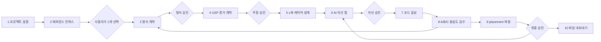
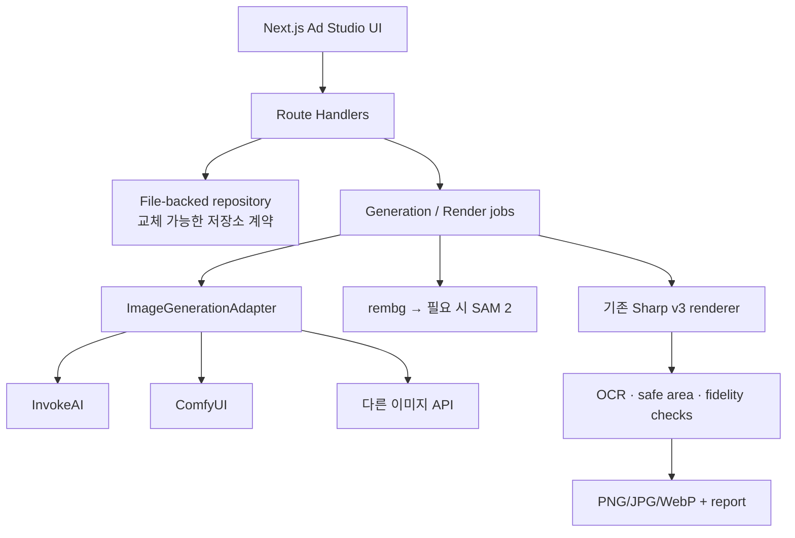

# Ad Studio — 레퍼런스 선택형 AI 광고 제작 플로우

- 작성일: 2026-07-26
- 상태: 구현 전 설계
- 대상: 레퍼런스를 직접 고르고 4:5·1:1·9:16 광고를 만드는 내부 웹 도구
- 기본 가정: 현재 Next.js 앱에 `/ad-studio`를 추가하고, 기존 Sharp v3 렌더러를
  최종 합성 엔진으로 재사용한다.

## 1. 제품 결정

이 도구의 핵심은 “AI가 광고를 알아서 만든다”가 아니다.

> 사용자가 형식을 고르고 잠근다. AI는 그 형식에 필요한 이미지 자산만 제안한다.
> 제품의 사실·한글·배치·최종 승인은 사람이 통제한다.

기존 시스템에서 AI slop이 생긴 주원인은 생성 모델의 성능보다, 선택 레퍼런스를
하나의 구속력 있는 계약으로 쓰지 않고 여러 카드와 장식을 자동으로 더한 데 있었다.
새 플로우는 레퍼런스 선택 뒤 바로 `Format Contract`를 만들고, 이후 단계가 그 계약을
벗어나면 렌더를 막는다.

## 2. Journey & Screen Story Contract

```text
전체 여정
제품·광고 목표 입력
→ 레퍼런스 수집
→ 1개 형식 선택
→ 형식 계약 승인
→ USP·증거 승인
→ 레이어 설계
→ AI 자산 선택
→ 코드 합성
→ placement 비교
→ 최종 승인·내보내기
→ 성과 메모로 재방문
```

- 현재 단계: 탐색 → 선택 → 생성 → 검수 → 결과.
- 진입 조건: 사용자는 광고할 제품과 후보 레퍼런스 URL 또는 이미지를 가지고 있다.
- 화면의 역할: AI에게 자유 생성시키기 전에 형식·사실·자산의 승인 순서를 고정한다.
- 화면의 이야기: “내가 고른 광고 형식이 어떤 레이어로 재현되는지 보고, 필요한
  AI 이미지와 실제 증거를 하나씩 승인해, placement별 완성본을 얻는다.”
- 주 행동: 현재 단계의 산출물을 `승인하고 다음 단계로`.
- 전체 액션: 승인 / 수정 / 이전 단계 / 버전 복원 / 생성 취소 / 실패 재시도.
- 이탈 감정: 무엇이 AI이고 무엇이 실제 증거인지 알 수 있다는 통제감.
- 기억 단서: 캔버스 옆에 계속 남아 있는 하나의 `z축 레이어 더미`.

## 3. 절대 분리하지 않는 두 계약

### 메시지 계약

성과 신호가 강한 광고에서 가져오는 것은 USP의 표현 우선순위뿐이다.

```text
대상 사용자의 순간
→ 검증된 문제
→ 제품이 실제로 반환하는 결과
→ 사용자가 랜딩에서 바로 할 행동
→ 금지 주장과 필수 고지
```

### 형식 계약

시각 형식은 사용자가 고른 레퍼런스 한 개를 기준으로 한다. 보조 레퍼런스는 색감이나
세부 동작 참고로만 둘 수 있고, 큰 구성은 섞지 않는다.

```text
큰 시각 덩어리 수
미디어 점유율
주 피사체 위치
제목 위치·점유율
stack anchor와 z-order
AI / 코드 / 제품 증거 / 실사 영역
둥근 면·배지·PIP·분할선의 허용 개수
정지 또는 모션 형식
```

## 4. 전체 플로우



사람이 반드시 결정하는 게이트는 다섯 개다.

1. 기준 레퍼런스 선택
2. 형식 계약 승인
3. USP·증거·금지 주장 승인
4. AI 자산 승인
5. 최종 placement 승인

AI는 이 다섯 결정을 자동 통과시키지 않는다.

## 5. 단계별 사용자와 AI의 역할

| 단계 | 사용자가 하는 일 | AI가 하는 일 | 저장되는 결과 | 다음 단계 조건 |
| --- | --- | --- | --- | --- |
| 1. 프로젝트 설정 | 제품, 랜딩, 타깃 순간, placement 선택 | 기존 제품 route/API에서 사실 후보 추출 | `CreativeProject` | 필수 입력 완료 |
| 2. 레퍼런스 인박스 | URL 붙여넣기, 이미지·영상 업로드, 프레임 선택 | 비율·미디어 점유율·텍스트 위치·큰 덩어리 분석 | `Reference`, `ReferenceFrame` | 사용자가 기준 1개 선택 |
| 3. 형식 계약 | 분석 결과 수정·잠금 | 형식 요소를 수치와 레이어로 변환, 불확실 항목 표시 | `FormatContract v1` | 사용자가 승인 |
| 4. USP·증거 | 실제 약속, CTA, 금지 주장, 증거 선택 | 기존 API 응답과 문구의 모순 검사 | `MessageContract` | 주장·증거 승인 |
| 5. 레이어 설계 | 실제 촬영 여부·교체 자산 확인 | AI/코드/CSS/증거/실사를 z축으로 배치 | `LayerPlan` | 필수 레이어 출처 존재 |
| 6. AI 자산 랩 | 3개 중 선택, 마스크·crop 수정 | 글자 없는 자산 3개 생성, prompt·seed 기록 | `GenerationRun`, `Asset` | 한 자산 승인 |
| 7. 코드 합성 | 문구·위치 미세 조정 | Sharp/SVG로 결정론적 렌더 | `CreativeVariant` | 렌더 warning 0 |
| 8. 충실도 검수 | 레퍼런스와 A/B/C 비교·선택 | blur·thumbnail·OCR·점유율 차이 표시 | `ReviewDecision` | 형식 규칙과 사람이 모두 통과 |
| 9. placement | Feed·Square·Story·Reels 프리뷰 확인 | anchor·scale·safe area만 재배치 | `PlacementRender` | 각 필수 placement 승인 |
| 10. 내보내기 | 파일 형식·이름 확인 | PNG/JPG/WebP와 보고서 묶음 생성 | `ExportBatch` | 최종 승인 |

## 6. 화면 설계

### `/ad-studio`

- 이야기: 진행 중인 광고와 현재 막힌 승인 단계를 바로 찾는다.
- 인지 순서: `프로젝트 이름 → 현재 단계 → 다음 행동`.
- 주 행동: `새 광고 만들기`.
- 보조 행동: 프로젝트 열기, 보관, 내보낸 파일 다시 보기.
- 빈 상태: “아직 만든 광고가 없어요. 제품과 레퍼런스부터 정해요.”

### `/ad-studio/[projectId]/references`

- 중심은 설명 카드가 아니라 큰 레퍼런스 갤러리다.
- URL, 업로드, 기존 갤러리에서 가져오기를 같은 인박스로 받는다.
- 한 카드에는 원본 미디어, 출처 URL, 캡처일, 비율, 형식 태그만 보인다.
- 선택은 기준 1개, 보조 2개까지 가능하다.
- 주 행동: `이 레퍼런스로 형식 분석`.
- 실패: URL을 불러오지 못하면 빈 썸네일을 만들지 않고 파일 업로드를 안내한다.

### `/ad-studio/[projectId]/format`

- 좌측: 기준 레퍼런스.
- 중앙: blur·thumbnail 분석이 겹쳐진 캔버스.
- 우측: 형식 계약 inspector.
- AI의 각 판단은 `확정 / 추정 / 확인 필요`로 표시한다.
- 사용자는 미디어 면적, 제목 영역, 큰 덩어리, z-order를 직접 수정할 수 있다.
- 주 행동: `이 형식 잠그기`.
- 형식을 바꾸면 새 버전이 생기며 이전 버전은 복원할 수 있다.

### `/ad-studio/[projectId]/message`

- 제품의 실제 route와 API에서 확인한 결과만 후보로 보여준다.
- 한 화면에서 `USP 한 줄 / 증거 / CTA / 금지 주장 / 고지`를 승인한다.
- “성과 보장”, 존재하지 않는 기능, AI로 만든 영수증·후기는 오류로 막는다.
- 주 행동: `주장과 증거 승인`.

### `/ad-studio/[projectId]/layers`

- 캔버스 위에 모든 레이어가 실제 z축으로 겹친다.
- 우측 목록은 `base → ai-art → product-evidence → bridge → code-text → legal` 순서다.
- 레이어를 숨겨도 캔버스의 분할 레이아웃으로 바꾸지 않는다.
- 각 레이어는 출처, 역할, 필수 여부, 편집 방식이 보인다.
- 주 행동: `이 레이어로 자산 만들기`.

### `/ad-studio/[projectId]/assets`

- 전체 광고 3개를 생성하지 않고, 현재 필요한 이미지 레이어만 3개 생성한다.
- 후보에는 prompt, model, seed, 생성 시점, 원본 크기, 마스크가 보인다.
- `다시 생성`은 새로운 run을 만들고 기존 결과를 덮어쓰지 않는다.
- `이 자산 사용`은 해당 자산을 layer plan에 고정한다.
- 글자가 감지되면 승인 버튼이 비활성화되고 재생성을 안내한다.

### `/ad-studio/[projectId]/compose`

- 중앙은 완성 캔버스, 우측은 코드 텍스트와 위치 inspector다.
- 사용자는 카피를 고치고 AI는 줄바꿈·safe area·대비 오류를 즉시 검사한다.
- 자유 CSS 입력보다 형식 계약에서 허용한 토큰을 조절한다.
- 주 행동: `비교본 만들기`.

### `/ad-studio/[projectId]/review`

- 같은 크기로 `레퍼런스 / A 현재 / B 절충 / C 충실`을 비교한다.
- 원본, 160px 축소, 12px blur, grayscale을 전환할 수 있다.
- 점수는 “판정”이 아니라 차이가 큰 위치를 알려주는 보조 정보다.
- AI는 “카드가 2개 더 많음”, “주 미디어가 17%p 작음”처럼 구조 차이를 말한다.
- 주 행동: `C를 placement로 만들기`처럼 선택 결과가 드러나는 문구를 쓴다.

### `/ad-studio/[projectId]/placements`

- Feed 4:5, Square 1:1, Story 9:16, Reels 9:16을 동시에 비교한다.
- z-order는 고정하고 anchor, scale, crop, safe area만 바뀐다.
- 중요한 문구가 잘리면 자동 축소하지 않고 해당 placement를 실패로 표시한다.
- 주 행동: `승인한 파일 내보내기`.

### `/ad-studio/[projectId]/export`

- 파일명, 크기, 형식, 승인자, reference URL, 생성 자산 provenance,
  warning을 마지막으로 보여준다.
- 결과는 이미지와 `render-report.json`을 함께 내려받는다.
- Meta 게시·예산 집행 버튼은 만들지 않는다.

## 7. 실제 인터랙션 연결

| 표시 이름 | 요소 | 행동·목적지 | 성공·실패 |
| --- | --- | --- | --- |
| 새 광고 만들기 | link | `/ad-studio/new` | 설정 화면 / init 오류 |
| URL 추가 | button | `POST /api/ad-studio/references/import` | 프레임 생성 / 업로드 대안 |
| 이 레퍼런스로 형식 분석 | button | reference 선택 후 analyze job | format 화면 / 분석 재시도 |
| 이 형식 잠그기 | button | format contract 새 버전 승인 | message 화면 / 누락 항목 표시 |
| 주장과 증거 승인 | button | message contract lock | layers 화면 / 모순 항목 표시 |
| 자산 3개 만들기 | button | generation run 생성 | 진행 상태 / 취소·재시도 |
| 이 자산 사용 | button | asset 승인·layer 연결 | compose 화면 / 품질 오류 |
| 비교본 만들기 | button | A/B/C render job | review 화면 / warning 목록 |
| placement 만들기 | button | approved variant 파생 | placements / safe-area 실패 |
| 승인한 파일 내보내기 | button | export batch 생성 | 다운로드 / 실패 파일 재시도 |
| 이전 버전 복원 | button | 새 버전으로 clone | 현재 화면 갱신 / 충돌 안내 |

`href="#"`, 빈 handler, 클릭되는 척하는 카드, 목적 없는 disabled 버튼은 만들지 않는다.

## 8. 데이터 모델과 상태

```text
CreativeProject
├─ Reference[]
│  └─ ReferenceFrame[]
├─ FormatContract[]       # versioned
├─ MessageContract[]      # versioned
├─ LayerPlan[]
│  └─ LayerSpec[]
├─ GenerationRun[]
│  └─ GeneratedAsset[]
├─ CreativeVariant[]
│  └─ PlacementRender[]
├─ ReviewDecision[]
└─ ExportBatch[]
```

최상위 상태는 다음만 쓴다.

```text
draft
→ references_ready
→ reference_locked
→ message_locked
→ layers_ready
→ assets_ready
→ composed
→ reviewed
→ export_ready
→ exported
```

거절은 실패 상태로 끝내지 않고 해당 단계의 새 버전으로 돌아간다.

```text
reviewed --형식 수정--> reference_locked의 새 버전
reviewed --자산 수정--> assets_ready의 새 run
export_ready --문구 수정--> composed의 새 variant
```

## 9. API 계약

MVP도 화면에서 정적 JSON을 직접 import하지 않는다. Next.js Route Handler가
파일 기반 저장소를 호출하고, 나중에 원격 저장소로 바꿔도 같은 요청 타입을 유지한다.

```text
POST   /api/ad-studio/projects
GET    /api/ad-studio/projects/:id
POST   /api/ad-studio/references/import
POST   /api/ad-studio/references/:id/analyze
PATCH  /api/ad-studio/references/:id/selection
POST   /api/ad-studio/format-contracts
POST   /api/ad-studio/message-contracts
POST   /api/ad-studio/layer-plans
POST   /api/ad-studio/generations
GET    /api/ad-studio/jobs/:id
PATCH  /api/ad-studio/assets/:id
POST   /api/ad-studio/renders
POST   /api/ad-studio/reviews
POST   /api/ad-studio/exports
```

모든 쓰기 요청은 `projectId`, `baseVersion`, `idempotencyKey`를 받는다. 생성·렌더 job은
`queued / running / succeeded / failed / cancelled`를 반환한다.

반드시 실제 응답으로 확인할 상태:

- loading: 캡처·분석·생성·렌더 진행
- empty: 레퍼런스·자산·프로젝트 없음
- error: URL 접근 실패, 모델 실패, 렌더 실패
- partial: 프레임은 있으나 출처 메타데이터 부족
- conflict: 다른 버전 위에서 수정
- permission: 로컬 파일 또는 외부 URL 접근 불가

## 10. 레이어와 생성 계약

### LayerSpec

```json
{
  "id": "hero-character",
  "role": "ai-art",
  "z": 10,
  "source": {"type": "generated", "assetId": null},
  "anchor": {"x": 0.52, "y": 0.55},
  "offset": [0, -0.06],
  "scale": 1.08,
  "rotate": -3,
  "overlapWith": ["product-evidence"],
  "editableBy": "asset-lab",
  "required": true
}
```

### GenerationRun

```json
{
  "layerId": "hero-character",
  "count": 3,
  "prompt": "장면과 피사체만 기술",
  "negativePrompt": "text, letters, logo, watermark, app UI, receipt",
  "referenceAssetIds": ["ref-frame-01"],
  "model": "adapter-defined",
  "seedPolicy": "record-every-seed",
  "status": "queued"
}
```

AI는 완성 광고를 한 번에 생성하지 않는다. `ai-art` 한 레이어씩 생성하고,
`code-text`, `product-evidence`, `legal`은 생성 요청에 넣지 않는다.

## 11. 기술 구조



### 도입 결정

- 유지: Next.js 15, TypeScript, Zod, Sharp, 기존 v3 manifest와 placement profiles.
- 재사용: `scripts/ad-image/lib/render-stacked-creative.mjs`.
- 추가 계약: `ImageGenerationAdapter`, `ProjectRepository`, `RenderJobRunner`.
- MVP 저장: `data/ad-studio/<projectId>/` 아래 versioned JSON과 자산.
- MVP UI: 기존 Radix/Tailwind를 유지한다. Astryx를 이 기능 때문에 새로 설치하지 않는다.
- 선택적 OSS: 사람 편집이 중요하면 InvokeAI, 재현 가능한 자동 생성이 중요하면 ComfyUI.
- 나중: 정지본 승인 뒤에만 Remotion adapter.

## 12. 반응형

이 도구의 제작 모드는 데스크톱 중심이고, 모바일은 선택·검수 중심이다.

| 폭 | 구조 | 가능한 일 |
| --- | --- | --- |
| compact `<600px` | 단일 pane, 하단 단계 이동 | 레퍼런스 선택, 후보 승인, 코멘트, placement 확인 |
| medium `600–839px` | 갤러리+캔버스, inspector는 sheet | 간단한 crop·문구·승인 |
| expanded `≥840px` | 갤러리 / 캔버스 / inspector 3-pane | 전체 레이어·형식·자산 편집 |

모바일에서 정밀 z축 드래그를 강요하지 않는다. 숫자 입력과 정렬 preset을 같은 기능의
대안으로 제공한다. 터치 타깃은 48px을 시작값으로 하고, 키보드 focus ring을 유지한다.

## 13. 모션 결정

제작 도구는 반복 사용 빈도가 높으므로 장식 모션을 넣지 않는다.

| 전환 | 목적 | 수치 | reduced motion |
| --- | --- | --- | --- |
| 갤러리 썸네일 → 형식 캔버스 | 같은 레퍼런스의 정체성 유지 | shared-object, 180ms ease-out | 즉시 교체+opacity |
| 레이어 순서 변경 | z-order 상태 피드백 | transform 160ms ease-out | 순서 즉시 변경 |
| inspector 열기 | 공간 관계 설명 | 220ms ease-out | opacity 150ms |
| 생성 완료 | 상태 피드백 | 새 후보만 120ms opacity | 동일 |

키보드 이동, 탭 전환, 반복 hover에는 애니메이션을 넣지 않는다. 긴 AI 로딩을
연출로 숨기지 않고 실제 job 상태와 취소 버튼을 보여준다.

## 14. 한국어와 UI 문구

- UI 본문: 기존 Pretendard가 있으면 유지, 없으면 실제 폰트 파일과 SIL OFL 1.1을
  확인한 뒤 self-host.
- 다중 행 본문 line-height `1.60`, 조밀한 목록 `1.48` 이상, 다중 행 제목 `1.35`.
- 광고 안의 제목은 레퍼런스 형식에 따라 별도 렌더하되 생성 이미지에 굽지 않는다.
- 버튼은 “다음”, “만들기”가 아니라 누른 직후 결과를 쓴다.

| 위치 | 최종 문구 | 누른 직후 결과 |
| --- | --- | --- |
| 레퍼런스 | 이 레퍼런스로 형식 분석 | 형식 계약 초안 생성 |
| 형식 | 이 형식 잠그기 | v1 승인 후 메시지 단계 |
| 자산 | 자산 3개 만들기 | generation run 시작 |
| 선택 | 이 자산 사용 | layer plan에 asset 고정 |
| 검수 | C를 placement로 만들기 | placement render 시작 |
| 내보내기 | 승인한 파일 내보내기 | export batch 다운로드 |

## 15. 품질 게이트

### 레퍼런스 충실도

- 큰 시각 덩어리 수가 같다.
- 주 미디어 점유율 차이가 `±10%p` 안에서 시작한다.
- 제목 위치와 점유율 차이가 `±8%p` 안에서 시작한다.
- 레퍼런스에 없는 카드·배지·CTA 면은 기본 0개다.
- z-order와 overlap은 placement가 바뀌어도 유지된다.

### AI slop 방지

- 이미지 속 글자·로고·워터마크 OCR 검출 0.
- 손·얼굴·제품 형태 이상은 사람이 100% 확대에서 승인.
- 같은 광고의 자산은 색온도, 주광원, grain이 맞는다.
- prompt에 추상 수식어만 쓰지 않고 카메라, 피사체, 동작, 광원, 배경을 적는다.
- 생성 자산을 실제 후기·성과·제품 증거로 표시하지 않는다.

### 제품 진실성

- 광고의 결과가 실제 API 상태 중 하나와 연결된다.
- 실제 촬영, AI, 제품 화면이 provenance로 구분된다.
- 존재하지 않는 기능, 가짜 숫자, 가짜 영수증, 가짜 리뷰를 막는다.
- CTA가 실제 랜딩의 첫 행동과 일치한다.

### placement

- Feed 4:5, Square 1:1, Story/Reels 9:16 safe-area warning 0.
- 자동 crop만으로 끝내지 않고 placement별 anchor를 승인한다.
- Reels는 정지본 첫 프레임이 승인된 뒤에만 만든다.

## 16. MVP 범위

### 1차 — 선택과 계약

- `/ad-studio` 프로젝트 생성
- 레퍼런스 URL·파일 인박스
- 기준 1개 선택
- Format Contract와 Message Contract 저장
- 기존 갤러리의 U1~U20 및 추가 전화형 레퍼런스 가져오기

### 2차 — 자산과 합성

- Layer Plan editor
- `ImageGenerationAdapter`의 mock과 실제 provider 한 개
- 자산 3개 생성·선택·버전 기록
- 기존 Sharp renderer 호출

### 3차 — 검수와 내보내기

- A/B/C 비교
- blur·thumbnail·OCR·safe area 검사
- placement 프리뷰
- 승인 이미지와 report export

영상, 자동 게시, 광고 성과 자동 최적화, SaaS 템플릿 편집기 복제는 MVP에서 제외한다.

## 17. 완료 기준

- 사용자가 설명 없이 레퍼런스를 넣고 기준 1개를 고를 수 있다.
- 선택한 형식 계약이 이후 모든 렌더에 version으로 남는다.
- AI가 만든 영역과 코드·제품 증거·실사 영역을 캔버스에서 구분할 수 있다.
- 실제 API 또는 같은 계약의 Route Handler를 통해 loading·empty·error·partial 상태가 보인다.
- 모든 버튼이 실제 API 호출 또는 실제 route에 연결된다.
- 레퍼런스·자산·렌더·승인을 이전 버전으로 복원할 수 있다.
- 4:5·1:1·9:16에서 z축이 유지되고 safe-area warning이 0이다.
- 자동 점수와 별개로 사람이 다섯 승인 게이트를 모두 통과해야 export된다.
