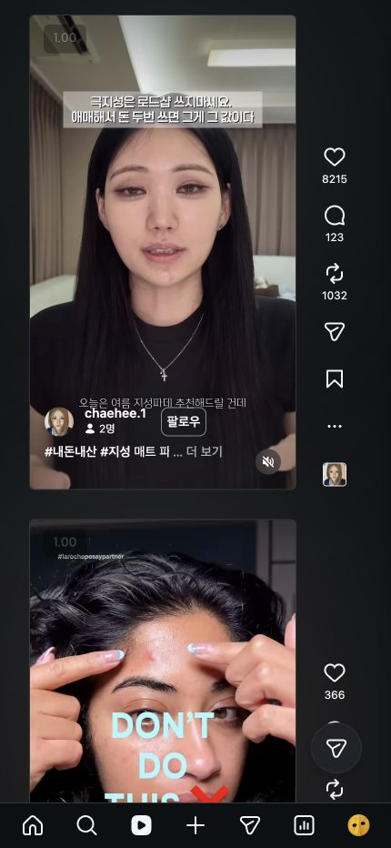
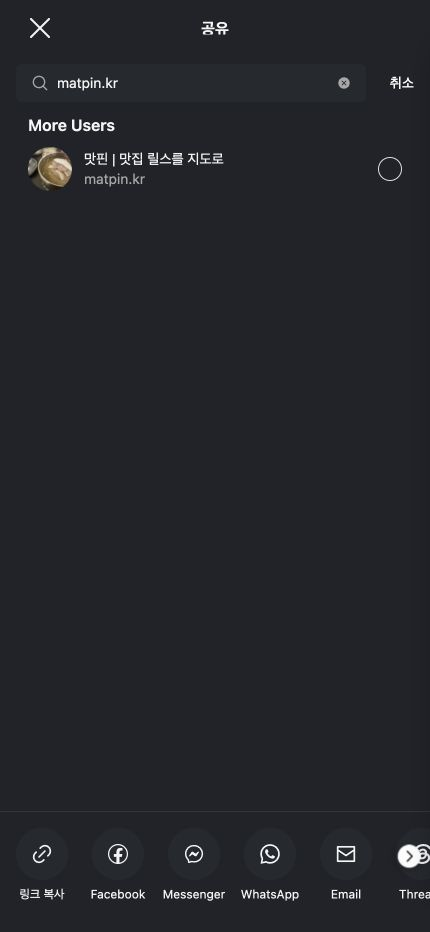
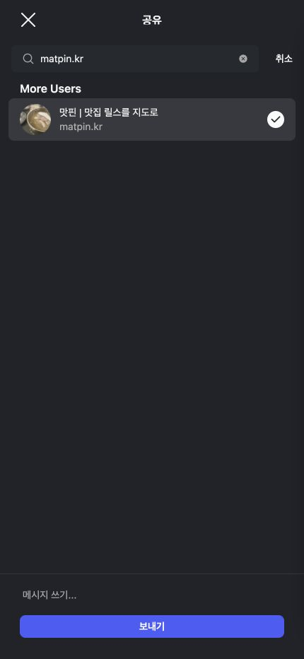
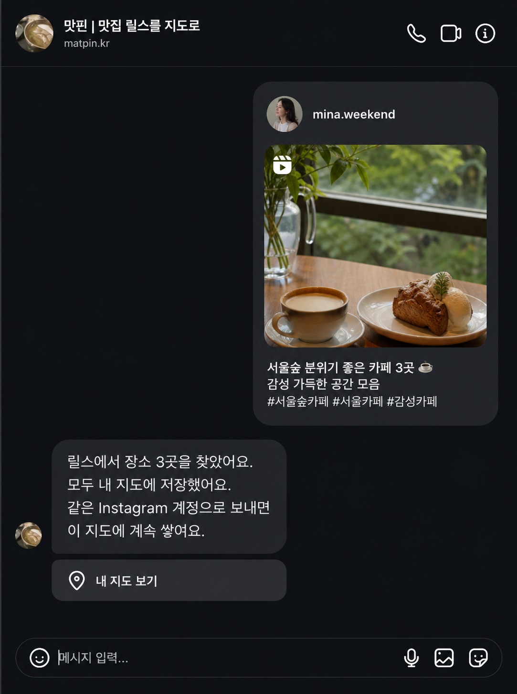
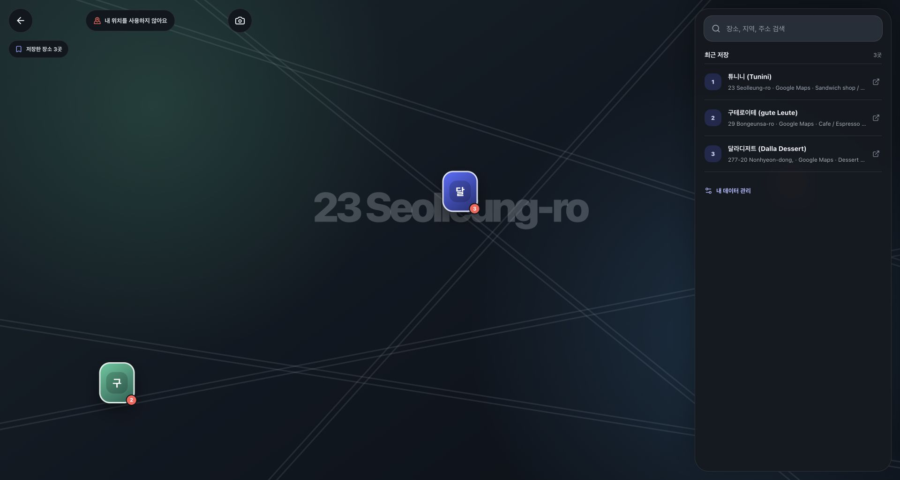
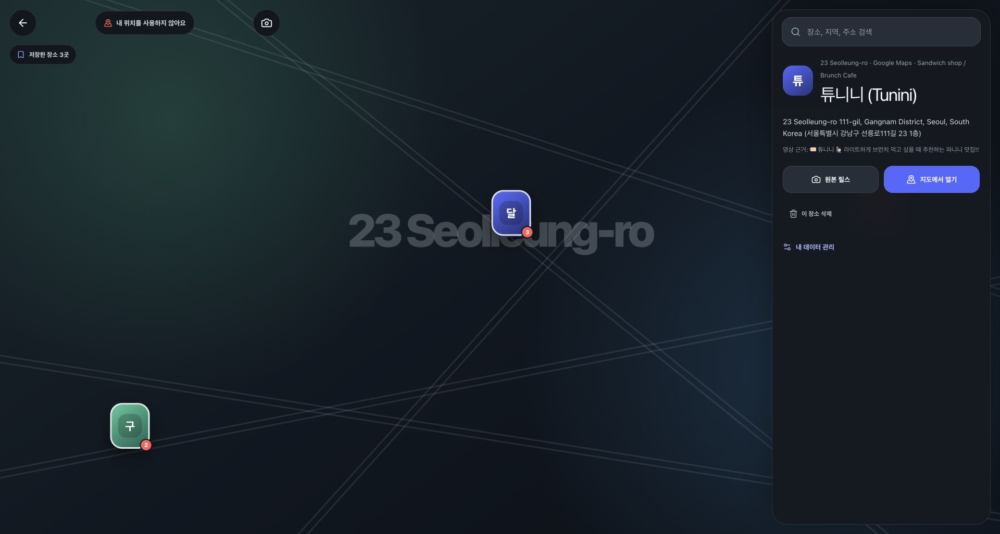

# Instagram 실제 화면으로 맛핀 저장하기

촬영일: 2026-08-02

이 문서는 로그인된 **실제 Instagram 웹 화면**과 실제 맛핀 지도를 바탕으로 만든 설명서입니다. 개인 대화를 보호하기 위해 DM 장면만 AI 합성 예시로 교체했습니다.

- 1~3번 화면: Chrome에서 Instagram을 휴대폰 크기로 열어 촬영
- 4번 화면: 실제 동작과 문구를 바탕으로 만든 30대 여성 가상 계정의 AI 합성 예시
- 5~6번 화면: DM에 있던 실제 개인 지도를 열어 촬영
- 설명을 만들 때 새 릴스를 보내지는 않음

## 한눈에 보는 흐름

```text
마음에 드는 릴스
      ↓ 종이비행기 버튼
matpin.kr 검색
      ↓ 맛핀 계정 선택
보내기
      ↓ 자동 분석
저장 완료 DM
      ↓ 내 지도 | 맛핀
내 지도에서 모든 장소 확인
```

## 1. 릴스에서 공유 버튼을 누릅니다



화면 오른쪽에 있는 **종이비행기 모양**이 공유 버튼입니다.

1. 저장하고 싶은 맛집 릴스를 엽니다.
2. 오른쪽의 종이비행기 버튼을 누릅니다.
3. 사람을 고르는 공유 화면이 열립니다.

## 2. `matpin.kr`을 검색합니다



위쪽 검색칸에 `matpin.kr`을 입력합니다.

검색 결과에서 아래 두 줄을 함께 확인하세요.

- 이름: **맛핀 | 맛집 릴스를 지도로**
- 아이디: **matpin.kr**

이름이 비슷한 다른 계정이 아니라, 아이디가 정확히 `matpin.kr`인 계정을 고릅니다.

## 3. 맛핀을 선택하고 `보내기`를 누릅니다



맛핀 오른쪽에 체크 표시가 생기면 선택된 상태입니다. 아래의 파란색 **보내기** 버튼을 누르면 끝입니다.

이 설명서를 촬영할 때는 중복 저장을 막기 위해 실제 `보내기` 버튼을 누르지 않았습니다. 이미 전에 보낸 테스트 릴스의 답장을 다음 화면에서 확인했습니다.

## 4. 맛핀이 자동으로 분석하고 DM으로 알려줍니다

> 아래 DM은 개인 대화를 보호하기 위해 만든 **AI 합성 예시**입니다. `mina.weekend`는 실제 사용자가 아닌 가상 계정입니다.



맛핀은 릴스에서 장소 이름과 주소를 찾습니다.

- 장소가 확실하면: 찾은 장소를 모두 저장하고 개인 지도 링크를 보냅니다.
- 장소가 애매하면: 후보를 보여주고 확인 링크를 보냅니다.
- 장소를 찾지 못하면: 다른 공개 릴스를 보내달라고 알려줍니다.

테스트 릴스에서는 장소 **3곳**을 찾았고 모두 저장됐습니다. 같은 Instagram 아이디로 다음 릴스를 보내면 새 지도를 만들지 않고, 같은 지도에 계속 쌓입니다.

개인 지도 링크는 열쇠와 같습니다. 다른 사람에게 보여주지 마세요. 합성 예시에는 실제 링크나 토큰을 넣지 않았습니다.

## 5. DM의 `내 지도 | 맛핀`을 누릅니다



DM 아래쪽의 **내 지도 | 맛핀**을 누르면 개인 지도가 열립니다.

테스트 결과는 다음과 같습니다.

1. 튜니니
2. 구테로이테
3. 달라디저트

한 릴스에서 여러 장소를 찾으면 하나만 고르게 하지 않고 전부 저장합니다. 화면 오른쪽 목록에서도 `3곳`이 저장된 것을 확인할 수 있습니다.

## 6. 장소를 누르면 자세한 정보를 볼 수 있습니다



지도 핀이나 오른쪽 장소 목록을 누르면 상세 화면이 열립니다.

- **원본 릴스**: 이 장소를 알게 된 영상을 다시 봅니다.
- **지도에서 열기**: 실제 지도 앱에서 위치와 길을 확인합니다.
- **이 장소 삭제**: 잘못 저장한 장소만 지웁니다. 필요할 때만 누르세요.

## 가장 중요한 한 문장

**Instagram 릴스에서 `matpin.kr`으로 공유하면, 릴스 속 장소가 내 Instagram 아이디 전용 지도에 자동으로 쌓입니다.**

## 실제 휴대폰 앱에서는 무엇이 다른가요?

이 문서의 Instagram 화면은 실제 계정에 로그인한 웹 화면입니다. iPhone·Android 앱에서는 버튼 크기와 위치가 조금 다를 수 있지만, 순서는 같습니다.

```text
릴스 → 공유 → matpin.kr 검색 → 선택 → 보내기 → DM의 내 지도 열기
```
