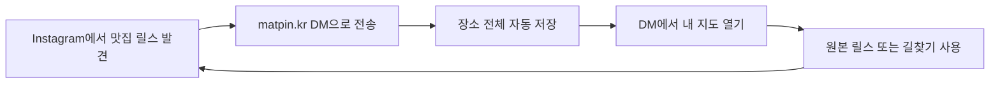
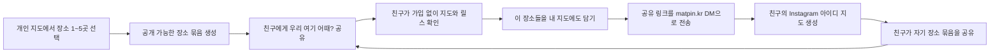

# 맛핀 오가닉 바이럴 전체 플로우

- 기준일: 2026-08-02
- 제품 단계: 0→1, PMF 탐색 전
- 결정: 광고보다 먼저 `저장 → 다시 찾기 → 친구에게 장소 보내기 → 친구가 자기 지도에 담기` 한 바퀴를 검증한다.
- 결과물 형태: Build-to-Learn · Limited Pilot
- 주의: 아래 FGI는 공개 자료를 근거로 합성한 의사결정 패널이며 실제 인물들이 함께 토론한 것이 아니다.

## 1. 결론

맛핀의 바이럴은 **서비스 초대**가 아니라 **장소 추천**이어야 한다.

사용자가 친구와 약속을 잡을 때 원래 하던 `우리 여기 어때?`를 다음처럼 바꾼다.

```text
릴스를 matpin.kr에 보냄
→ 장소가 내 비공개 지도에 저장됨
→ 같이 갈 장소 1~5곳만 골라 친구에게 보냄
→ 친구는 가입 없이 장소·지도·원본 릴스를 봄
→ 친구가 그 공유 링크를 matpin.kr DM으로 보내 자기 지도에 담음
→ 친구도 다음 장소 묶음을 다른 친구에게 보냄
```

핵심은 **친구가 결과를 본 뒤에만 사용자 전환을 요청하는 것**이다. 랜딩, 회원가입, 앱 설치를 먼저 통과시키지 않는다.

## 2. 문제 계약 9칸

| 칸 | 이번 설계의 답 |
| --- | --- |
| 사용자 | Instagram에 맛집 릴스를 저장하고, 친구·연인과 갈 곳을 주고받는 사람 |
| R1 | DM 자동 저장과 Instagram 아이디별 개인 지도는 구현돼 있으나, 실제 반복 저장·지도 재방문·친구 공유 데이터는 미확인이다. 지도 결과는 현재 사용자 본인에게 닫혀 있다. |
| R2 | 사용자가 저장한 장소를 실제 약속에 다시 쓰고, 고른 장소를 친구에게 보내며, 친구도 자기 Instagram 아이디의 지도를 만드는 상태 |
| Y | 7일 안에 공유를 통해 첫 장소를 저장한 신규 Instagram 사용자 수 |
| X | 활성 사용자가 선택한 장소 묶음을 공유하고, 수신자가 공개 결과를 본 뒤 그 묶음을 matpin.kr DM으로 보내는 행동 |
| M | 7일 |
| N | 활성 사용자 1명당 최소 1개의 장소 묶음 공유, 수신자 1명당 첫 저장 1회 |
| 제품 단계 | 문제·해결책 검증과 PMF 탐색 사이 |
| 결정 | 공유 페이지 하나를 추가해 오가닉 루프를 검증할지, 저장·재방문만 먼저 더 검증할지 선택 |

### 사실·주장·가정 분리

| 구분 | 내용 |
| --- | --- |
| 확인된 코드 상태 | Instagram-scoped ID로 저장함을 나누고, 찾은 장소를 최대 3곳까지 저장하며, DM으로 비공개 지도 링크를 보내는 코드가 있다. |
| 확인된 코드 상태 | 현재 개인 지도에는 장소 검색·원본 릴스·외부 지도·삭제가 있지만, 선택 장소를 친구에게 공유하는 루프는 없다. |
| 사용자 요구 | 광고보다 오가닉을 먼저 설계하고, 바이럴 K를 높이되 페이지 수와 허들을 줄인다. |
| 가장 위험한 가정 | 사용자가 개인 지도에 저장된 장소를 친구와 실제로 공유하고 싶어 한다. |
| 두 번째 가정 | 수신자가 받은 장소 묶음을 자기 지도에 담기 위해 Instagram DM으로 한 번 더 보내는 수고를 감수한다. |
| 기술 가정 | 공개 공유 링크를 Instagram DM으로 받으면 공유 토큰과 발신자의 Instagram-scoped ID를 함께 저장할 수 있다. 현재 코드에는 이 입력 처리가 없다. |

## 3. Growth Loop 두 개

### A. 제품 가치 루프 — 먼저 살아남아야 하는 루프



이 루프가 돌아야 공유할 결과가 생긴다. 바이럴 기능이 저장 가치의 부족을 가리면 안 된다.

### B. 오가닉 바이럴 루프 — 결과가 다음 사용자를 데려오는 루프



### 공유물이 주는 가치

- 발신자: 여러 링크를 설명하며 보내지 않고 `우리 여기 어때?` 한 장으로 약속을 잡는다.
- 수신자: 앱 설치·가입 없이 장소명, 지도, 원본 릴스, 길찾기를 즉시 본다.
- 맛핀: 공유 토큰이 다시 DM으로 들어올 때 발신자→수신자 전환을 정확히 연결한다.

금전 보상, 친구 수 채우기, 자동 초대 DM은 사용하지 않는다. 스팸을 늘리면 K의 단기 숫자는 올라가도 신뢰와 리텐션이 내려간다.

## 4. 최소 페이지 구조

주요 페이지는 **3개만** 둔다. Instagram DM은 입출력 통로이며 웹 페이지로 세지 않는다.

| 페이지 | 누구를 위한가 | 입력 | 처리 | 즉시 결과 | 주 행동 | 로그인 경계 |
| --- | --- | --- | --- | --- | --- | --- |
| `/matpin` 사용 안내 | 프로필·검색·입소문으로 처음 온 사람 | 없음 | 3단계 사용법과 실제 저장 결과 설명 | 맛핀이 무엇을 하는지 이해 | `Instagram에서 matpin.kr 열기` | 없음 |
| `/matpin/saved#token=…` 내 비공개 지도 | 릴스를 보낸 사람 | DM의 개인 링크 | 해당 Instagram-scoped ID의 저장 장소 조회 | 내 지도·목록·원본 릴스·길찾기 | `같이 갈 곳 보내기` | 회원가입 없음, 비공개 토큰 |
| `/s/{shareToken}` 공개 장소 묶음 | 공유받은 친구 | 친구가 보낸 링크 | 공유자가 고른 장소만 조회 | 장소·지도·원본 릴스를 바로 확인 | `내 지도에도 담기` | 보기에는 없음, 저장은 본인 Instagram DM으로 식별 |

### 별도 페이지로 만들지 않을 것

- 온보딩 페이지
- 회원가입·로그인 페이지
- 프로필 페이지
- 공개 피드
- 친구 목록·팔로우
- 컬렉션 생성 마법사
- 별도 검색 페이지
- 별도 공유 완료 페이지

검색은 내 지도 안에, 공유 설정은 바텀시트에, 데이터 관리는 설정 시트에 넣는다. 장소가 불명확할 때만 기존 확인 화면을 예외적으로 사용한다.

## 5. 전체 사용자 플로우

### Flow 1 — 오가닉 첫 유입: Instagram에서 바로 저장

```text
친구의 말·커뮤니티·맛핀 프로필에서 사용법을 알게 됨
→ Instagram에서 맛집 릴스의 공유 버튼을 누름
→ matpin.kr 계정으로 보냄
→ 맛핀이 캡션 → 작성자 댓글 → 영상 단서 순으로 확인
→ 명확한 장소가 여러 곳이면 전부 자동 저장
→ DM: “릴스에서 찾은 3곳을 모두 저장했어요” + 내 지도 링크
→ 지도는 릴스를 보낸 Instagram 아이디 기준으로 생성
```

처음부터 랜딩을 거칠 필요가 없다. 맛핀 프로필과 친구의 설명은 Instagram 안에서 바로 `릴스를 보내는 행동`으로 연결한다.

### Flow 2 — 친구가 보낸 장소로 첫 유입

```text
카카오톡·Instagram DM 등에서 “우리 여기 어때?” 링크를 받음
→ 공개 장소 묶음이 바로 열림
→ 지도·장소명·원본 릴스·길찾기 확인
→ “내 지도에도 담기” 선택
→ “이 링크를 Instagram에서 matpin.kr에 보내세요” 바텀시트
→ 링크 공유 또는 복사 후 matpin.kr DM으로 전송
→ 맛핀이 shareToken을 인식해 선택 장소를 수신자 계정 지도에 복사
→ DM으로 수신자의 개인 지도 링크 전달
```

공유 페이지의 첫 화면은 맛핀 설명이 아니라 **친구가 보낸 장소 결과**다.

### Flow 3 — 반복 저장

```text
다음 맛집 릴스 발견
→ 공유 대상의 최근 대화에서 matpin.kr 선택
→ 중복 검사
→ 새로운 장소만 저장
→ 같은 개인 지도 링크와 “이번에 추가된 N곳” 전달
→ 지도는 새 장소에 맞춰 열림
```

다시 가입하거나 새 지도를 만들지 않는다. 같은 Instagram 아이디는 항상 같은 지도에 쌓인다.

### Flow 4 — 장소를 친구에게 공유

```text
내 지도에서 장소 카드 선택
→ “같이 갈 곳 보내기”
→ 기본은 현재 장소 1곳, 추가 선택은 최대 5곳
→ 미리보기: “성수 맛집 3곳 · 우리 여기 어때?”
→ 공개 범위 안내 확인
→ OS 공유 시트로 링크 전송
→ 친구가 링크를 열면 Flow 2 시작
```

공유 CTA는 저장 직전이나 처리 중에 띄우지 않는다. 사용자가 지도에서 결과를 확인한 뒤 장소 상세에 둔다.

### Flow 5 — 다시 찾기와 실제 사용

```text
약속 장소를 정할 때 DM의 내 지도 링크 재방문
→ 지역·장소 검색 또는 지도 핀 선택
→ 원본 릴스로 분위기 확인
→ 외부 지도에서 길찾기
→ 필요하면 장소 묶음을 친구에게 공유
```

리텐션은 앱을 매일 여는 것이 아니라, 다음 릴스를 저장하거나 실제 약속 때 지도를 다시 쓰는 것으로 정의한다.

### Flow 6 — 실패와 복구

| 상황 | 같은 화면·대화에서의 복구 |
| --- | --- |
| 장소를 찾지 못함 | DM으로 `가게명이나 지역 한 단어`만 요청 |
| 동일 상호의 지점이 모호함 | 최대 3개 후보를 확인 화면 한 곳에서 선택 |
| 한 릴스에 서로 다른 실제 장소가 여러 개 | 하나를 고르게 하지 않고 확인된 장소 전부 저장 |
| 이미 저장한 릴스 | `이미 저장되어 있어요`와 기존 지도 링크 전달 |
| 개인 링크 만료·분실 | matpin.kr DM에 `지도`를 보내 새 링크 받기 |
| 공개 공유 링크 철회 | 내 지도 공유 관리 시트에서 링크 비활성화 |
| 원치 않는 데이터 | 내 지도 설정 또는 DM `삭제`로 제거 |

## 6. 화면별 구체 행동

### `/matpin` — 짧은 오가닉 안내

1. 한 문장: `Instagram 릴스를 matpin.kr로 보내면, 나온 장소를 모두 내 지도에 저장해요.`
2. 실제 흐름 3프레임: `공유 → 모두 저장 → 지도`
3. 개인정보 안내: 현재 위치를 수집하지 않고, 릴스를 보낸 Instagram 계정별로 나눔
4. CTA 하나: `Instagram에서 matpin.kr 열기`

광고 연출 이미지, 긴 문제 설명, 여러 중복 CTA는 오가닉 첫 사용에 필수가 아니다.

### 내 비공개 지도 — 제품의 중심

- 기본 탭을 추가하지 않는다. 지도와 목록을 한 화면에서 전환한다.
- 새 DM 링크는 이번에 저장된 핀을 강조해 연다.
- 장소 상세 주 행동: `원본 릴스`, `길찾기`, `같이 갈 곳 보내기`
- 공유 바텀시트: 1~5곳 선택, 제목 자동 생성, 공개 범위 확인, 링크 만들기
- 전체 개인 지도 공유는 기본 제공하지 않는다.

### 공개 장소 묶음 — 바이럴의 중심

첫 화면 순서:

1. `친구가 같이 가고 싶은 성수 맛집 3곳을 보냈어요`
2. 실제 장소 카드와 작은 지도
3. `원본 릴스`와 `길찾기`
4. `내 지도에도 담기`
5. 작은 보조 링크 `맛핀은 어떻게 쓰나요?`

수신자가 장소를 보기 전에 가입·Instagram 연결·앱 설치를 요구하지 않는다.

## 7. 공유 카드 문구

### 발신자가 보내는 기본 문구

> 우리 여기 어때? 성수에서 가볼 만한 3곳을 모아봤어.

### 링크 미리보기

- 제목: `친구가 보낸 성수 맛집 3곳`
- 설명: `지도와 원본 릴스를 한 번에 확인하세요.`
- 이미지: 실제 장소 사진 1장 + 지도 핀 + `3곳`

`맛핀에 가입해 주세요`, `친구 초대`, `내가 혜택을 받아요`는 사용하지 않는다. 받는 사람에게 유용한 선물처럼 보여야 한다.

## 8. K 정의와 계측

### 바이럴 K

```text
K_7d = 활성 사용자 1명당 공유 링크를 받은 고유 수신자 수
       × 수신자가 7일 안에 자기 Instagram 지도에 첫 장소를 저장한 비율
```

활성 사용자는 `장소 3곳 이상 저장 + 개인 지도 1회 이상 열기`를 모두 한 사람으로 정의한다. 공유한 사람만 분모에 두면 K가 과대평가되므로 전체 활성 사용자를 분모로 둔다.

### 단계별 입력 지표

| 단계 | 이벤트 | 판단 질문 |
| --- | --- | --- |
| 결과 생성 | `save_completed` | 공유할 만한 정확한 결과가 생겼는가? |
| 가치 확인 | `private_map_opened` | 저장 결과를 실제로 보았는가? |
| 공유 의도 | `share_started` | 공유할 필요가 생겼는가? |
| 공유물 생성 | `share_link_created` | 선택과 공개 안내가 너무 어렵지 않은가? |
| 수신 성공 | `share_link_opened` | 친구가 링크를 열 이유가 있었는가? |
| 가져오기 시작 | `shared_bundle_import_started` | 수신자가 자기 것으로 만들고 싶은가? |
| DM 귀환 | `shared_bundle_dm_received` | 웹→Instagram 전환 허들을 넘었는가? |
| 추천 활성화 | `referred_first_save_completed` | 새로운 사용자가 실제 첫 가치를 얻었는가? |
| 루프 반복 | `referee_first_share_created` | 수신자가 다시 발신자가 되었는가? |

### 같이 볼 지표

- 루프 시간: 공유 링크 생성 → 추천 사용자의 첫 저장까지 걸린 시간
- 공유 성공률: 링크 생성 대비 고유 수신자 열람
- 수신자 활성화율: 고유 수신자 열람 대비 첫 저장
- 품질 가드레일: 잘못 저장된 장소 비율, 공유 링크 신고·철회율
- 리텐션 가드레일: 추천 유입자의 D7 지도 재방문과 두 번째 릴스 저장

K만 높고 추천 사용자가 다시 쓰지 않으면 제품 성장 루프가 아니라 일회성 캠페인이다.

## 9. 가상 Toss × Reforge 패널

### Round 0 — 가장 위험한 가정

`이승건 · 제품 생존 렌즈`

현재는 확대가 아니라 학습 단계입니다. 자동 저장이 반복 사용을 만드는지 확인하기 전에 바이럴 숫자만 키우면, 남지 않는 사용자를 더 빨리 데려올 수 있습니다.* [SG-PO-02]

`윤민정 · 바이럴·리텐션 렌즈`

현재 루프는 사용자가 지도를 받은 뒤 끝납니다. 친구에게 서비스가 아니라 유용한 장소를 보내고, 친구가 결과를 본 감정 고점에서 자기 지도를 만드는 길이 있어야 합니다. [MJ-PRODUCT-48]

`하길우 · 근거 감사 렌즈`

“K를 높인다”는 아직 조작 가능한 목표가 아닙니다. 7일 안에 어떤 사용자에게 어떤 행동을 몇 번 만들 것인지, 분모와 전환 상태를 먼저 고정해야 합니다. [GW-LIVE-15]

> 이번 라운드: 근거 3건 · 추론 1건(*)

### Round 1 — 독립 진단

`박세진 · 콘텐츠 바이럴 렌즈`

K는 한 사용자가 초대한 사람 수와 수신자의 전환율을 곱해 봐야 합니다. 콘텐츠형 공유는 보상형보다 K가 낮을 수 있으므로, 임의로 K=1을 성공선으로 두지 말아야 합니다. [PS-TMC25-07]

`배효진 · 단순성 렌즈`

공유는 이미 익숙한 행동 위에 두고, 보내는 사람과 받는 사람 모두 불편하거나 민망하지 않아야 합니다. 두 사람에게 많은 선택지를 주지 않는 것이 학습 비용과 마음의 허들을 함께 낮춥니다. [BH-TMC25-08]

`조성은 · 지표 분해 렌즈`

K를 공유 시도, 수신자가 메시지를 여는 성공률, 한 사람이 보내는 수신자 수로 나눠야 병목을 찾을 수 있습니다. 수신자가 열지 않는다면 문구보다 “열고 얻을 것이 없다”는 근본 원인을 먼저 봐야 합니다. [CS-TMC25-06]

> 이번 라운드: 근거 3건 · 추론 0건

### Round 2 — 교차 반박

`이승건 → 윤민정`

동의하는 부분: 수신자→발신자 연결은 필요합니다. 반박하는 부분: 첫 저장 직후 공유를 강하게 요구하면 아직 검증되지 않은 핵심 가치를 공유가 가릴 수 있으므로, 지도에서 결과를 확인한 뒤에만 노출해야 합니다.*

`윤민정 → 이승건`

동의하는 부분: 공유는 핵심 가치 뒤에 있어야 합니다. 반박하는 부분: 오래 쓸 지도를 완성한 뒤까지 기다릴 필요는 없고, 친구와 갈 장소 하나를 찾은 순간이면 이미 이타적으로 보낼 가치가 있습니다.*

`조성은 → 배효진`

동의하는 부분: 액션은 단순해야 합니다. 반박하는 부분: 버튼을 하나로 줄이는 것만으로 반복은 생기지 않으며, 사용자가 결과와 피드백을 받아 다시 공유할 이유가 있어야 합니다. [CS-TMC25-11]

> 이번 라운드: 근거 1건 · 추론 2건(*)

판정: 공유 CTA는 **첫 저장 전에는 금지**, 첫 개인 지도를 연 뒤 장소 상세에 상시 제공한다. 별도 팝업은 3곳 이상 저장했거나 길찾기를 연 뒤 한 번만 시험한다.

### Round 3 — Reforge 역검증

| 대조축 | 판정 | 이유 |
| --- | --- | --- |
| Growth Loops | 합치 | 선택 장소 묶음이 새 수신자를 데려오고, 수신자가 자기 지도를 만든 뒤 다시 장소 묶음을 생산한다. 공유 버튼만 있는 퍼널과 다르다. |
| Retention & Engagement | 인접 | 지도 재방문과 다음 릴스 저장은 리텐션, 한 번에 더 많은 장소를 저장·공유하는 것은 engagement다. 둘을 한 지표로 합치지 않는다. |
| Four Fits | 조건부 합치 | 제품 입력과 공유가 Instagram이라는 기존 고빈도 채널 안에서 시작한다. 다만 웹→Instagram DM으로 돌아가는 단계가 실제로 쉬운지는 검증 전이다. |

### Round 4 — 최소 학습 계획

지금 결정은 `학습`이다. 기존 자동 저장을 유지하고 **공개 장소 묶음 페이지 한 개와 DM 가져오기 계약만** Build-to-Learn으로 추가한다.

## 10. 1~2주 실행 카드

| 가정 | 검증 결과물 | 검증 방법 | 지표 | 성공 기준 | 폐기·중단 기준 | 생산화 기준 | 기한 |
| --- | --- | --- | --- | --- | --- | --- | --- |
| 저장 결과를 친구에게 보낼 필요가 있다 | 내 지도 공유 바텀시트 + 공개 장소 묶음 | 활성 사용자 10명이 실제 약속 상대에게 공유 | 공유 시작·링크 생성·고유 열람 | 10명 중 4명 이상이 자발적으로 링크 생성, 고유 수신자 8명 이상 | 10명 모두 공유하지 않거나 “보낼 이유 없음”이 반복 | 서로 다른 3개 사용자군에서 반복 공유 | 1주 |
| 수신자가 결과를 자기 지도에 담고 싶다 | `내 지도에도 담기` + 공유 토큰 DM 입력 | 수신자가 설명 도움 없이 수행 | 공개 페이지 열람→DM 귀환→첫 저장 | 고유 수신자 8명 중 3명 이상 첫 저장 | 8명 중 0명이 DM 귀환, 또는 절반 이상이 절차를 이해 못함 | 30명 이상에서 수신자 활성화율과 오류율 안정 | 1주 |
| 공유가 신규 활성 사용자를 만든다 | 추천 귀속 이벤트 | shareToken으로 발신자와 수신자 연결 | K_7d, 루프 시간 | 파일럿 K_7d ≥ 0.3, 중앙 루프 시간 72시간 이하 | K_7d=0 또는 스팸·개인정보 문제 발생 | K_7d ≥ 0.5가 3개 코호트에서 반복되고 추천 유입자의 D7 재방문이 유지 | 2주 |
| 추천 유입자도 제품 가치를 반복한다 | 추천 사용자의 개인 지도 | 두 번째 릴스 저장과 D7 지도 열기 추적 | 두 번째 저장, D7 재방문 | 추천 활성 사용자 3명 중 2명 이상이 두 번째 릴스 저장 | 첫 장소만 복사하고 누구도 다시 저장하지 않음 | 반복 저장·지도 재방문이 비추천 코호트와 유사 | 2주 |

성공 기준은 업계 표준이 아니라 **이번 소규모 파일럿의 내부 의사결정선**이다.

## 11. 먼저 만들 순서

1. 현재 DM 자동 저장과 개인 지도 열람이 실제 계정에서 끝까지 되는지 확인한다.
2. 개인 지도에 `같이 갈 곳 보내기`를 추가하되 장소 1~5곳만 선택하게 한다.
3. 공개 장소 묶음 `/s/{shareToken}` 한 페이지를 만든다.
4. 수신자가 공유 링크를 matpin.kr DM으로 보내면 자기 지도에 복사하는 입력 계약을 추가한다.
5. 발신자→수신자→첫 저장을 연결하는 이벤트를 기록한다.
6. 10명 Limited Pilot을 진행하고 K보다 먼저 각 단계의 병목을 본다.
7. 이 루프가 돌아간 뒤에만 SEO 공개 페이지, 공동 지도, 크리에이터 컬렉션을 검토한다.

## 12. 이번 버전에서 빼는 것

- 광고 캠페인과 보상형 추천
- 친구 초대 포인트
- 공개 소셜 피드
- 팔로우·좋아요·댓글
- 친구 위치 공유
- 전체 개인 지도 공개
- 공동 편집
- 여행 동선 자동 생성
- 앱 설치·강제 회원가입
- AI 추천 피드

이 기능들은 K를 높여 보일 수 있지만, 현재 가장 위험한 가정인 `저장 결과를 실제로 친구에게 보내는가`를 더 싸게 검증하지 못한다.

## 13. 출처와 근거 상태

| ID | 사용 범위 | 출처 | 상태 |
| --- | --- | --- | --- |
| SG-PO-02 | PMF 전에는 획득 확대보다 첫 가치·리텐션·핵심 가설 검증 | [Toss PO Session 요약 스냅샷](https://www.youtube.com/playlist?list=PL1DJtS1Hv1PiGXmgruP1_g7-0bR6d2L8M) | 공개 세션 요약, 경험칙을 보편값으로 쓰지 않음 |
| MJ-PRODUCT-48 | 이타적 공유, 수신자→발신자 루프, 바이럴 뒤 재사용 | [윤민정 프로덕트 빌딩 강의](https://www.youtube.com/watch?v=QftqZM-_iAk&t=2818s) | 자동 자막 기반 교정 스냅샷 |
| GW-LIVE-15 | Y·X·Window·Frequency로 전략을 조작적으로 정의 | [하길우 라이브](https://www.youtube.com/watch?v=PjzNWDTPXeI&t=5072s) | 화자 구분 라이브 요약 |
| PS-TMC25-07 | K = 초대 수 × 전환율 | [박세진 TMC25 07:05](https://www.youtube.com/watch?v=V0fn-eMbfKg&t=425s) | D2 자동 자막, 개인 귀속 확인 |
| BH-TMC25-08 | 익숙한 공유 경험, 발신자·수신자의 심리 허들, 선택지 절제 | [배효진 TMC25 07:25–08:44](https://www.youtube.com/watch?v=2tKTGnq3L-c&t=445s) | D2 자동 자막, 개인 귀속 확인 |
| CS-TMC25-06 | 공유 시도율·공유 성공률·인당 수신자 수 분해 | [조성은 TMC25 05:54–07:47](https://www.youtube.com/watch?v=_DK2bdDxhb8&t=354s) | D2 자동 자막, 개인 귀속 확인 |
| CS-TMC25-11 | 반복 공유에는 다시 들어올 유인과 결과 피드백이 필요 | [조성은 TMC25 10:19–12:09](https://www.youtube.com/watch?v=_DK2bdDxhb8&t=619s) | D2 자동 자막, 개인 귀속 확인 |
| RF-LOOPS | 산출물이 다음 입력으로 돌아오는지, 루프 시간·가치·비용 확인 | [Reforge Growth Loops](https://www.reforge.com/blog/growth-loops) | 공개 프레임워크 재구성 |
| RF-RETENTION | retention과 engagement 구분 | [Reforge Define User Engagement](https://www.reforge.com/guides/define-user-engagement) | 공개 가이드 재구성 |
| RF-FOUR-FITS | Product–Market·Product–Channel·Channel–Model·Model–Market 적합성 | [Reforge Four Fits](https://www.reforge.com/blog/four-fits-growth-framework) | 공개 프레임워크 재구성 |
