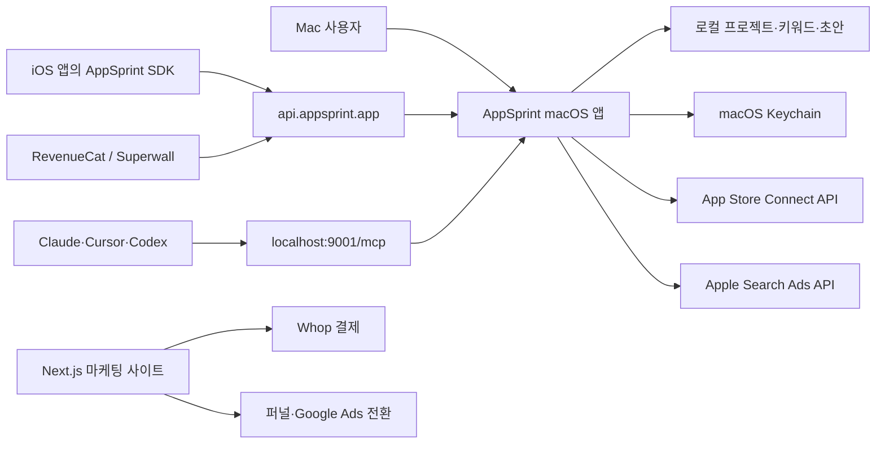
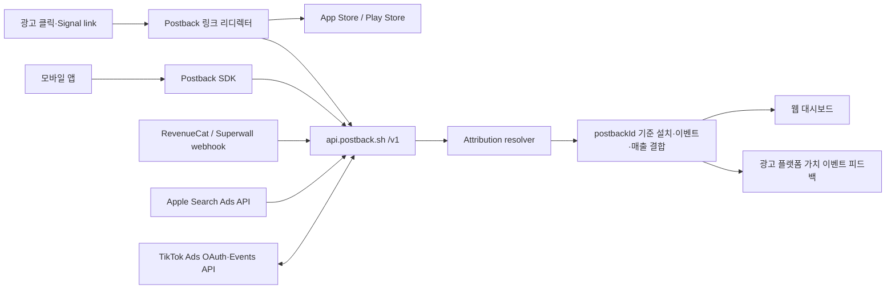

# AppSprint ASO + Postback 공개 블랙박스 리버스 엔지니어링

조사일: 2026-07-21  
대상: [AppSprint ASO](https://appsprint.app/), [Postback](https://postback.sh/)

## 0. 범위와 결론

이 보고서는 공개 페이지, 공식 문서·정책, 공개 API, 브라우저 DOM·네트워크, 공개 클라이언트 번들, GitHub·npm·pub.dev의 공식 배포물을 이용한 블랙박스 분석이다. AppSprint 약관이 금지하는 DMG 디컴파일, 라이선스·기기 제한 우회, 비공개 계정 접근은 하지 않았다.

핵심 결론은 다음과 같다.

1. 두 제품은 프랑스 `Tap & Swipe SAS`와 Arthur Spalanzani가 운영하는 같은 제품군이다.
2. AppSprint는 `키워드 발견 → 경쟁 난이도 판단 → 메타데이터 변경 → 순위·광고·매출 확인`을 한곳에 묶은 로컬 우선 macOS ASO 워크스테이션이다.
3. Postback은 AppSprint 안의 attribution 확장 경로에서 분리·리브랜딩된 웹 SaaS다. 기존 `appsprint.app/attribution/*`는 현재 `postback.sh/`로 리디렉션된다.
4. AppSprint의 강점은 민감 데이터를 Mac에 남기면서 Apple 작업과 로컬 MCP를 연결하는 의사결정 워크플로우다.
5. Postback의 강점은 `광고 클릭 → 설치 → 체험 → 구독·매출 → 광고 플랫폼 피드백`을 `postbackId`로 결합하고, 과금 단위를 유료 설치 수에 맞춘 점이다.
6. Postback은 제품·SDK가 매우 초기 단계다. 공개 랜딩의 앱 검색 401, 법적 페이지 오류, 가격 문서 불일치, SDK 프라이버시 선언 충돌이 관찰됐다.

## 1. 두 제품의 관계

| 항목 | AppSprint ASO | Postback |
|---|---|---|
| 핵심 고객 | 인디 iOS 앱 개발자·ASO 담당자 | 유료 획득을 운영하는 앱 창업자·소규모 팀 |
| 핵심 질문 | 어떤 키워드와 메타데이터를 바꿀까? | 어떤 광고가 실제 결제자를 만들었나? |
| 주 인터페이스 | macOS 앱 + 로컬 MCP + 공개 마케팅 사이트 | 웹 대시보드 + 모바일 SDK + 광고·매출 연동 |
| 가치 단위 | 키워드·국가·앱 단위 의사결정 | 유료 설치·구독·매출·ROAS |
| 데이터 경계 | 프로젝트·Apple 자격 증명·MCP 데이터는 로컬 우선 | 이벤트·설치·클릭·매출을 서버에서 결합 |
| 운영사 | Tap & Swipe SAS | Tap & Swipe SAS |

AppSprint의 `llms.txt`는 `/attribution/docs`를 “broader AppSprint attribution product”로 설명하지만, 해당 기존 URL들은 Postback 루트로 리디렉션된다. Postback의 `llms.txt`도 공개 제품명은 Postback이며 기존 SDK 심볼·`postbackId`·`api.postback.sh`는 호환성을 위해 유지한다고 명시한다. 제품적으로는 ASO 의사결정 도구와 MMP를 분리해 각각 더 선명한 카테고리로 판매하는 구조다.

## 2. AppSprint ASO

### 2.1 해결하는 일

AppSprint는 데이터 조회 도구보다 “다음 앱스토어 업데이트에서 무엇을 바꿀지” 결정하게 하는 도구다.

핵심 루프:

1. 앱과 국가를 선택한다.
2. 10~20개 시드 키워드를 넣는다.
3. 수요, 난이도, 현재 순위, 상위 앱 다운로드·MRR을 비교한다.
4. 경쟁 앱의 키워드·평점·스크린샷·국가별 강도를 확인한다.
5. title, subtitle, keyword field를 같은 화면에서 편집한다.
6. App Store Connect로 변경을 푸시한다.
7. 순위 이동과 Apple Ads의 spend·trial·revenue·ROAS를 확인한다.
8. 매주 소수의 키워드·스토어 에셋만 교체한다.

### 2.2 정보 구조와 기능 표면

| 영역 | 공개적으로 확인된 기능 |
|---|---|
| Keyword Research | popularity, difficulty, rank, top-5 downloads, top-5 MRR, country, top apps |
| AI Suggestions | 메타데이터 갭, 경쟁사 랭킹, 검색 수요를 이용한 후보 생성 |
| Competitor Analysis | 키워드, 국가별 순위, 유사 앱, 다운로드·매출 추정, 평점, 스크린샷 |
| Metadata Editor | App Store Connect 메타데이터 pull, 문자 수, 편집, push |
| Rank Tracking | 앱·국가별 키워드 순위 변화 |
| Apple Ads | 캠페인·키워드·입찰·예산·ROAS 분석과 제한된 쓰기 |
| Analytics | 설치, source, geography, D1/D7/D30 retention, trials, revenue |
| SDK | Apple Ads 설치 신호를 RevenueCat·Superwall 매출과 연결 |
| MCP | 38개 도구로 ASO·분석·광고를 읽고 계획하고 승인된 변경을 적용 |

### 2.3 공개 무료 도구의 역할

무료 키워드 체커는 SEO 획득과 제품 샘플을 동시에 담당한다. 실제 조회는 다음 공개 엔드포인트를 호출했다.

```text
GET /api/tools/app-keyword-checker?keyword=habit+tracker&country=us
```

응답은 다음 데이터 계약을 가진다.

```ts
type PublicKeywordEstimate = {
  keyword: string;
  country: string;
  popularityScore: number;
  difficultyScore: number;
  opportunityScore: number;
  intentLabel: string;
  competitionSummary: string;
  topApps: Array<{ name: string; iconUrl: string }>;
  relatedKeywords: string[];
  source: "public-estimate";
  lastUpdatedLabel: string;
};
```

표본 결과:

| 키워드 | Popularity | Difficulty | Opportunity | Intent |
|---|---:|---:|---:|---|
| habit tracker | 23 | 65 | 26 | Utility |
| budget planner | 63 | 19 | 71 | Finance |
| meditation | 45 | 25 | 58 | Wellness |
| photo editor | 61 | 51 | 60 | Creative |
| sleep sounds | 58 | 31 | 63 | Wellness |
| todo list | 50 | 36 | 56 | App Store search |

점수는 실제 Apple 지표라고 단정하지 않고 `public-estimate`, `Public rounded estimate`, `Refreshed daily`로 표시한다. 공개 도구는 상위 앱 이름·아이콘과 휴리스틱 점수만 보여주고, 다운로드·MRR 숫자는 유료 앱 안으로 남긴다.

### 2.4 MCP가 만드는 제품 차별점

로컬 MCP 엔드포인트는 다음과 같다.

```text
http://localhost:9001/mcp
```

도구는 세 층으로 나뉜다.

- Read: 앱·키워드·순위·메타데이터·스크린샷·분석·Apple Ads 상태.
- Plan: 안전 기본값, 공식, 진단, 입찰 제안, 캠페인 dry-run.
- Write: 키워드 제거, 메타데이터·스크린샷 변경, 광고 캠페인·입찰·예산 변경.

주요 가드레일:

- 쓰기는 기본 dry-run이며 diff를 먼저 반환한다.
- App Store와 광고 변경은 명시적 confirmation이 필요하다.
- 예산 쓰기는 `max_daily_budget`가 필요하다.
- 예산 증액은 별도 승인 없이는 차단된다.
- 기본 캠페인은 Search Results, 국가별 분리, Exact Match, Search Match off다.

이 구조의 핵심은 “AI에게 데이터만 보여주는 것”이 아니라, 읽기·계획·쓰기의 권한 경계를 제품 자체가 정의했다는 점이다.

### 2.5 기술 구조



확인된 구현 단서:

- 마케팅 사이트: Next.js App Router/RSC, React, Turbopack 청크, Cloudflare 프록시.
- CSP의 API 허용 대상: `api.appsprint.app`.
- 체크아웃: `POST /api/aso/whop-checkout` → Whop URL 반환.
- 마케팅 이벤트: `POST /api/marketing/funnel`.
- 퍼널 식별자: visitor ID, session ID, referrer, UTM, gclid·gbraid·wbraid.
- 실험: `no_trial`/`trial_14d`, `competitor_map`/`analytics_map` 변형.
- 민감 ASO 데이터·Apple 키·캠페인 데이터는 정상 앱 흐름에서 서버로 보내지 않는 로컬 우선 설계.
- App Store Connect `.p8` 자격 증명과 Apple Ads private key는 Mac의 Keychain·로컬 저장소에 둔다.
- AppSprint 서버는 공개 정책상 Whop, Cloudflare, Neon/PostgreSQL, Plunk, SES, Google Ads, Sentry를 사용한다.

### 2.6 가격과 성장 루프

| 플랜 | 월 | 연 | 경계 |
|---|---:|---:|---|
| Solo | $29 | $174 | 1 app |
| Pro | $49 | $294 | Unlimited apps |

성장 구조:

- Acquisition: 무료 키워드·경쟁 앱·로컬라이제이션 도구, 블로그, 비교·대안 SEO, Google Ads, 50% affiliate.
- Activation: 첫 앱 추가 → 키워드 10개 → 현실적인 타깃 5개 → 경쟁 니치 확인.
- Retention: 주간 순위·메타데이터·광고 루틴.
- Expansion: 1개 앱에서 다중 앱, Apple Ads·SDK·RevenueCat·MCP로 확장.
- Moat: 로컬 민감 데이터 + Apple 작업 실행 + 의사결정 문맥 + AI agent write guardrail의 결합.

### 2.7 약점과 리스크

1. 기능 범위가 키워드, 경쟁사, 메타데이터, 광고, 분석, SDK, MCP까지 넓어 초보자의 첫 성공 경로가 흐려질 수 있다.
2. 다운로드·매출·난이도는 추정치다. 유료 화면에서 추정 신뢰도·업데이트 시점이 충분히 명확해야 한다.
3. MCP 쓰기 도구는 편리하지만 Apple 메타데이터·광고비를 실제로 변경하므로 감사 로그와 승인 UX가 핵심이다.
4. 로컬 우선 구조는 보안에 유리하지만 Mac 분실·삭제 시 복구가 어렵고 다중 기기·팀 협업에는 약하다.
5. 랜딩의 사용자 수가 홈 591명, 일부 기능 페이지 544명으로 달라 마케팅 데이터 동기화가 느슨하다.

## 3. Postback

### 3.1 해결하는 일

Postback은 “싸게 설치된 사용자”가 아니라 “실제로 결제한 사용자”를 광고 플랫폼이 학습하게 하는 소규모 팀용 MMP다.

핵심 루프:

1. 앱을 만든다.
2. SDK API key를 복사해 앱 시작 시 `configure()`한다.
3. 설치와 표준·커스텀 이벤트를 전송한다.
4. RevenueCat 또는 Superwall에 `postbackId`를 사용자 속성으로 넣는다.
5. Apple Search Ads 또는 TikTok을 연결한다.
6. 광고 클릭·설치·trial·purchase·renewal·refund를 한 사용자·캠페인에 연결한다.
7. 캠페인·국가·키워드·링크별 ROAS를 비교한다.
8. 지원 채널에 가치 이벤트를 다시 보내 광고 학습을 개선한다.

### 3.2 공개 데모에서 확인한 대시보드 IA

| 화면 | 핵심 내용 |
|---|---|
| Overview | paid installs, trials, spend, revenue, ROAS, source 비중, 캠페인 랭킹 |
| Users | postback ID, source, country, latest event, revenue |
| Signal links | link name, channel, clicks, installs, revenue |
| Live events | install, trial, subscription, renewal 이벤트 스트림 |

랜딩의 인터랙티브 데모는 실제 API 호출 없이 클라이언트 로컬 상태로 네 개 화면을 전환한다. 가입 전 가치 이해를 돕는 “제품을 닮은 설명서” 역할이다.

### 3.3 SDK 데이터 계약

공통 설정:

```ts
type PostbackConfig = {
  apiKey: string;
  apiUrl?: "https://api.postback.sh";
  enableAppleAdsAttribution?: boolean;
  customerUserId?: string | null;
  autoTrackSessions?: boolean;
  autoRefreshAttribution?: boolean;
  isDebug?: boolean;
  logLevel?: number;
};
```

주요 이벤트:

```text
session_start, login, sign_up, register, purchase, subscribe,
start_trial, add_payment_info, add_to_cart, add_to_wishlist,
initiate_checkout, view_content, view_item, search, share,
tutorial_complete, achieve_level, level_start, level_complete, custom
```

어트리뷰션 결과:

```ts
type AttributionResult = {
  source: "apple_ads" | "tracking_link" | "organic";
  isAttributed: boolean;
  matchType:
    | "apple_ads" | "idfa" | "idfv" | "gaid"
    | "ttclid" | "gclid" | "gbraid" | "wbraid"
    | "ip_user_agent" | "organic";
  campaignName?: string;
  link?: { id: string; name: string };
  appleAds?: {
    campaignId?: string;
    adGroupId?: string;
    keywordId?: string;
    countryOrRegion?: string;
    conversionType?: string;
  };
  utmSource?: string;
  utmMedium?: string;
  utmCampaign?: string;
};
```

신뢰성 설계:

- `configure()`는 로컬 상태 복원 후 빨리 반환하고 설치 등록은 백그라운드에서 수행한다.
- 이벤트는 iOS UserDefaults·Android SharedPreferences에 최대 100개 큐잉된다.
- configure, 새 이벤트, lifecycle flush, 수동 `flush()`에서 재시도한다.
- 401/403이면 SDK를 비활성화하고 큐를 지운다.
- `refreshAttribution()`은 `install_not_found` 404에서 설치 등록을 다시 수행한다.
- session은 기본 30분 debounce다.
- Apple AdServices의 늦은 해석을 위해 iOS는 약 75초 뒤 재조회한다.

### 3.4 서버 결합 구조



가능성이 높은 resolver 우선순위는 공개 `matchType` 목록과 문서상 동작을 기준으로 다음과 같이 추정할 수 있다.

1. Apple AdServices token.
2. 광고 식별자(IDFA·GAID) 또는 기기 IDFV.
3. 네트워크 click ID(ttclid·gclid·gbraid·wbraid).
4. Signal link가 저장한 캠페인·UTM·브라우저 클릭 정보.
5. IP + User-Agent 시간창 매칭.
6. 매칭 실패 시 organic.

이는 소스 코드로 확인한 순서가 아니라 공개 필드와 공식 설명을 조합한 추론이다.

### 3.5 광고·매출 연동

Apple Search Ads:

- SDK가 AdServices token을 자동 수집한다.
- install에 orgId, campaignId, adGroupId, keywordId, country, conversionType 등이 붙는다.
- 별도 API 인증은 spend, taps, impressions와 사람이 읽는 캠페인·키워드 이름을 보강한다.

RevenueCat:

```text
POST https://api.postback.sh/v1/integrations/revenuecat/webhooks/{appId}
Authorization: Bearer {revenuecatWebhookToken}
```

- RevenueCat subscriber attribute에 `postbackId`만 넣어 설치와 구독 이벤트를 연결한다.
- sandbox webhook은 연결 검증만 하고 실제 어트리뷰션·광고 전환은 만들지 않는다.

TikTok:

- Postback Signal link를 TikTok 광고의 Website URL로 사용한다.
- OAuth는 광고주·리포트 읽기, Pixel ID·Events API token은 서버 이벤트 전송에 사용한다.
- 현재는 TikTok Web Events API를 사용하며 App Promotion Events API가 아니다.
- Purchase·Subscribe는 Sales, StartTrial·Sign-up은 Lead generation 목적에 맞춘다.

### 3.6 웹·인프라 구조

확인된 단서:

- 마케팅·로그인·대시보드 셸: Next.js App Router/RSC, React Server Actions, Turbopack.
- 인증 UI: Google·GitHub OAuth. 구체적인 auth 라이브러리는 공개 클라이언트 코드만으로 확인되지 않았다.
- 호스팅 경계: Cloudflare 프록시, HSTS, CSP.
- API: `api.postback.sh`, REST `/v1/`.
- 사이트 분석: Cloudflare Insights, `taap.it/scripts/tracker.js`, `ingest.tapp.it`.
- 운영 상태 페이지: Dashboard 99.87%, API 100% 90일 수치와 worker health route.
- SDK 배포: iOS XCFramework, React Native/Expo native bridge, Flutter method channel, Android AAR.
- 2026-07-17 기준 공개 SDK 1.0.0이 처음 배포된 매우 초기 제품이다.

### 3.7 가격 모델

현재 랜딩의 월별 가격 배열은 클라이언트 번들에 명시되어 있다.

| 월 유료 설치 | Starter | Growth |
|---:|---:|---:|
| 200 | $9 | $19 |
| 500 | $19 | $39 |
| 1,000 | $35 | $69 |
| 2,500 | $69 | $139 |
| 5,000 | $119 | $239 |
| 10,000 | $199 | $399 |
| 25,000 | $349 | $699 |
| 50,000 | $549 | $1,099 |
| 100,000 | $799 | $1,599 |

- Starter: 1 app, Apple Search Ads. TikTok과 priority support는 제외.
- Growth: unlimited apps, Apple Search Ads, TikTok, priority support.
- organic installs와 이벤트는 무제한이며 과금 단위는 paid installs다.
- yearly는 “2 months free”를 내세운다.

이 과금은 고객이 광고를 확대해 유료 설치가 늘 때 매출도 함께 늘어나는 value metric 구조다.

### 3.8 관찰된 결함·리스크

#### P0 — 법적·프라이버시 표면 오류

- `/privacy`, `/terms`, `/gdpr`가 브라우저와 Firecrawl에서 오류 또는 빈 화면을 반환했다.
- 랜딩 footer는 세 페이지를 정상 링크한다.
- status 페이지는 모든 시스템 정상으로 표시해 이 사용자 경로를 감시하지 않는 것으로 보인다.

#### P0 — SDK 프라이버시 선언 충돌

- 공식 iOS GitHub README는 `DeviceID`, `ProductInteraction`, `UserID`, `CoarseLocation`, `OtherDataTypes`를 Linked·Tracking으로 선언하고 `NSPrivacyTracking: true`, tracking domain `api.postback.sh`라고 설명한다.
- 같은 1.0.0의 npm·pub.dev README는 같은 데이터 종류를 나열하지만 `Tracking: false`, core API domain을 tracking domain으로 선언하지 않는다고 설명한다.
- 실제 XCFramework의 `PrivacyInfo.xcprivacy`와 App Store privacy answers를 기준으로 하나의 정본을 즉시 확정해야 한다.

#### P1 — 공개 랜딩 앱 검색 실패

- 홈의 “Search for your iOS app” 입력은 `GET /api/dashboard/app-store-search?q=Finch&limit=5`를 호출했다.
- 비로그인 상태에서 401을 반환해 UI에 “The App Store did not respond. Try again.”이 표시됐다.
- 인증이 필요한 기능이라면 입력 전에 로그인 요구를 명확히 해야 하고, 공개 검색이 의도라면 endpoint scope를 분리해야 한다.

#### P1 — 가격 문서 드리프트

- 현재 랜딩은 200~100,000 paid installs의 Starter/Growth 가격표다.
- 현재 `llms.txt`는 Free $0, Pro $149 + $0.04/install, Enterprise를 설명한다.
- AI 검색·에이전트가 오래된 가격을 답할 가능성이 높다.

#### P1 — 제품 주장과 구현 범위의 긴장

- “ATT 없이 유용하다”는 주장은 맞지만, SDK matchType과 공식 프라이버시 설명에는 IDFA·IDFV·GAID·IP/UA가 포함된다.
- TikTok은 현재 Web Events API 경로라 일반적인 앱 이벤트 최적화와 동일하지 않다.
- `90%+ match accuracy`는 랜딩 주장으로 보이며 계산 방법·표본·신뢰구간 공개가 없다.

#### P2 — 초기 성숙도

- SDK 1.0.0은 조사일 기준 2~3일 전에 배포됐다.
- 공개 iOS release asset 다운로드 수는 매우 작고, React Native·Flutter 패키지도 첫 버전이다.
- API 안정성보다 문서·프라이버시·마이그레이션 정합성에 먼저 회귀 테스트가 필요하다.

## 4. 제품 전략 비교

| 축 | AppSprint | Postback |
|---|---|---|
| 첫 가치 | 키워드 하나의 기회·난이도 판정 | 광고 하나의 설치·매출 연결 |
| 활성화 난이도 | 낮음: 앱·키워드만 추가 | 중간: SDK·webhook·광고 계정 필요 |
| 핵심 재방문 | 주간 ASO 업데이트 | 실시간 이벤트·주간 광고 최적화 |
| 전환 장치 | 무료 도구에서 상세 수치·편집 기능 잠금 | 인터랙티브 데모 + 14일 trial |
| 확장 장치 | 앱 수, Apple Ads, SDK, MCP | paid installs, 앱 수, ad network 수 |
| 데이터 모트 | Apple·키워드·메타데이터 문맥의 결합 | 클릭·설치·매출·피드백 identity graph |
| 가장 큰 위험 | 기능 과밀·Apple API 의존·로컬 복구 | 프라이버시·정합성·초기 SDK 신뢰 |

## 5. 재구현 청사진

### 5.1 AppSprint형 제품을 만든다면

1단계 — 1~2주:

- 공개 키워드 체커 하나.
- 앱·국가·키워드 입력.
- 수요·난이도·상위 앱·관련 키워드.
- 점수 출처와 추정치 라벨.

2단계 — 4~8주:

- 사용자 앱·키워드 저장.
- 순위 이력과 경쟁 앱 비교.
- 메타데이터 편집·문자 수·중복 키워드 검사.
- App Store Connect는 read-only부터.

3단계 — 8주 이상:

- Apple Ads, RevenueCat, attribution SDK.
- 메타데이터·스크린샷 write와 광고 write.
- MCP는 read → dry-run plan → confirmed write 순으로 개방.

처음부터 38개 MCP 도구와 광고 쓰기를 만들면 핵심 가치 검증 전에 보안·권한·예외 처리 범위가 폭발한다.

### 5.2 Postback형 제품을 만든다면

1단계 — 단일 채널:

- iOS + Apple Search Ads만 지원.
- install registration, AdServices token, event queue.
- `postbackId`와 RevenueCat webhook join.
- campaign·keyword별 installs, trials, revenue, ROAS.

2단계 — Signal link:

- redirect endpoint와 click ID·UTM 저장.
- app store redirect, IP/UA 시간창 매칭.
- user history와 live event stream.

3단계 — 피드백:

- TikTok 또는 Meta 한 채널만 추가.
- 이벤트 mapping, dedupe, retry, dead-letter, outbound audit log.
- privacy manifest·consent·삭제·retention 정책을 코드와 문서의 단일 정본으로 생성.

4단계 — 멀티플랫폼:

- native engine을 먼저 안정화한 후 RN·Flutter는 얇은 bridge로 배포.
- SDK contract test와 실제 배포 artifact의 privacy manifest 검증을 릴리즈 게이트로 둔다.

## 6. 오늘 해볼까에 적용할 것

### 가져올 패턴

1. **가치 먼저, 로그인 나중**: AppSprint 무료 체커처럼 첫 판단 결과를 공개하고 더 깊은 저장·추적·실행에서 로그인한다.
2. **제품을 닮은 랜딩 데모**: Postback 데모처럼 결과·이력·실시간 반응 화면을 가입 전에 직접 전환해 보게 한다.
3. **판정 → 근거 → 다음 행동**: 점수만 주지 말고 왜 이 아이디어가 지금 맞는지, 바로 무엇을 할지를 한 화면에 묶는다.
4. **로컬·민감 데이터 경계**: AI·외부 API를 붙일 때 읽기·계획·쓰기와 확인 절차를 분리한다.
5. **가치와 연결된 과금 단위**: 생성 횟수보다 실제 발행·검증·외부 반응처럼 사용자가 얻는 결과에 가까운 단위를 찾는다.
6. **SEO용 작은 도구**: “아이디어 조합 점검”, “검증 질문 생성”, “공유 문구 점검” 같은 한 가지 무료 도구로 진입점을 만든다.

### 피할 패턴

1. 공개 CTA가 인증 endpoint를 호출해 실패하는 흐름.
2. 가격·LLM 문서·랜딩이 서로 다른 상태.
3. 법적·프라이버시 페이지를 status monitor에서 제외하는 것.
4. SDK·분석·광고·MCP를 핵심 루프 검증 전에 동시에 만드는 것.
5. “정확도 90%+”처럼 방법론 없는 숫자를 신뢰의 핵심 증거로 쓰는 것.

## 7. 근거 링크

AppSprint:

- [홈](https://appsprint.app/)
- [Start Guide](https://appsprint.app/docs)
- [MCP](https://appsprint.app/docs/mcp)
- [SDK](https://appsprint.app/docs/sdks)
- [App Store Connect](https://appsprint.app/docs/app-store-connect)
- [Apple Search Ads](https://appsprint.app/docs/apple-ads)
- [Privacy](https://appsprint.app/privacy)
- [Terms](https://appsprint.app/terms)
- [최신 macOS 릴리스 v1.6.13](https://github.com/dev-err418/app-sprint-aso-releases/releases/tag/v1.6.13)

Postback:

- [홈](https://postback.sh/)
- [Docs](https://postback.sh/docs)
- [iOS SDK](https://postback.sh/docs/ios-swift)
- [RevenueCat](https://postback.sh/docs/revenuecat)
- [Apple Search Ads](https://postback.sh/docs/apple-search-ads)
- [TikTok Ads](https://postback.sh/docs/tiktok-ads)
- [Status](https://postback.sh/status)
- [iOS SDK GitHub](https://github.com/getpostback/postback-ios-sdk)
- [React Native npm](https://www.npmjs.com/package/postback-react-native)
- [Flutter pub.dev](https://pub.dev/packages/postback_flutter)

