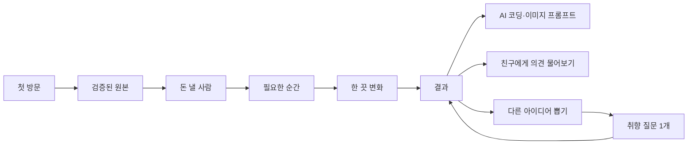
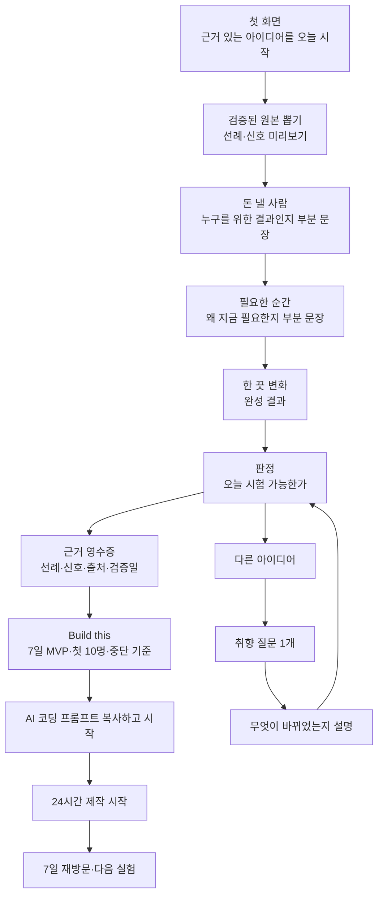

# 오늘 해볼까 — Aha Moment와 JTBD 재설계

결론: **카드 네 장을 완성하는 순간이 아니라, 실제 선례가 있는 아이디어를 내 조건에 맞는 7일 실험으로 바꾸고 첫 제작 행동을 시작하는 순간**을 Aha Moment 후보로 삼는다.

## 1. 새 Aha Moment 정의

### 사용자가 느끼는 Aha

> “이건 랜덤 아이디어가 아니다. 실제로 쓰인 원본과 내 조건을 근거로, 오늘 시작할 만큼 작게 줄인 실험이다.”

### 측정 가능한 Activation 후보

```text
첫 방문 사용자가 10분 안에
근거가 포함된 결과 1개를 이해하고
AI 코딩 프롬프트 또는 7일 실행 브리프를 1회 복사한다.
```

- 현재 `idea_result_viewed`는 결과가 보였다는 뜻일 뿐 Aha의 증거가 아니다.
- 현재 존재하는 `idea_prompt_copied` 중 `artifact_type=development`가 가장 가까운 행동 프록시다.
- 진짜 가치 검증은 24시간 안의 제작 시작과 7일 안의 재방문·두 번째 실행으로 확인한다.
- 행동과 리텐션의 연관을 확인하기 전에는 이를 확정된 Aha라고 부르지 않는다.

### 세 층을 구분한다

| 층 | 사용자 경험 | 측정 후보 |
|---|---|---|
| Wow | “내 상황에 맞는 결과가 나왔다” | 결과를 자기 말로 설명 |
| Activation | “이걸 오늘 시작할 수 있다” | 개발 프롬프트·7일 실행안 복사 |
| Retained value | “다음 아이디어도 여기서 좁히고 싶다” | 7일 재방문, 두 번째 실행안 사용 |

## 2. 현재 앱에서 확인된 사실

[현재 Idea Lab 구현](../../../src/components/organisms/idea-lab/idea-lab.tsx)은 다음 순서다.



### 잘하고 있는 것

- 로그인 없이 네 장과 결과·제작 자료를 모두 볼 수 있다.
- 카드가 `검증된 원본 → 돈 낼 사람 → 필요한 순간 → 한 끗 변화`로 구성돼 있다.
- 결과에 타겟, 원본과의 차이, 전체 플로우, 오늘 시작할 첫 단계가 있다.
- AI 코딩 프롬프트·이미지 프롬프트·전체 브리프를 바로 복사할 수 있다.
- 다시 뽑기는 여러 질문을 강제하지 않고 추상 취향 질문 하나만 묻는다.
- 결과 선택 ID를 기기에 자동 보존하므로 로그인 전 가치가 사라지지 않는다.

### Aha를 약하게 만드는 지점

1. 네 장을 모두 뽑기 전에는 완성될 아이디어의 의미가 거의 보이지 않는다.
2. `검증된 원본`이라는 이름은 있지만 결과 화면에 선례·신호·출처·검증일이 영수증처럼 보이지 않는다.
3. 결과의 가장 강한 하단 CTA가 제작 시작이 아니라 `친구에게 의견 물어보기`다.
4. 이미 자동 저장되는데 `이 기기에 결과 저장` 버튼이 별도 행동으로 남아 CTA 위계를 분산한다.
5. `오늘 시작`은 한 줄로만 표시되고, 7일 MVP·첫 10명·중단 기준까지 연결되지 않는다.
6. 결과 조회 이벤트는 있지만 “이해했다”와 “실제로 시작했다”는 아직 구분하지 못한다.

### 이번 설계에서 실제로 확인한 범위

- 2026-07-21 현재 프로덕션 빌드가 성공했다.
- [Idea Lab E2E](../../../tests/e2e/idea-lab.spec.ts)의 `첫 카드 → 네 장 완성 → 결과 조회` 퍼널이 실제 Chromium에서 통과했다.
- [반응형 회귀 E2E](../../../tests/e2e/responsive-and-regression.spec.ts)의 `다시 뽑기 → 취향 질문 1개 → 새 결과` 흐름이 실제 Chromium에서 통과했다.
- Mobbin 합성 이미지 네 장은 로컬 OCR로 `START → CHOICE/INPUT/TOUR → RESULT/CORE ACTION` 순서와 핵심 문구를 다시 확인했다.
- 아직 실제 사용자 24시간 제작 시작과 7일 리텐션은 검증하지 않았다. 따라서 아래 Aha는 **검증할 후보**다.

## 3. 다각도 JTBD

### 핵심 JTBD

> 무언가 만들어보고 싶지만 무엇을 고르고 어디까지 줄여야 할지 모를 때, 실제 선례와 내 조건을 이용해 아이디어 하나를 믿을 수 있는 7일 실험으로 바꿔줘. 더 찾아보지 않고 오늘 첫 제작 행동을 시작하고 싶다.

### JTBD의 여섯 면

| 관점 | 사용자가 고용하는 일 |
|---|---|
| 기능적 | 수많은 후보를 실제 선례가 있는 아이디어 하나와 7일 MVP로 좁힌다. |
| 감정적 | “아무거나 고른 건 아닐까?”라는 불안을 줄이고 오늘 시작할 자신감을 얻는다. |
| 사회적 | 친구·동료에게 아이디어가 왜 말이 되는지 근거와 함께 설명한다. |
| 정체성 | 아이디어만 모으는 사람이 아니라 작은 실험을 끝내는 빌더가 된다. |
| 전환 | ChatGPT 브레인스토밍·메모·검색 탭을 오가는 대신 한 결과에서 결정과 실행을 끝낸다. |
| 회피 | 아이디어 100개, 긴 창업 강의, 근거 없는 AI 점수, 거대한 PRD는 원하지 않는다. |

### 상황별 JTBD

| 상황 | 사용자의 진전 | 성공의 모습 | 주요 불안 |
|---|---|---|---|
| 아이디어가 전혀 없음 | 내 생활과 역량에 맞는 후보 하나 발견 | 결과를 자기 말로 설명 | 또 뻔한 AI 아이디어일까 |
| 후보가 너무 많음 | 비교를 멈추고 하나 선택 | 다른 후보를 더 찾지 않고 실행안 열기 | 더 좋은 걸 놓칠까 |
| 아이디어는 있지만 큼 | 입력 1개→처리 1회→결과 1개로 축소 | 7일 MVP 범위가 한 문장 | 만들다 끝나지 않을까 |
| 근거가 부족함 | 실제 선례와 신호 확인 | 출처를 열거나 타인에게 설명 | 돈 되는 척 꾸민 정보일까 |
| 시작 방법을 모름 | 첫 10명·중단 기준·첫 작업 확보 | 프롬프트 복사 후 제작 시작 | 무엇부터 해야 할까 |
| 다시 방문함 | 기억된 취향으로 다음 실험을 더 빨리 선택 | 질문 1개 뒤 새 결과 사용 | 처음부터 다시 해야 할까 |

### 사용자를 움직이는 힘

| 힘 | 내용 |
|---|---|
| Push | 만들고 싶지만 검색·비교·범위 결정에 시간을 잃는다. |
| Pull | 검증 원본, 내 조건, 7일 실행안이 한 결과에 모인다. |
| Anxiety | 근거가 약하거나 실행 범위가 여전히 크면 믿지 못한다. |
| Habit | ChatGPT에 다시 묻거나 아이디어 목록을 계속 구경한다. |

따라서 경쟁 상대는 다른 아이디어 생성기만이 아니다. **계속 검색하기, ChatGPT에 다시 묻기, 메모만 쌓기, 시작을 다음 주로 미루기**가 더 직접적인 대안이다.

## 4. 실제 앱 흐름에서 가져온 결정

### Duolingo — 선택이 출발점을 바꾼다


- 흐름: 시작 → 목표 선택 → 선택이 반영된 출발점
- 관찰: 질문을 받는 데서 끝나지 않고 결과가 어떻게 달라졌는지 돌려준다.
- 적용: 두 번째 카드부터 현재 조합이 만드는 부분 결과를 한 문장으로 보여준다.
- 제외: 결과 전에 긴 질문 흐름을 추가하지 않는다.
- 출처: [Mobbin flow](https://mobbin.com/flows/b0b4f93f-5637-46ec-9d77-49ecda6b991d)

### Headspace — 답변을 이름 붙은 결과로 돌려준다


- 흐름: 짧은 체험 → 입력 → 이름이 붙은 개인화 결과
- 관찰: 입력을 수집했다는 사실보다 “당신은 이런 유형”이라는 해석을 먼저 준다.
- 적용: 결과에 `왜 이 결과가 나왔는지`를 네 카드와 취향 답변으로 설명한다.
- 제외: 개인화 결과 전에 가입이나 결제를 요구하지 않는다.
- 출처: [Mobbin flow](https://mobbin.com/flows/31b21791-dec6-448a-8253-648f5ebbba3e)

### ChatGPT — 교육은 선택 사항, 핵심 행동은 즉시


- 흐름: 환영 → 선택적 투어 → 핵심 입력 화면
- 관찰: 짧은 예시와 `Skip Tour`가 공존하고 결국 핵심 입력으로 이동한다.
- 적용: 카드 설명은 유지하되 별도 온보딩은 만들지 않고 첫 뽑기를 즉시 가능하게 한다.
- 제외: 여러 장의 설명 화면을 핵심 행동 앞에 강제하지 않는다.
- 출처: [Mobbin flow](https://mobbin.com/flows/dbfbb3db-6c4e-4e3f-93c9-f668698b7f0c)

### Life Reset — 질문이 구체적인 판정으로 끝난다


- 흐름: 질문 안내 → 입력과 기대 형성 → 답변 기반 결과
- 관찰: 질문 완료 축하보다 답변을 해석한 판정이 먼저 나온다.
- 적용: 네 장 완성 뒤 `판정 → 근거 → 다음 행동` 순서로 결과를 구성한다.
- 제외: 긴 설문과 근거 없는 성공 확률 점수는 사용하지 않는다.
- 출처: [Mobbin flow](https://mobbin.com/flows/e91bc9a4-db92-449a-8de2-2d5e81381f6b)

## 5. 지정 작업에서 가져온 제품 패턴

지정한 Codex 작업 `019f8013-d288-79a0-b369-84c582b21bb6`은 AppSprint·Postback·Starter Story를 실제 공개 흐름으로 역분석한 작업이다.

### AppSprint·Postback

[통합 분석](../appsprint-postback/SUMMARY.md)에서 가져올 핵심은 다음이다.

- 첫 판단 가치는 로그인 전에 제공한다.
- 기능 설명 대신 제품을 닮은 체험을 제공한다.
- 결과는 `판정 → 근거 → 다음 행동` 순서로 보여준다.
- 읽기·계획·쓰기 권한을 나누고 민감한 행동 전에 확인한다.
- 생성 횟수보다 실제 발행·검증 같은 결과에 가까운 가치를 본다.

### Starter Story

[통합 분석](../starter-story/SUMMARY.md)에서 가져올 핵심은 다음이다.

- 아이디어를 같은 스키마로 비교할 수 있어야 한다.
- 실제 선례·사용/수익 신호·출처·검증일을 evidence receipt로 묶는다.
- `Build this`는 아이디어 감상이 아니라 7일 MVP·첫 10명·중단 기준으로 연결된다.
- 자연어 질문은 구조화된 데이터 위에 얹는다.
- 데이터→행동이 검증되기 전에 Academy·커뮤니티를 만들지 않는다.

## 6. 제안하는 새 흐름



### 단계별 설계

#### 1. 첫 화면 — 설명이 아니라 약속

```text
실제로 쓰인 제품 원본을
내 조건에 맞는 7일 MVP로 바꿔보세요.

[첫 카드 뽑기]
```

- 별도 온보딩 화면을 만들지 않는다.
- 현재 카드 덱 인터랙션은 제품의 정체성으로 유지한다.
- 첫 CTA는 그대로 핵심 행동인 카드 뽑기다.

#### 2. 카드 진행 — 완성 전에도 의미를 돌려준다

| 카드 | 즉시 돌려줄 부분 결과 |
|---|---|
| 검증된 원본 | `{원본명}의 입력→결과 흐름에서 시작합니다.` |
| 돈 낼 사람 | `{대상}이 반복해서 겪는 문제로 좁혔어요.` |
| 필요한 순간 | `{순간}에 바로 찾게 될 제품이에요.` |
| 한 끗 변화 | `원본은 유지하고 {변화} 하나만 바꿨어요.` |

`읽었어요 · 다음 카드`는 유지하되 사용자가 무엇을 만들고 있는지 상단에서 계속 합성해 보여준다.

#### 3. 결과 상단 — 판정

```text
오늘 시험할 수 있는 아이디어예요

{제품명}
{누가, 언제, 무엇을 얻는지 한 문장}

당신의 네 장이 이렇게 반영됐어요.
```

“성공 확률 92%”처럼 검증할 수 없는 점수는 쓰지 않는다.

#### 4. Evidence receipt — 근거

```text
실제 선례        {원본 제품}
확인된 신호      실제 사용 또는 결제 근거 1개
보존한 엔진      입력 → 처리 → 결과
바꾼 것          한 끗 변화 1개
출처             2개
마지막 확인      YYYY-MM-DD
```

현재 100개 원본과 100/100으로 연결된 리서치 링크를 새로운 대형 데이터베이스 없이 재사용한다.

#### 5. Build this — 다음 행동

```text
오늘 30분       첫 입력 1개 준비
7일 MVP         입력 1개 → 처리 1회 → 결과 1개
첫 10명         어디에서 누구에게 보여줄지
중단 기준       어떤 반응이면 더 만들지 않을지
도구·비용       필요한 도구와 범위
```

현재 `전체 플로우`와 AI 코딩 프롬프트 사이에 이 블록을 넣어 영감에서 실행으로 연결한다.

#### 6. CTA 위계 — 공유보다 시작

1. **Primary:** `AI 코딩 프롬프트 복사하고 시작`
2. **Secondary:** `7일 실행안 복사`
3. **Tertiary:** `친구에게 의견 물어보기`
4. **Tertiary:** `다른 아이디어 뽑기`

결과는 이미 기기에 자동 보존되므로 별도 `이 기기에 결과 저장` 버튼은 상태 문구 `이 기기에 자동 저장됨`으로 축소한다.

#### 7. 다시 뽑기 — 질문의 효용을 설명

현재처럼 질문은 정확히 하나만 묻는다. 새 결과가 나오면 다음 한 줄을 추가한다.

```text
“다음 행동을 정해주는 판단”을 골라
결과물 생성형보다 분석·추천형 아이디어를 우선했어요.
```

사용자는 질문이 실제로 무엇을 바꿨는지 확인할 수 있어야 한다.

#### 8. 로그인 — 가치 뒤의 동기

- 첫 결과·근거·7일 실행안·프롬프트는 익명으로 제공한다.
- 로그인은 여러 기기 동기화, 실행 기록, 7일 후 회고가 필요할 때만 요청한다.
- 로그인 실패가 현재 결과와 제작 자료를 지우지 않는 기존 계약을 유지한다.

## 7. 정보 위계

| 순서 | 사용자가 답해야 하는 질문 | 화면 요소 |
|---|---|---|
| 1 | 이 아이디어는 무엇인가? | 이름, 문제 질문, 전후 변화 |
| 2 | 왜 나에게 맞는가? | 네 카드와 취향 답변 반영 설명 |
| 3 | 왜 믿을 수 있는가? | evidence receipt |
| 4 | 어디까지 만들면 되는가? | 7일 MVP |
| 5 | 누구에게 보여줄 것인가? | 첫 10명 경로 |
| 6 | 언제 그만둘 것인가? | 중단 기준 |
| 7 | 지금 무엇을 누를 것인가? | 제작 프롬프트 복사 |

## 8. 측정 설계

### 기존 이벤트로 바로 볼 수 있는 것

| 이벤트 | 의미 | Aha 증거 여부 |
|---|---|---|
| `idea_first_card_drawn` | 핵심 행동 시작 | 전 단계 |
| `idea_four_cards_completed` | 조합 완료 | 메커니즘 완료 |
| `idea_result_viewed` | 결과 노출 | 부족 |
| `idea_prompt_copied` | 실행 자료 사용 | Activation 후보 |
| `idea_voluntary_share` | 타인 검토 요청 | 보조 가치 |
| `idea_reroll_started` | 첫 결과 불만족 또는 탐색 지속 | 해석 필요 |

### 추가할 이벤트

| 이벤트 | 발생 조건 |
|---|---|
| `idea_evidence_viewed` | 근거 영수증이 의미 있게 노출됨 |
| `idea_build_plan_viewed` | 7일 MVP·첫 10명·중단 기준이 노출됨 |
| `idea_first_action_started` | 복사만으로 자동 기록하지 않고, 제작 링크 이동 또는 사용자의 명시적 `시작했어요` 확인 |
| `idea_returned_to_result_24h` | 같은 결과를 24시간 안에 다시 엶 |
| `idea_returned_to_build_7d` | 7일 안에 실행안 또는 두 번째 결과를 다시 사용함 |

이벤트 이름보다 먼저 `대상·행동·시간·분모`를 고정한다.

### 1차 성공 기준

[기존 7일 검증 계획](../../dev/experiments/idea-lab/anonymous-value-first-validation-2026-07-20.md)의 두 집단 12명을 유지한다.

- 12명 중 10명 이상 결과 도달
- 12명 중 8명 이상 타겟·필요 순간·한 끗을 자기 말로 설명
- 12명 중 5명 이상 24시간 안에 프롬프트 사용 또는 제작 시작
- 아이디어가 없는 집단과 아이디어를 못 좁히는 집단을 따로 해석

표본 12명의 비율은 시장 전체 전환율로 일반화하지 않는다.

### Aha 후보를 확정하는 조건

1. 프롬프트 복사가 결과 조회보다 먼저 일어나고 실제 제작으로 이어진다.
2. 복사 행동을 쉽게 만든 집단에서 24시간 제작 시작이 늘어난다.
3. 7일 재방문 또는 두 번째 실행이 함께 늘어난다.
4. 억지 복사·오복사·즉시 이탈 같은 부작용이 늘지 않는다.

## 9. 사실·가정·모름

| 구분 | 내용 |
|---|---|
| 사실 | 100개 검증 원본, 네 카드, 익명 결과, 취향 질문 1개, 제작 프롬프트, 로컬 복원이 구현돼 있다. |
| 사실 | 현재 결과의 primary CTA는 공유이며 제작 프롬프트 복사는 본문 안에 있다. |
| 사실 | Mobbin 4개 흐름은 선택·입력 뒤 그것이 반영된 결과를 보여준다. |
| 가정 | 사용자는 더 많은 아이디어보다 믿을 수 있는 선택과 작은 실행 범위를 원한다. |
| 가정 | evidence receipt와 7일 실행안이 결과 이해·공유·제작 시작을 높인다. |
| 모름 | 카드 네 장을 한 장씩 뽑는 의식이 실행 의지를 높이는지 시간을 낭비하는지 모른다. |
| 모름 | 아이디어가 없는 사람과 범위를 못 줄이는 사람 중 누가 더 오래 남는지 모른다. |
| 모름 | 어떤 첫 행동이 7일 리텐션과 인과적으로 연결되는지 아직 모른다. |

## 10. 구현 우선순위

| 우선순위 | 변경 | 이유 |
|---|---|---|
| P0 | 결과 CTA를 제작 시작 중심으로 재배치 | Aha 행동과 화면의 주 행동을 일치 |
| P0 | evidence receipt 추가 | `검증된 원본`을 사용자가 확인 가능한 신뢰로 전환 |
| P0 | 7일 MVP·첫 10명·중단 기준 추가 | 결과를 실행 결정으로 전환 |
| P1 | 카드별 부분 결과 노출 | 네 장을 다 뽑기 전 가치 이해 |
| P1 | 취향 질문이 바꾼 결과 설명 | 개인화의 인과를 사용자가 이해 |
| P1 | 24시간·7일 행동 계측 | 결과 조회와 실제 가치 구분 |
| P2 | 로그인 후 실행 기록·회고 | 반복 가치가 확인된 뒤 리텐션 강화 |

## 11. 지금 만들지 않을 것

- 별도 온보딩 캐러셀
- 질문 여러 개가 선행되는 취향 조사
- 근거 없는 성공 확률·AI 점수
- 아이디어 수를 더 늘리는 작업
- Academy·커뮤니티·거대한 데이터 탐색 화면
- 제작보다 앞서는 공유·로그인·결제 강제
- 자동으로 모든 것을 만들어주는 다단계 에이전트

## 12. 최종 제품 문장

기존의 `아이디어를 뽑는 앱`보다 다음 문장이 새 Aha Moment에 가깝다.

> **실제로 쓰인 제품 원본을 내 조건에 맞는 7일 MVP로 바꿔, 오늘 첫 코딩을 시작한다.**

이 문장을 사용자가 실제 행동으로 증명할 때만 Aha Moment가 성립한다.

## 출처와 한계

- 현재 구현: [Idea Lab](../../../src/components/organisms/idea-lab/idea-lab.tsx), [모델](../../../src/components/organisms/idea-lab/model.ts), [취향 추천](../../../src/lib/idea-taste.ts)
- 현재 제품 계약: [TASK.md](../../../TASK.md)
- 실제 앱 플로우: [Mobbin 온보딩 요약](../../dev/onboarding-process-from-mobbin.md)
- 지정 작업: `앱스프린트 역분석` (`019f8013-d288-79a0-b369-84c582b21bb6`)
- 제품 역분석: [AppSprint·Postback](../appsprint-postback/SUMMARY.md), [Starter Story](../starter-story/SUMMARY.md)
- 제품 원칙: 이승건 PO 세션 2편의 Aha 형식과 3편의 Activation 정의를 적용했다. 행동과 리텐션의 인과는 별도 실험 전까지 가설이다.

> 화면·공개 문서·현재 코드에서 확인한 구조는 근거지만, 제안한 Aha 행동이 리텐션을 개선한다는 증거는 아직 없다.
