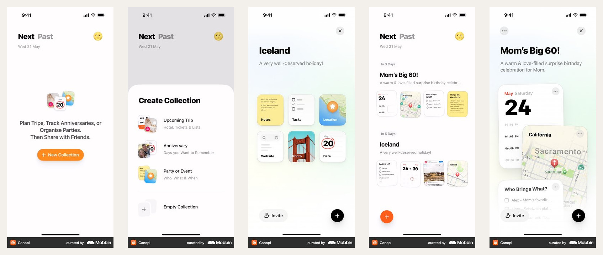

# Canopi → 맛핀 랜딩 적용 검토

- 기준일: 2026-08-02
- 대상: 맛핀 랜딩의 `Instagram 릴스 전송 → 장소 자동 저장 → 개인 지도 확인` 설명
- 사용자 가치 순간: 내가 보낸 릴스의 장소가 Instagram 아이디 기준으로 쌓인 지도를 처음 확인하는 순간
- 랜딩의 주 행동: `Instagram에서 matpin.kr 열기`
- 가입 요청: 랜딩에서는 하지 않음
- 확인 범위: Canopi iOS의 홈, 컬렉션 생성, 카드 선택, 완성 목록, 상세 화면
- 근거 등급: E0(화면 관찰). 전환 성과나 사용자 반응은 확인하지 않음

## 확인한 원본

- [사용자가 지정한 Canopi 화면 모음](https://mobbin.com/apps/canopi-ios-300771d2-30a8-4fe9-bfae-b6d94307e3cd/7bbf6c63-52db-412e-be53-f5861d25498e/screens)
- [Creating a collection 플로우](https://mobbin.com/flows/ebcaea14-7195-48d5-9a03-f3387e6ca479)
- [Creating an empty collection 플로우](https://mobbin.com/flows/d939b927-cfe5-44b8-ae29-9acb3051c6e9)
- [Collection detail 플로우](https://mobbin.com/flows/7f8dd8ce-344a-4627-b9af-70dc51328db6)

왼쪽부터 `빈 홈 → 만들기 선택 → 카드 종류 선택 → 완성 목록 → 상세 카드 묶음`이다.

## E0 관찰

1. **빈 상태가 곧 사용 설명이다.** 긴 온보딩 대신 가운데 작은 카드 묶음, 한 문단, `New Collection` 한 버튼으로 제품의 목적과 첫 행동을 동시에 설명한다.
2. **만들기 전에 목적을 먼저 고른다.** 여행·기념일·파티처럼 사용자가 이해하는 말로 템플릿을 고르게 하고, `Empty Collection`은 보조 선택지로 둔다.
3. **정보 종류가 카드의 생김새로 구분된다.** 메모, 할 일, 위치, 사진, 날짜가 같은 크기지만 각기 다른 표면을 가져 설명을 읽기 전에도 구분된다.
4. **완성 목록은 작은 카드 미리보기로 요약된다.** 컬렉션 이름 아래에 날짜·지도·체크리스트·사진이 한 줄로 보여, 열기 전에 안의 내용을 예상할 수 있다.
5. **상세는 카드가 겹친 한 장면이다.** 날짜, 지도, 할 일이 같은 공간에 깊이를 달리해 놓여 있어 여러 정보가 한 사건에 묶였다는 인상을 준다.
6. **행동 수가 적다.** 각 상태에서 주 행동은 대체로 하나이고, 추가는 동일한 `+` 버튼으로 유지된다.

## 맛핀에 가져올 것

| Canopi 원리 | 맛핀 적용 | 이유 |
| --- | --- | --- |
| 빈 상태가 사용 설명 | 첫 화면에 `릴스를 matpin.kr로 보내보세요`와 전송 버튼 하나 배치 | 공개 릴스 데모보다 실제 첫 행동을 바로 이해시킴 |
| 여러 정보 유형을 카드로 구분 | `캡션`, `고정 댓글`, `영상`, `찾은 장소`를 서로 다른 실제 카드로 표현 | 장소를 어디서 찾았는지 투명하게 설명 |
| 작은 카드 미리보기 | 릴스 하나 아래 찾은 장소들을 2~4개의 실제 장소 카드로 노출 | 장소가 여러 개면 전부 저장된다는 핵심을 한눈에 증명 |
| 겹친 카드의 깊이 | 릴스 카드가 장소 카드로 풀리고, 마지막에 지도 핀으로 합쳐지는 전환 | 자동 정리의 인과를 스크롤만으로 이해시킴 |
| 상태마다 주 행동 하나 | 섹션마다 CTA를 늘리지 않고 `Instagram에서 matpin.kr 열기`로 통일 | 사용자가 다음 행동을 고민하지 않게 함 |

## 그대로 가져오지 않을 것

- Canopi의 여행·기념일 템플릿 선택은 맛핀에 필요 없다. 맛핀은 릴스를 보내는 순간 자동 분류되어야 한다.
- 흰 배경, 주황색 버튼, `Next / Past` 정보 구조, 카드 모양을 복제하지 않는다.
- `Invite` 같은 협업 기능은 현재 맛핀의 핵심 가치와 무관하므로 랜딩에 넣지 않는다.
- 카드가 예쁘게 겹치는 장면만 보여주면 자동 저장의 증거가 약해진다. 실제 릴스 썸네일, 장소명, 지도 핀을 사용한다.

## Poly 분석과 합치는 방식

Poly는 **페이지 전체의 이야기와 카메라 이동**, Canopi는 **그 안에 들어갈 모바일 제품 상태**에 사용한다.

1. `보내기`: Instagram 릴스가 matpin.kr DM으로 이동한다.
2. `찾기`: 하나의 릴스 카드에서 캡션·고정 댓글·영상 단서가 분리된다.
3. `저장`: 찾은 장소가 여러 개의 장소 카드로 모두 나타난다.
4. `쌓기`: 장소 카드가 Instagram 아이디의 개인 지도 핀으로 모인다.
5. `다시 찾기`: 지도에서 핀을 누르면 원본 릴스와 장소 정보가 함께 열린다.

Poly의 연속 스크롤 무대를 쓰되, 각 프레임의 UI는 Canopi처럼 **한 상태, 한 행동, 읽을 수 있는 실제 데이터**로 제한한다.

## 결정

Canopi는 맛핀 랜딩의 **모바일 UI 문법**으로 적합하다. 특히 `작은 카드 여러 개가 한 묶음이 되는 장면`은 “릴스 하나에서 장소가 여러 개면 전부 저장한다”를 설명하기 좋다. 다만 랜딩의 전체 전개는 Poly의 연속적인 변환 구조를 유지하고, Canopi의 브랜드 스타일이 아니라 상태 설계만 가져온다.

## 측정 기준

- 주 지표: 랜딩에서 Instagram CTA 클릭률, 릴스 DM 전송 완료율
- 보조 지표: 전송 후 개인 지도 첫 열람률
- 가드레일: `내 위치를 수집한다`고 오해하는 비율, 여러 장소 중 하나만 저장된다고 오해하는 비율
