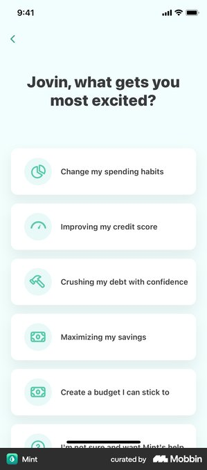
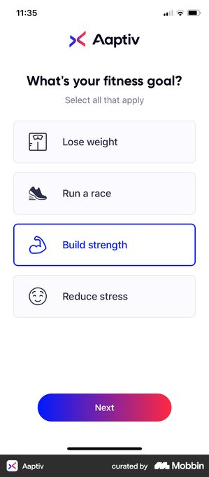
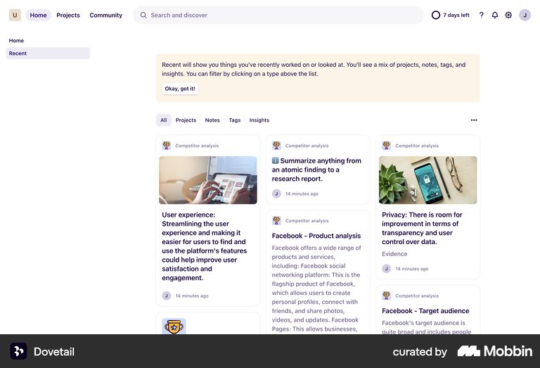
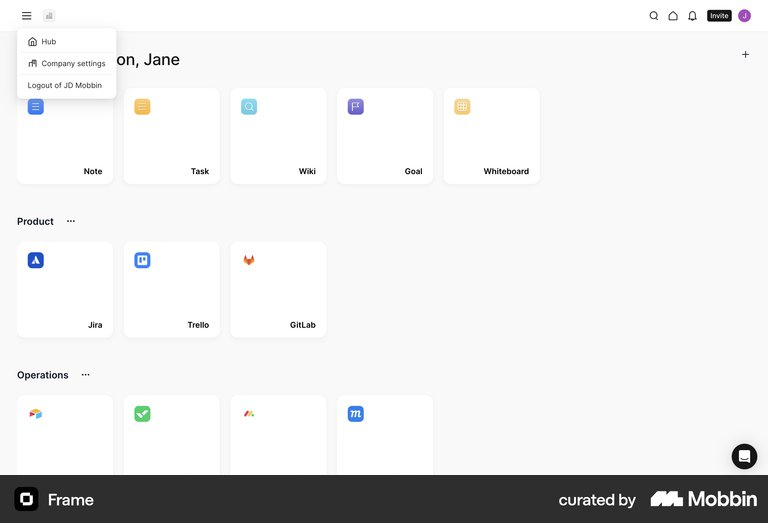

# 허브 앱 선택 화면 레퍼런스 요약

결론: 허브는 네 앱을 설명하는 랜딩 페이지보다, 한 질문 아래 네 결과를 바로 고르는 선택 화면에 가깝게 줄인다.

## 조사 브리프

- 사용자 과업: 처음 온 사용자가 네 앱의 차이를 빠르게 이해하고 하나를 연다.
- 진입 트리거: 루트 주소 직접 진입 또는 다른 앱 사용 뒤 재방문.
- 현재 기준선: 큰 소개 문구, 최근 사용 카드, 설명·입력·결과·CTA가 반복되는 세로형 앱 카드 네 장.
- 가치 순간: 사용자가 원하는 결과의 앱을 열고 첫 입력을 시작한다.
- 검토할 요청: 없음.
- 결정: 카드 설명을 어디까지 줄이고, 최근 사용을 어떤 무게로 둘지 정한다.
- 목표 지표: 허브 진입 뒤 첫 앱 열기.
- guardrail: 잘못 고른 뒤 즉시 이탈, 앱 간 차이 오해, 키보드·터치 접근성.
- 가정: 앱 이름보다 사용자가 받는 결과가 선택을 더 잘 돕는다.

## Mint

- 흐름: TRIGGER → 한 질문 → 결과 중심 선택지 → 선택.
- 관찰 E0: 아이콘과 결과 문구만 있는 전체 폭 선택지가 한 화면에 연속으로 보인다.
- 전이 판단: `adapt` — 앱 이름 대신 결과를 먼저 읽게 하되, 낯선 앱을 구분할 실제 화면 썸네일은 남긴다.
- 위험·한계: 온보딩 목표 선택이고 서로 다른 제품을 여는 허브는 아니다.
- 출처: [Mint 화면](https://mobbin.com/screens/08d766a8-535a-4e03-93e2-ba83d348a893)

## Aaptiv

- 흐름: TRIGGER → 한 질문 → 네 선택지 → 선택 상태 → Next.
- 관찰 E0: 네 선택지는 짧은 문구로 비교되고, 선택 후 별도 Next 버튼이 나타난다.
- 전이 판단: `adapt` — 네 항목의 밀도는 옮기되, 허브는 링크 한 번이면 충분하므로 별도 다음 버튼은 두지 않는다.
- 위험·한계: 여러 목표를 고르는 설문이라 즉시 화면 이동과는 행동 계약이 다르다.
- 출처: [Aaptiv 화면](https://mobbin.com/screens/a89f9bb3-e524-4742-a8f4-4186ade80025)

## Dovetail

- 흐름: 재진입 → Recent → 최근 항목 확인 → 다시 열기.
- 관찰 E0: 최근 작업이 별도 홈 화면의 첫 콘텐츠로 배치되고 항목 자체가 재진입점이 된다.
- 전이 판단: `adapt` — 최근 사용 앱은 유지하되 큰 홍보 카드가 아니라 한 줄 재진입점으로 축소한다.
- 위험·한계: Dovetail은 최근 문서가 핵심 콘텐츠이고, 이 허브는 서로 다른 앱을 고르는 화면이다.
- 출처: [Dovetail 화면](https://mobbin.com/screens/d55ae4b5-531d-478b-b05e-de21b09dd287)

## Frame

- 흐름: 재진입 → 제품 분류 → 이름·아이콘 타일 → 선택.
- 관찰 E0: 작은 타일이 많은 도구를 한 화면에 보여주지만, 각 도구로 무엇을 얻는지는 거의 설명하지 않는다.
- 전이 판단: `reject` — 네 실험의 이름이 아직 익숙하지 않아 아이콘·브랜드명만으로 고르게 하지 않는다.
- 위험·한계: 사내 도구처럼 사용자가 제품 이름을 이미 아는 환경에는 더 적합할 수 있다.
- 출처: [Frame 화면](https://mobbin.com/screens/565160cd-af6e-4589-b8a9-e077b452613c)

## 반복 패턴과 예외

- 반복 E1: Mint와 Aaptiv 모두 한 질문 아래 선택지를 짧게 나열하고, 선택지마다 긴 설명을 반복하지 않는다.
- counterexample: Frame은 더 많은 항목을 한 화면에 넣지만 제품 지식이 없는 사용자는 결과를 예측하기 어렵다.
- 외부 근거 E2: 없음. Mobbin 수록 화면의 구조만 확인했다.

## 우리 앱에 적용

1. 결정: 소개 영역을 줄이고, 네 앱을 결과 중심의 짧은 전체 클릭 카드로 만든다.
2. 결정: 카드 안의 별도 CTA 상자와 긴 본문을 제거하고 `입력 → 결과` 한 줄만 남긴다.
3. 결정: 최근 사용은 한 줄 재진입점으로 줄이고, 최근 앱이 있을 때만 `다른 앱 시작하기`로 구분한다.
4. 검증: 허브 진입 뒤 앱 링크 클릭률을 보고, 앱 진입 10초 안 이탈률을 guardrail로 함께 본다.

> Mobbin 화면은 출시된 구조의 근거이며 성과·규정 준수의 증거가 아니다.
