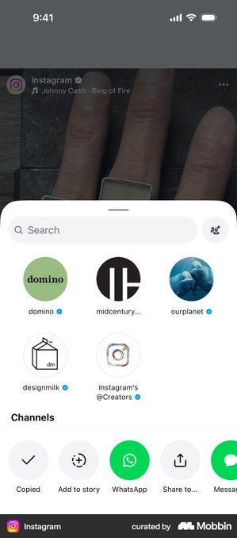
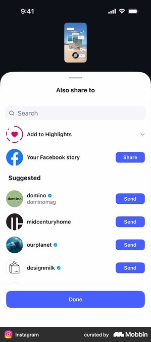
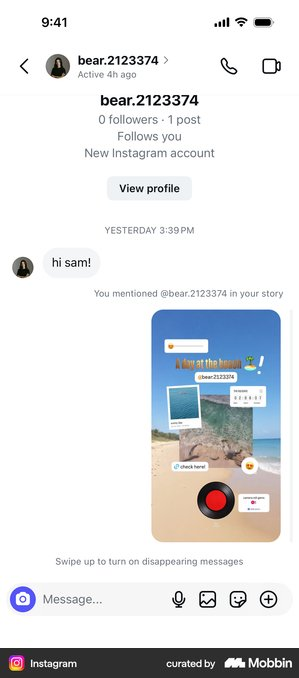
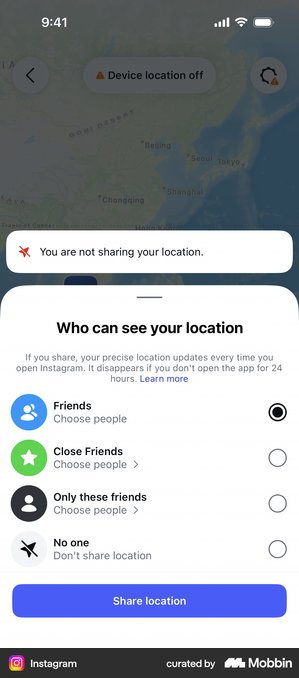

# Instagram 공유 흐름을 맛핀에 적용한 근거

결론: 맛핀의 첫 행동은 추상적인 카드보다 Instagram의 `릴스 → 공유 시트 → 계정 선택 → DM 답장` 구조를 닮아야 사용자가 바로 이해한다.

## 조사 브리프

- 사용자 과업: 보고 있던 맛집 릴스를 `matpin.kr`로 보내고 저장 결과 링크를 연다.
- 현재 기준선: 맛핀 안에서 릴스 카드가 흩어지고 정리되지만 Instagram에서 무엇을 눌러야 하는지 보이지 않았다.
- 가치 순간: Instagram DM 답장에서 역별 보관함 링크를 받아 저장된 원본 릴스를 확인한다.
- 검토할 요청: 가입·위치 권한·결제 없음.
- 결정: 실제 Instagram 화면의 정보 구조를 맛핀 모션 첫 두 장면과 결과 연결에 적용한다.
- 목표 지표 / guardrail: 설명 없이 공유 행동을 시작한 비율 / 실제 Instagram 화면으로 오해하는 비율.

## Instagram 공유 바텀시트

- 흐름: 릴스의 공유 아이콘 → 흰색 바텀시트 → 검색 → 원형 계정 선택.
- 관찰 E0: 영상은 뒤에 남고, 바텀시트 안에서 검색창과 최근 계정이 먼저 보인다.
- 전이 판단: adapt — 맛핀도 릴스 배경을 유지한 채 `matpin.kr` 검색 결과를 선택하게 표현한다.
- 위험·한계: 화면을 그대로 복제하지 않고 맛핀용 합성 예시임을 유지한다.
- 출처: [Mobbin 화면](https://mobbin.com/screens/bfb555df-bc0a-48ba-aaf9-65c583afaba2)

## Instagram 수신자별 보내기

- 흐름: 검색 → 추천 계정 목록 → 계정별 `Send` → 완료.
- 관찰 E0: 선택 대상과 즉시 행동이 같은 행에 있어 결과를 예측하기 쉽다.
- 전이 판단: adapt — 작은 화면에서는 `matpin.kr` 선택 상태와 하단 파란 `보내기` 한 개로 압축한다.
- 위험·한계: 다른 사람에게 잘못 보내는 것처럼 보이지 않도록 선택 체크를 함께 표시한다.
- 출처: [Mobbin 화면](https://mobbin.com/screens/c238ca02-2463-4377-a4af-194493c998dc)

## Instagram DM 대화

- 흐름: 계정 헤더 → 보낸 미디어 → 받은 답장 → 입력창.
- 관찰 E0: 상대 계정, 대화 내용, 다음 행동을 위에서 아래로 읽는다.
- 전이 판단: adapt — `matpin.kr` 답장, 저장 완료 문구, `보관함 열기`를 한 묶음으로 보여준다.
- 위험·한계: 실제 개인 DM을 쓰지 않고 합성 계정·합성 메시지만 사용한다.
- 출처: [Mobbin 화면](https://mobbin.com/screens/6d31c75e-4c65-4f1d-9937-5f9e9a2e8a46)

## 반례: 위치 공유 권한

- 흐름: 위치 공유 상태 → 공개 범위 선택 → 권한 행동.
- 관찰 E0: 위치와 공개 범위를 결정해야 해 별도의 이해와 동의가 필요하다.
- 전이 판단: reject — 맛핀은 사용자의 현재 위치를 수집하지 않으므로 이 권한·지도 문법을 쓰지 않는다.
- 위험·한계: 역 분류가 사용자 위치 기반이라는 오해를 만들 수 있다.
- 출처: [Mobbin 화면](https://mobbin.com/screens/daef3fa1-b2c1-4379-aa7c-6b25ad7a8239)

## 맛핀 적용

1. `공유 버튼 누르기 → matpin.kr 선택 → 자동 정리 → DM 링크로 보관함 열기`의 4개 핵심 상태로 설명한다.
2. Instagram 구간은 흰색 바텀시트, 검색창, 원형 계정, 파란 보내기 버튼만 가져온다.
3. 분석 구간은 캡션·댓글·영상 단서와 가까운 역 결과를 유지한다.
4. 위치 공유 화면은 사용하지 않으며, 현재 위치를 수집하지 않는 제품 계약을 지킨다.

> Mobbin 화면은 출시된 구조의 근거이며 성과·규정 준수의 증거가 아니다.
