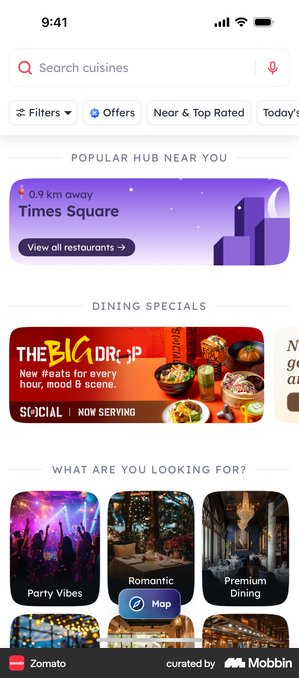
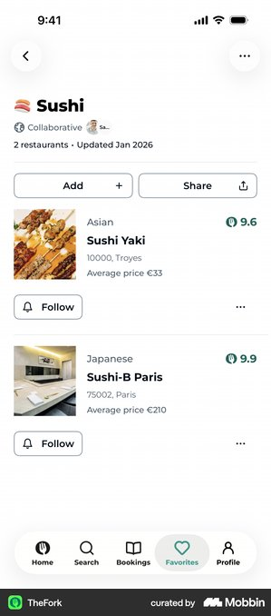

# MATPICK 목록형 MVP 레퍼런스 요약

결론: 지도와 보조 기능을 빼고 `역 선택 → 최신 숏폼 맛집 목록 → 원본 영상 재생 → 저장`만 한 열에 남긴다.

## 조사 브리프

- 사용자 과업: 강남역·역삼역 주변에서 최근 릴스·쇼츠에 나온 맛집을 빠르게 고른다.
- 진입 트리거: 지금 갈 역의 새로운 맛집을 찾고 싶다.
- 현재 기준선: 지도·상세 패널·다중 필터가 같은 화면에 공존하고 모바일에서 상세가 오른쪽으로 밀린다.
- 가치 순간: 음식점 행에서 최신 게시일과 영상 출처를 확인하고 원본 영상을 바로 재생한다.
- 검토할 요청: 없음. 저장은 기기 안에서 먼저 제공한다.
- 결정: 지도 보기를 삭제하고 목록형 모바일 MVP로 재설계한다.
- 목표 지표: 첫 원본 영상 재생률.
- guardrail: 첫 영상 재생까지 걸린 시간, 가로 넘침, 저장 성공률.
- 가정: Google/Material 계열의 타이포·색·밀도는 유지하고 타 앱에서는 행동과 정보 구조만 가져온다.

## Zomato

- 관찰 E0: 검색과 짧은 필터 뒤에 큰 이미지 중심의 탐색 콘텐츠가 한 열로 이어진다.
- 전이 판단: adapt — MATPICK은 검색·프로모션을 빼고 역과 정렬만 남긴다.
- 위험·한계: 콘텐츠 구획이 많아지면 숏폼 원본이라는 핵심이 약해진다.
- 출처: [Mobbin screen](https://mobbin.com/screens/b6816c86-7e2b-4c78-8e64-fd465cacc706)

## TheFork 저장 목록

- 관찰 E0: 컬렉션 제목 아래 음식점 사진·분류·주소·점수가 가벼운 행 구분으로 반복된다.
- 전이 판단: adopt — 저장 목록과 역별 목록 모두 같은 행 컴포넌트를 재사용한다.
- 위험·한계: `Follow` 같은 별도 관계 행동은 MATPICK MVP에 필요하지 않다.
- 출처: [Mobbin screen](https://mobbin.com/screens/49105a9b-d460-4761-9689-720b98cb769c)

## NAVER Clip

- 관찰 E0: 영상이 화면의 가장 큰 영역을 차지하고 제목·출처·반응 행동이 영상 가까이에 붙는다.
- 전이 판단: adapt — 첫 맛집만 영상 증거를 크게 보여주고 나머지는 압축된 행으로 둔다.
- 위험·한계: 전체를 숏폼 피드로 만들면 역별 비교가 느려질 수 있다.
- 출처: [Mobbin screen](https://mobbin.com/screens/2dea2db8-de8f-4196-8b8f-91f044aa69dc)

## TheFork 지도 결과

- 관찰 E0: 지도·검색 조건·결과 시트가 첫 화면의 공간과 주의를 나눠 가진다.
- 전이 판단: reject — MATPICK의 첫 가치는 위치 탐색보다 최신 숏폼 증거 확인이다.
- 위험·한계: 지도를 빼면 정확한 위치 비교는 약해지지만 MVP의 선택 속도는 더 직접적으로 측정할 수 있다.
- 출처: [Mobbin screen](https://mobbin.com/screens/25a33ea6-3844-4896-bb0d-0a5e3fbba4c6)

## 반복 패턴과 예외

- 반복 E1: 음식점 탐색과 저장 목록은 한 열 안에서 이미지·이름·핵심 메타데이터를 반복해 빠르게 훑게 한다.
- counterexample: 지도 중심 결과는 공간 이해에는 유리하지만 MATPICK의 최신 영상 증거를 첫 화면 아래로 밀어낸다.
- 외부 근거 E2: 없음. Mobbin 화면은 출시된 구조만 확인했다.

## 우리 앱에 적용

1. 결정: 지도 보기·지도 상세·위치 권한을 제거하고 역·정렬·목록·재생·저장만 남긴다.
2. 근거: TheFork의 압축된 컬렉션 행과 NAVER의 가까운 영상 출처 표시를 결합하되 시각 스타일은 MATPICK으로 유지한다.
3. 검증: 첫 원본 영상 재생률을 주 지표로 보고 가로 넘침 0건, 저장 성공률, 첫 재생 시간을 함께 본다.

> Mobbin 화면은 출시된 구조의 근거이며 성과·규정 준수의 증거가 아니다.
