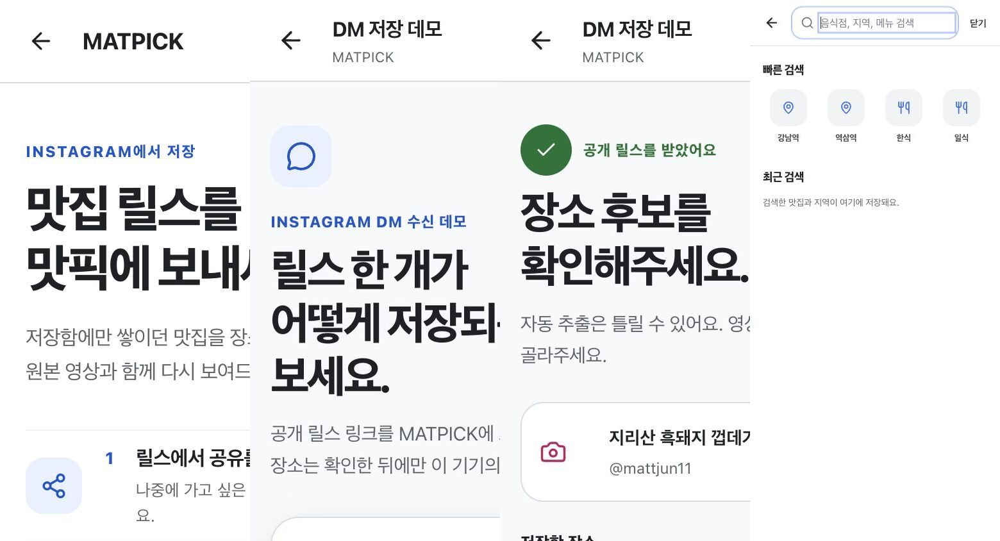
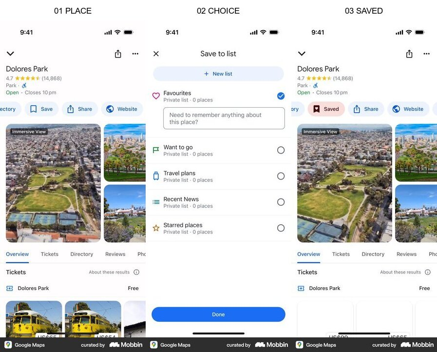
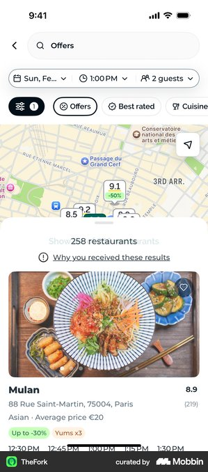

# MATPICK 페이지 시스템 개선 결정안

## 결론

MATPICK은 `Google Maps의 단정한 정보 구조`를 주 시각 언어로 사용하고, 음식 콘텐츠는 `9:16 릴스·쇼츠 그리드`, 저장은 `같은 화면에서 즉시 상태가 바뀌는 피드백`으로 통일한다.

- 지도는 MVP에서 제외한다.
- Instagram·YouTube의 시각 스타일은 섞지 않는다.
- 다른 앱에서는 행동 순서와 정보 구조만 가져온다.
- 모든 페이지의 공통 목표는 `영상 발견 → 원본 재생 → 음식점 저장`이다.

## 광고 유입 결정

광고는 **MATPICK Instagram 계정으로 집행하되, 계정 자체를 광고하지 않는다.** 소재는 `역삼역 TOP20`, `이번 주 강남역에서 많이 본 맛집`처럼 사용자가 즉시 얻는 결과를 제목으로 쓴다.

가장 짧은 전체 여정은 다음과 같다.

`Instagram 콘텐츠형 광고 → 역삼역 최근 숏폼 맛집 미리보기 → 역삼역 전체 목록 → 원본 영상 확인 → 음식점 저장 → 저장함 재방문 → 내 릴스 DM 저장 선택`

- 광고 목적지: Instagram 프로필이 아니라 `/matpick/start`
- 첫 주 행동: `역삼역 N곳 보기`
- 첫 가치 이전에 요구하지 않는 것: 가입, Instagram 로그인, DM 권한
- 첫 저장 이후 보조 행동: `내가 본 릴스도 저장`
- 다른 기기 복구가 필요해진 뒤의 선택 행동: 계정 연결
- `TOP20` 문구는 실제로 20곳이 준비된 지역에서만 쓴다. 현재 데모는 실제 데이터 개수인 `역삼역 N곳`으로 표기한다.

## 이전 캡처 기준 화면 감사

이 이미지는 이번 구현 전 캡처다. 현재 실행 화면 재캡처는 Codex 브라우저의 로컬 URL 보안 정책에 막혀 있어, 아래 항목은 이전 캡처와 코드 구조를 함께 본 판단이다.

### 구현 전 확인된 문제

1. `/start`, `/dm` 입력, `/dm` 후보 화면은 390px 모바일에서 제목·본문·카드가 오른쪽으로 잘린다.
2. 페이지마다 헤더 이름, 상단 여백, 제목 크기, 버튼 밀도가 달라 하나의 제품처럼 보이지 않는다.
3. `/dm` 입력 화면이 작업의 한 단계보다 별도의 랜딩 페이지처럼 커서 첫 결과까지 오래 걸린다.
4. `/search`는 콘텐츠가 적고 여백이 커서 탐색을 시작할 단서가 약하다.
5. `/matpick` 저장함 캡처는 빈 화면으로 저장되어 이번 감사 근거에서 제외했다.
6. `/matpick/import`는 브라우저 보안 정책 때문에 캡처가 차단되어 시각 감사하지 못했다.

## 선택한 Mobbin 근거

### 1. Beli — 가치 설명에서 첫 핵심 행동까지

- 근거 수준: `직접` — [Mobbin flow](https://mobbin.com/flows/bf32f945-5507-4a2c-acac-578856b13f42)
- 관찰: 제품 가치, 자주 먹는 지역, 첫 목록 행동을 한 방향으로 연결한다.
- 채택: 첫 화면에서 가치와 다음 행동을 한 문장과 하나의 주 CTA로 설명한다.
- 거절: 31개 화면을 그대로 따르는 긴 온보딩은 MVP에 맞지 않는다.

### 2. Collect — 실제 공유 시트에서 수집 시작

- 근거 수준: `유사` — [Mobbin screen](https://mobbin.com/screens/fa57253d-c437-4a78-a198-21930456cae6)
- 관찰: 사용자가 보고 있던 콘텐츠 위에 운영체제 공유 시트가 나타나고 저장 앱을 선택한다.
- 채택: 공유로 MATPICK을 호출한다는 개념과 짧은 설명 순서만 가져온다.
- 거절: 웹 데모 안에 가짜 iOS 공유 시트를 그리지 않는다.

### 3. Google Maps — 장소 확인, 저장 선택, 완료 피드백

- 근거 수준: `직접` — [Mobbin flow](https://mobbin.com/flows/fcd1f02e-80a9-421a-8078-996a8eb13b7c)
- 관찰: 장소 맥락을 유지한 채 저장 목록을 고르고 같은 화면에서 저장 완료를 확인한다.
- 채택: MATPICK의 버튼, 목록 선택, 저장 아이콘, 저장 완료 상태를 이 방식으로 통일한다.
- 시각 적용: 중립 배경, 간결한 헤더, 명확한 선택 상태, 촘촘한 정보 밀도를 전체 제품에 사용한다.

### 4. TheFork — 지도 중심 탐색의 반례

- 근거 수준: `직접` — [Mobbin screen](https://mobbin.com/screens/25a33ea6-3844-4896-bb0d-0a5e3fbba4c6)
- 관찰: 지도, 필터, 결과가 동시에 주의를 요구한다.
- 거절: MATPICK의 차별점은 지도보다 최근 영상 근거이므로 지도 UI는 MVP에서 제외한다.

## 페이지별 개선안

### `/matpick/start`

- 광고에서 약속한 지역 결과를 첫 화면에서 바로 보여준다.
- 한 문장 가치 제안: “역삼역에서 지금 볼 맛집.”
- 주 CTA는 `역삼역 N곳 보기`로 두고, `내 릴스 저장 방법`은 첫 가치 아래로 내린다.
- 저장 방법은 3단계만 노출한다: `영상 공유 → 장소 확인 → 지역별 저장`.
- 로그인은 가치가 확인된 뒤 저장 동기화가 필요할 때 요청한다.

### `/dm`

- 입력과 후보 확인을 한 작업의 연속 단계로 만든다.
- 큰 히어로를 제거하고 공통 헤더, 짧은 진행 표시, 입력 영역으로 압축한다.
- 후보 카드에서 원본 영상과 음식점을 확인하고 바로 저장한다.
- 저장 후에는 페이지를 이동시키지 않고 아이콘, 문구, 개수로 완료를 보여준다.

### `/matpick`

- 사용자가 고른 9:16 음식 영상 그리드를 유지한다.
- 헤더는 `MATPICK / 검색 / 저장 개수`로 고정한다.
- 정렬과 지역은 위계를 나눈다: `정렬 | 근처 역 3개 · 지역 전체`.
- 음식점명은 16–18px, 거리는 12–14px로 유지한다.
- 검정에서 투명으로 이어지는 하단 그라데이션 위에 음식점명, 플랫폼, 거리를 읽기 쉽게 배치한다.

### `/search`

- 헤더 검색 아이콘을 누르면 독립 검색 페이지를 연다.
- 첫 화면부터 `근처 역 3개 · 지역 전체`, `최신 영상`, `최근 검색`을 제공한다.
- 입력 즉시 음식점·역·메뉴 결과를 2열 9:16 썸네일로 보여준다.
- 결과 없음 화면에도 다른 역과 최신 영상을 제안한다.

### `/matpick/import`

- 독립 제품처럼 보이지 않게 `/dm`과 같은 공통 헤더와 단계 구조를 사용한다.
- YouTube 링크 수집은 보조 입력 방식으로 두고 핵심 진입은 공유·DM 흐름으로 유지한다.
- 캡처 차단 때문에 실제 화면 비교는 선택 후 구현 단계에서 다시 확인한다.

## Journey & Screen Story Contract

전체 여정: `릴스·쇼츠 발견 → MATPICK으로 보내기 → 장소 후보 확인 → 저장 → 지역·검색으로 다시 찾기 → 원본 영상 재생`

가치 순간: 사용자가 영상 속 음식점을 올바른 장소와 연결해 저장하고, 나중에도 원본 영상과 함께 다시 찾는 순간이다.

| 화면 | 현재 단계 | 화면의 이야기 | 주 행동 | 다음 상태 |
|---|---|---|---|---|
| `/matpick/start` | 첫 가치 | 광고에서 본 역삼역 맛집과 실제 원본 영상이 준비되어 있음을 확인한다. | `역삼역 N곳 보기` | 역삼역 필터가 선택된 목록 |
| `/matpick/dm` 입력 | 입력 | 실제 Instagram 권한 없이 공개 링크로 저장 과정을 체험할 수 있다. | `이 릴스에서 장소 찾기` | Mock API가 장소 후보 반환 |
| `/matpick/dm` 후보 | 확인 | 자동 추출은 틀릴 수 있으므로 영상과 맞는 장소를 직접 고른다. | `이 장소 저장` | 현재 브라우저 저장함 갱신 |
| `/matpick` | 재발견 | 최근 영상과 근처 역을 기준으로 저장할 맛집을 빠르게 훑는다. | `원본 영상 열기` 또는 `저장` | 원본 플랫폼 또는 저장 완료 |
| `/matpick/search` | 탐색 | 음식점·지역·메뉴를 입력해 바로 관련 영상과 장소를 찾는다. | `검색 결과 선택` | 장소 영상 상세 또는 원본 |
| `/matpick/import` | 보조 입력 | YouTube Shorts 링크에서도 장소를 찾아 같은 저장함에 넣을 수 있다. | `이 Shorts에서 장소 찾기` | 후보 확인 후 명시적 저장 |

검토할 요청은 `가입`이지만 첫 가치 이전에는 요청하지 않는다. 다른 기기 복구나 지속 동기화가 필요해진 뒤에만 선택적으로 제안한다.

## Perception Contract

- 목적: 5초 안에 최근 음식 영상, 장소 이름, 거리, 저장 행동을 이해한다.
- 진입 상태: 릴스·쇼츠를 보다가 음식점을 잊기 전에 빠르게 저장하거나 다시 찾으려 한다.
- 인지 순서: 1) 실제 음식 영상 2) 음식점명과 거리 3) 원본 재생·저장 행동
- 주 행동: 탐색 화면에서는 원본 영상 재생, 확인 화면에서는 장소 저장
- 이탈 감정: “영상에서 본 곳을 잃지 않았다”는 안심과 통제감
- 기억 단서: 영상 썸네일 아래로 이어지는 검정→투명 그라데이션과 명확한 저장 상태

## 실제 데이터와 상태

- 음식점 목록은 `GET /api/tastepin/library`의 응답 계약을 사용한다.
- Instagram DM 데모는 `POST /api/matpick/dm`을 호출하고 응답을 스키마로 다시 검증한다.
- YouTube Shorts 입력은 `POST /api/tastepin/resolve`를 사용한다.
- 저장은 현재 `localStorage`에 기록된다. 운영 계정 동기화처럼 보이게 표현하지 않는다.
- 입력 화면은 `idle / loading / error`, 후보 화면은 `candidates / saved`, 목록은 `loading / empty / error / success`를 모두 표현해야 한다.
- `/matpick/import`는 분석 즉시 자동 저장하지 않고, 사용자가 후보를 확인한 뒤 저장한다.

## 핵심 인터랙션 계약

| 표시 이름 | 종류 | 행동·목적지 | 성공·실패 결과 |
|---|---|---|---|
| 검색 | button | `/matpick/search` | 전용 검색 화면과 키보드 포커스 |
| 저장 개수 | link | `/matpick?saved=1` | 저장된 음식점만 표시 |
| 근처 역 | filter chip | 현재 목록 필터 변경 | 선택 칩과 결과 개수 갱신 |
| 지역 전체 | filter chip | 모든 역 결과 표시 | 선택 칩과 전체 결과 |
| 최신순·조회수순 | select | 현재 목록 정렬 변경 | 그리드 순서만 갱신 |
| 영상 카드 | link | 실제 Instagram Reel 또는 YouTube Shorts | 새 탭에서 원본 재생 |
| 저장 | button | 현재 장소 ID 저장·해제 | 아이콘, 개수, 짧은 완료 알림 |
| 이 릴스에서 장소 찾기 | submit | `POST /api/matpick/dm` | 후보·오류 상태 |
| 장소 저장 | button | 후보를 로컬 저장함에 추가 | 같은 화면에서 저장 완료 |
| 이 Shorts에서 장소 찾기 | submit | `POST /api/tastepin/resolve` | 후보·오류 상태 |
| Shorts 후보 저장 | button | 확인한 분석 결과를 로컬 저장함에 추가 | 저장함 딥링크 제공 |
| 다시 하기 | button | 현재 입력 과정 초기화 | 입력 상태 복귀 |

## 플랫폼·타이포그래피·모션 결정

- 대상: `ko-KR` 모바일 퍼스트 웹, 390px compact window
- Material 3 적용: 필터 칩 전체가 터치 영역이며 최소 48×48 CSS px를 확보한다. 모바일 검색 앱 바의 trailing action은 최대 두 개로 제한한다. 근거: [Chips](https://m3.material.io/components/chips/guidelines), [App bars](https://m3.material.io/components/app-bars/guidelines), 2026-07-10 캡처.
- Adaptive 적용: compact window에서는 열 수를 줄이고 정보가 잘리지 않는 집중형 레이아웃을 사용한다. MATPICK은 사용자 선택을 반영해 3열 9:16 그리드를 유지하되, 390px에서 텍스트가 읽히지 않으면 2열로 줄이는 것을 QA 게이트로 둔다. 근거: [Grids & spacing](https://m3.material.io/foundations/layout/grids-spacing/grids), 2026-07-10 캡처.
- 타이포그래피: 음식점명 16–18px, 거리 12–14px, 여러 줄 한국어 본문 line-height 1.60, 여러 줄 제목 1.35를 시작값으로 검증한다.
- 모션 판정: 반복 탐색에는 장식 모션을 넣지 않는다. 저장 버튼 press는 100–160ms, 저장 상태 변경은 150–200ms `ease-out`만 사용한다. `prefers-reduced-motion`에서는 위치 이동을 제거하고 색·아이콘 상태만 바꾼다.

## 공통 컴포넌트

- `AppHeader`: 브랜드, 검색, 저장 개수
- `FilterRail`: 정렬 구분선, 근처 역 3개, 지역 전체
- `VideoPlaceCard`: 9:16 미디어, 하단 그라데이션, 음식점명, 플랫폼, 거리, 저장
- `SaveFeedback`: 같은 화면의 저장 상태와 짧은 완료 알림
- `FlowProgress`: 입력, 확인, 저장의 짧은 진행 상태
- `EmptyState`: 최근 영상이나 다른 역으로 이어지는 실제 다음 행동

## 측정 기준

- 핵심 지표: 첫 원본 영상 재생률, 첫 음식점 저장 완료율
- 보조 지표: 첫 가치 도달 시간, 검색 후 결과 선택률
- 보호 지표: 390px 화면 잘림 0건, 동작 없는 핵심 UI 0개, 저장 실패율
