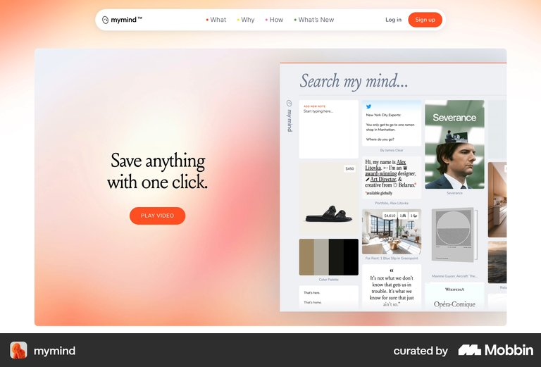
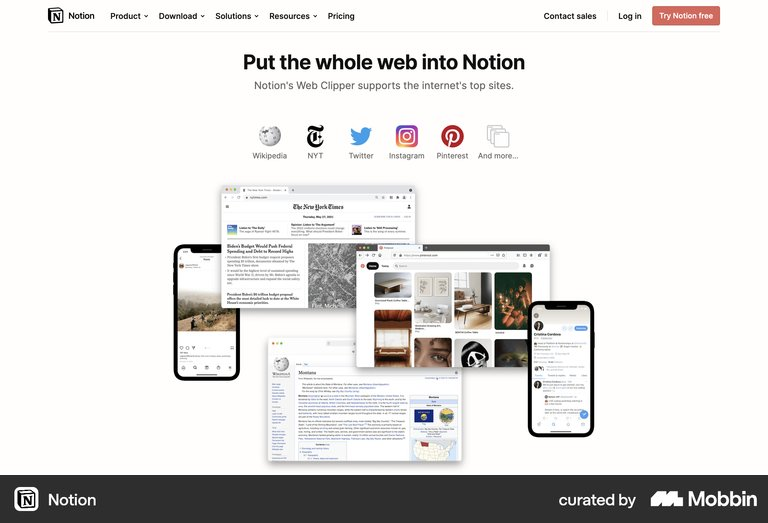
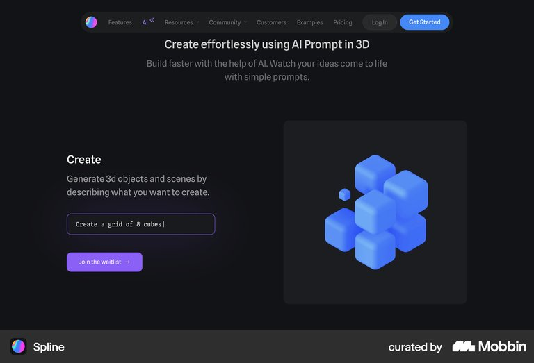
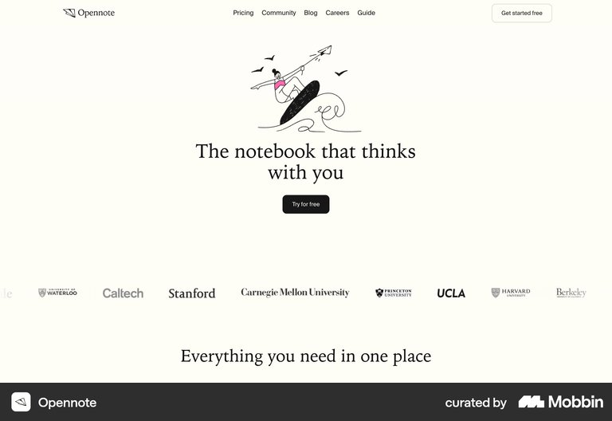

# 맛핀 첫 장면 USP 랜딩 레퍼런스 요약

결론: 첫 화면 안에서 `Instagram 릴스 → matpin.kr로 공유 → 가까운 역 보관함에 저장`을 같은 릴스 카드로 연결하고, 제목은 `릴스를 보내면, 역별로 정리돼요`로 고정한다.

## 조사 브리프

- 사용자 과업: Instagram에서 본 맛집 릴스를 나중에 다시 찾기 쉽게 저장한다.
- 진입 트리거: 맛핀 랜딩에 처음 들어온 순간.
- 현재 기준선: 다크모드 모바일 프레임과 릴스 카드가 있지만, USP와 저장 결과가 한 시야에서 완전히 연결되지 않는다.
- 가치 순간: 릴스 하나가 `역삼역` 같은 역별 영상 보관함에 들어간 결과를 본다.
- 검토할 요청: 없음.
- 결정: 첫 장면의 문장·제품 증거·CTA 위계를 정한다.
- 목표 지표: 5초 뒤 사용자가 `릴스를 맛핀에 보내면 역별로 저장된다`고 설명하는 비율.
- guardrail: 위치 추적, 링크 직접 입력, 수동 장소 선택으로 오해하는 비율.
- 가정: 모바일에서 한 화면에 읽히며, 첫 장면은 완전히 흩어진 상태로 시작하지 않는다.

## mymind

- 관찰 E0: `Save anything with one click` 한 문장과 여러 종류의 실제 저장 카드가 좌우 한 쌍으로 배치된다.
- 전이 판단: adapt — 맛핀도 한 문장 옆에 실제 역별 릴스 보관함을 두되, `anything` 대신 Instagram 릴스로 대상을 좁힌다.
- 위험·한계: 저장 행동의 출발점인 공유 시트는 이 정지 화면만으로 보이지 않는다.
- 출처: [Mobbin section](https://mobbin.com/sites/sections/b3fb1061-28a5-4d4f-b4ef-3ac8f4f8a991)

## Notion Web Clipper

- 관찰 E0: `Put the whole web into Notion` 아래에 Instagram 등 출처 아이콘과 저장 후 결과 화면을 한 덩어리로 보여준다.
- 전이 판단: adopt — 맛핀은 출처를 Instagram 하나로 좁히고, 결과 화면을 `역삼역 · 저장된 릴스` 보관함으로 바꾼다.
- 위험·한계: 여러 출처와 여러 기기를 그대로 따라 하면 맛핀의 단일 핵심 행동이 흐려진다.
- 출처: [Mobbin section](https://mobbin.com/sites/sections/13fa5884-ce86-4e8f-a5d4-a083c521b707)

## Spline AI

- 관찰 E0: 구체적인 입력 문장과 그 입력으로 생긴 3D 결과를 같은 높이에 나란히 둔다.
- 전이 판단: adapt — 왼쪽에는 Instagram 공유 시트의 `matpin.kr`, 오른쪽에는 같은 릴스가 들어간 역별 보관함을 둔다.
- 위험·한계: AI 제품의 자유 입력창을 복사하면 사용자가 맛핀 안에서 링크를 직접 붙여넣는다고 오해할 수 있다.
- 출처: [Mobbin section](https://mobbin.com/sites/sections/7969fd89-9e80-46cf-b901-a8a3bbb10747)

## Opennote — counterexample

- 관찰 E0: `The notebook that thinks with you`와 장식 일러스트, CTA는 보이지만 사용자의 입력과 제품 결과는 첫 시야에 없다.
- 전이 판단: reject — 맛핀이 이 구조를 따르면 `릴스를 어디로 보내고 무엇이 저장되는지`를 첫 화면에서 알 수 없다.
- 위험·한계: 브랜드 인상은 남을 수 있으나 이번 결정인 핵심 기능 이해를 검증할 근거가 부족하다.
- 출처: [Mobbin section](https://mobbin.com/sites/sections/451c6ea9-5cf9-4d0d-8cbe-2b3a9f5809f6)

## 반복 패턴과 예외

- 반복 E1: mymind·Notion·Spline은 모두 큰 약속만 말하지 않고, 입력 또는 출처와 실제 결과를 같은 첫 시야에 둔다.
- counterexample: Opennote는 넓은 약속과 일러스트가 먼저여서 실제 작동 원리를 다음 화면으로 미룬다.
- 외부 근거 E2: 없음. Mobbin 화면만으로 전환율이나 이해도 개선을 주장하지 않는다.

## 우리 앱에 적용

1. 결정: 제목은 `릴스를 보내면, 역별로 정리돼요`로 바꾸고, 보조 문장은 `Instagram 공유에서 matpin.kr를 선택하세요` 한 줄만 둔다.
2. 제품 증거: 왼쪽 위에 실제 맛집 릴스 1개, 중앙에 `공유 → matpin.kr` 칩, 오른쪽 아래에 `역삼역 · 릴스 12개` 보관함을 둔다. 같은 썸네일을 양쪽에 써서 원인과 결과를 연결한다.
3. CTA: 첫 버튼은 `저장 흐름 보기`로 두고, 회원가입·위치 권한·지도는 첫 장면에서 요청하지 않는다.
4. 모션: 시작 상태는 휴대폰과 대표 릴스가 안정적으로 보인다. 스크롤하면 같은 릴스 카드가 공유 칩을 지나 역별 보관함에 꽂히고, 다음 장면에서 여러 릴스가 역별로 정리된다.
5. 검증: 5명에게 모바일 첫 화면을 5초만 보여준 뒤 `무엇을 어디에 보내면 어떻게 되는가`를 묻는다. 정답률을 목표 지표로, 위치 추적·링크 입력 오해율을 guardrail로 기록한다.

> Mobbin 화면은 출시된 구조의 근거이며 성과·규정 준수의 증거가 아니다.
