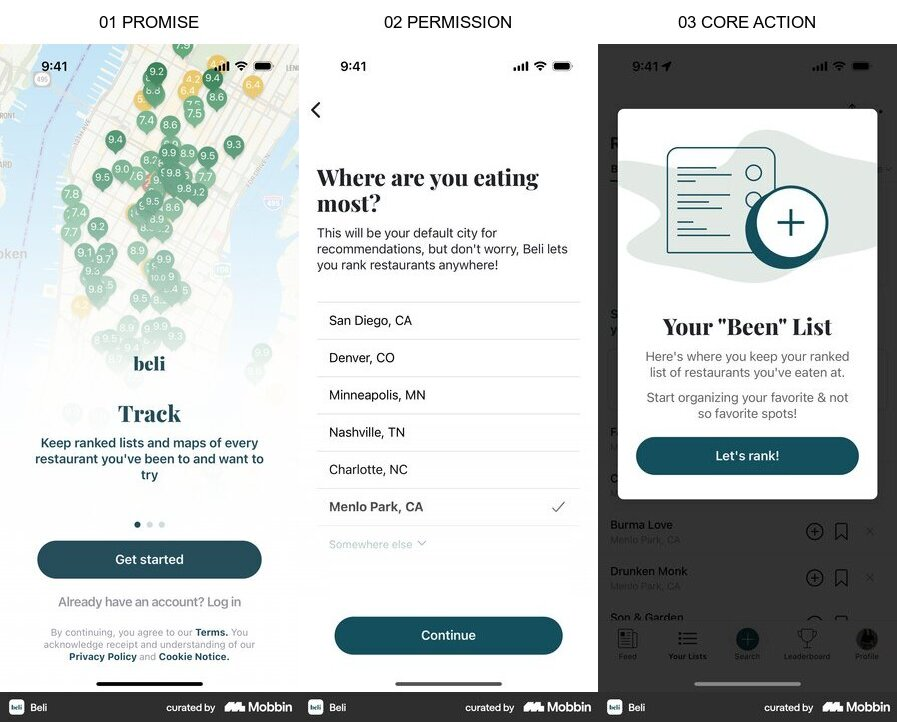
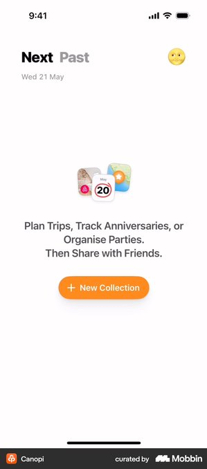
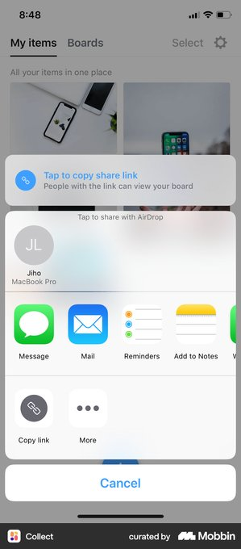

# 맛핀 온보딩 CTA 레퍼런스 요약

결론: 첫 버튼에서는 `matpin.kr` 주소를 반복하지 않고, 사용자가 다음 행동을 예측할 수 있는 `Instagram에서 시작하기`를 사용합니다.

## 조사 브리프

- 사용자 과업: Instagram에서 본 맛집 릴스를 맛핀 계정으로 보내 저장을 시작합니다.
- 진입 트리거: 맛핀 모바일 랜딩의 첫 장면을 봅니다.
- 현재 기준선: `matpin.kr 열기`가 Instagram 프로필로 이동합니다.
- 가치 순간: 보낸 릴스가 가까운 역별 보관함에 쌓인 결과를 확인합니다.
- 검토할 요청: 없음
- 결정: 첫 CTA에 주소와 행동 중 무엇을 우선할지 정합니다.
- 목표 지표: 첫 CTA 클릭률과 Instagram 프로필 도달률
- guardrail: 버튼 문구와 실제 이동 결과의 일치, 저장 완료로 오해하는 비율
- 가정: 사용자는 버튼을 누른 뒤 Instagram의 matpin.kr 프로필에서 공유 방법을 확인합니다.

## Beli

- 흐름: 가치 약속 → 지역 선택 → 첫 목록 행동
- 관찰 E0: 첫 CTA는 브랜드 주소가 아니라 `Get started`로 시작 행동을 말하고, 결과 화면에서는 `Let's rank!`로 핵심 과업을 말합니다.
- 전이 판단: adapt, 맛핀도 주소보다 시작 행동을 먼저 씁니다.
- 위험과 한계: Beli는 앱 안에서 행동이 이어지지만 맛핀은 Instagram으로 이동합니다.
- 출처: [Mobbin flow](https://mobbin.com/flows/bf32f945-5507-4a2c-acac-578856b13f42)

## ChatGPT

- 흐름: 시작 → 선택적 투어 → 핵심 입력
- 관찰 E0: 투어의 `Next`와 `Skip Tour` 뒤에는 목적지 이름이 아니라 핵심 과업인 `Ask ChatGPT`가 놓입니다.
- 전이 판단: adapt, 설명을 읽은 뒤 사용자가 해야 할 행동을 CTA에서 바로 알려줍니다.
- 위험과 한계: ChatGPT의 핵심 행동은 같은 앱 안에서 끝나므로 외부 이동 맥락은 별도로 알려야 합니다.
- 출처: [Mobbin flow](https://mobbin.com/flows/dbfbb3db-6c4e-4e3f-93c9-f668698b7f0c)

## Canopi

- 관찰 E0: 빈 상태는 제품 이름을 반복하지 않고 `New Collection`으로 사용자가 만들 대상을 말합니다.
- 전이 판단: adopt, 한 화면의 주 CTA는 하나로 두고 다음 행동을 동사로 표현합니다.
- 위험과 한계: 맛핀은 새 보관함을 수동 생성하지 않으므로 `저장하기`처럼 즉시 완료를 암시하면 안 됩니다.
- 출처: [Mobbin screen](https://mobbin.com/screens/b19a1cc5-4dae-4c99-8855-1ee3f0e7e8ad)

## Collect

- 관찰 E0: 시스템 공유 시트에서는 `Message`, `Mail`, `Copy link`처럼 실제 목적지와 동작 이름이 선택 항목이 됩니다.
- 전이 판단: hold, Instagram의 실제 공유 시트에서는 `matpin.kr` 계정명이 중요하지만 랜딩 CTA에서는 같은 주소를 반복할 필요가 없습니다.
- 위험과 한계: 랜딩 버튼과 시스템 공유 대상은 역할이 다르므로 같은 문구를 강제로 맞추면 안 됩니다.
- 출처: [Mobbin screen](https://mobbin.com/screens/fa57253d-c437-4a78-a198-21930456cae6)

## 반복 패턴과 예외

- 반복 E1: Beli, ChatGPT, Canopi는 첫 행동이나 핵심 과업을 CTA에 씁니다.
- counterexample: Collect처럼 사용자가 여러 목적지 중 하나를 고르는 시스템 공유 화면에서는 서비스 이름이 선택 정보가 됩니다.
- 외부 근거 E2: 없음

## 우리 앱에 적용

1. 결정: 첫 장면과 마지막 장면의 CTA를 `Instagram에서 시작하기`로 통일합니다.
2. 근거: 주소는 제목과 설명에 이미 보이고, 버튼은 이동 채널과 시작 행동을 알려야 합니다.
3. 검증: CTA 클릭률과 Instagram 프로필 도달률을 보고, 저장 완료로 오해하는 문의나 이탈을 함께 확인합니다.

> Mobbin 화면은 출시된 구조의 근거이며 성과와 사용성의 증거가 아닙니다.
