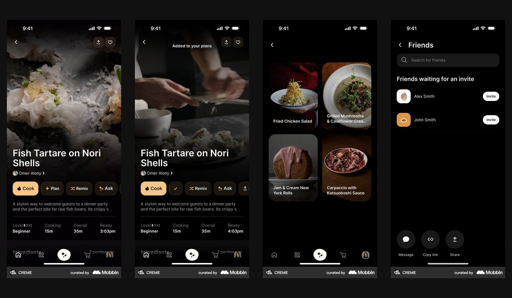
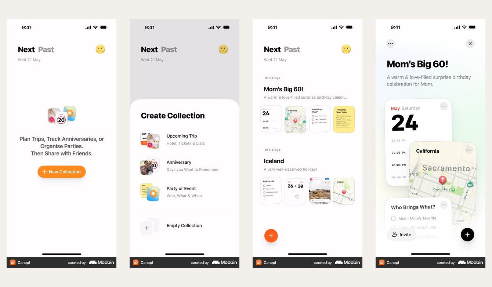
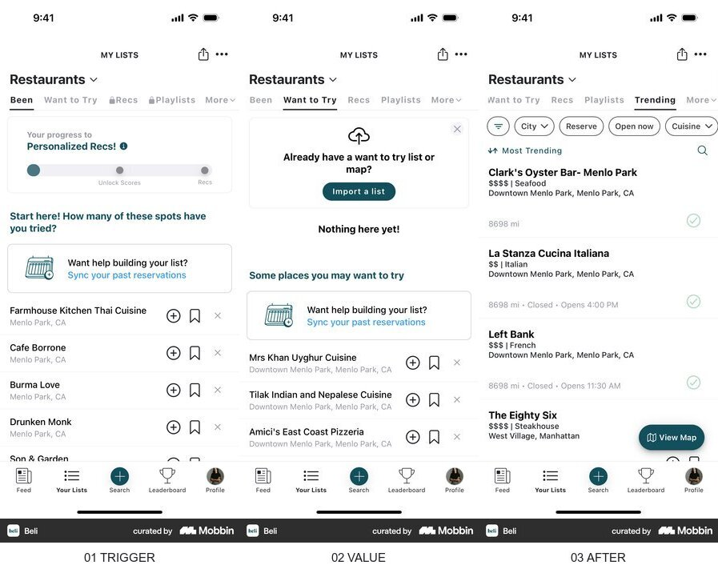
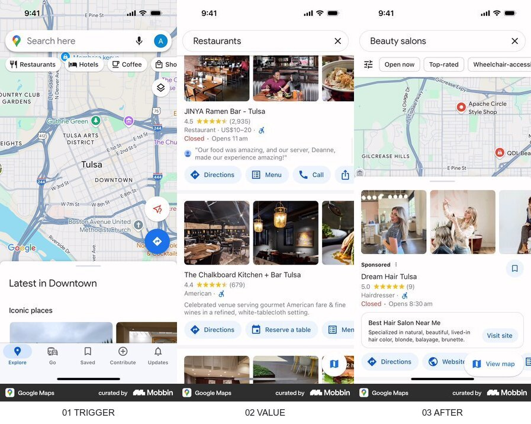

# 맛핀 모바일 스토리보드 구도 분리

- 날짜: 2026-08-05
- 과업: 같은 `발견 → 보내기 → 장소 확인 → 역별 정리` 흐름을 유지하면서 여섯 후보의 카메라 시점과 정보 구조를 겹치지 않게 만든다.
- 검증: 캐시된 실제 Mobbin 보드 4장을 `image-reader` OCR로 다시 확인했다. OCR 원본은 [`evidence/matpin-storyboard-visual-diversity-2026-08-05-ocr.jsonl`](evidence/matpin-storyboard-visual-diversity-2026-08-05-ocr.jsonl)에 있다.
- 판단 경계: 아래 내용은 화면에서 관찰한 구조와 맛핀으로의 전이 판단이다. 전환율이나 사용성 성과를 뜻하지 않는다.

## 1. Crème — 직접 레퍼런스

- 출처: [Crème 앱](https://mobbin.com/apps/creme-ios-2437b570-6f06-4b2a-a683-834d6a6ee2de), [상세 화면](https://mobbin.com/screens/1fd7eb47-6704-44e8-bc3a-45a91b22627a), [저장 피드백](https://mobbin.com/screens/9cce0c35-df8e-4798-a6e3-a1c894bc71a3)
- 관찰: 첫 화면은 음식 이미지를 화면 전체에 두고 행동을 콘텐츠 가까이에 붙인다. 저장 결과는 새 페이지보다 현재 문맥 위의 짧은 완료 신호로 보인다. 저장 목록은 큰 이미지 격자다.
- 전이: A는 `정면 풀블리드`, D는 `현재 화면을 유지한 스캔·완료 신호`만 가져간다.
- 한계: 레시피 앱이라 Instagram DM 입력과 역별 분류는 증명하지 않는다.

## 2. Canopi — 직접 레퍼런스

- 출처: [Creating a collection](https://mobbin.com/flows/ebcaea14-7195-48d5-9a03-f3387e6ca479), [겹친 상세 카드](https://mobbin.com/screens/246066eb-4a3b-4076-94ee-540ae6789009)
- 관찰: 한 화면에는 한 상태와 한 행동을 두고, 결과에서는 작은 미리보기와 겹친 카드로 여러 정보를 한 묶음으로 만든다.
- 전이: C는 모든 장면을 `3/4 사선 카드 적층`으로 만들고 마지막 역 보관함도 겹친 카드로 끝낸다.
- 한계: 사용자가 직접 컬렉션을 만드는 흐름이므로 맛핀의 자동 분류 행동으로 옮기지 않는다.

## 3. Beli — 구조 레퍼런스

- 출처: [Beli saved lists](https://mobbin.com/flows/3255694a-faad-444f-914d-4b7c82083fa6)
- 관찰: 저장 장소는 지도가 아니라 목록에서 먼저 훑고, 지도는 보조 행동으로 남는다. 행 단위 목록은 많은 장소를 빠르게 스캔하게 한다.
- 전이: B는 위에서 내려다본 `정리 테이블과 세로 목록`, E는 역 이름 아래 영상을 훑는 `측면 레일`로 나눈다.
- 한계: 개인 추천 목록이라 릴스 분석 과정이나 자동 저장 상태를 보여주지는 않는다.

## 4. Google Maps — 반례

- 출처: [Google Maps nearby places](https://mobbin.com/flows/fc8dfce3-bd09-4346-9a97-441f0948cf53)
- 관찰: 첫 화면의 넓은 지도가 공간 위치를 먼저 설명하고 검색 결과는 카드로 압축한다.
- 전이: 맛핀의 핵심은 위치 탐색보다 저장한 영상을 다시 보는 것이므로 지도 우선 구조는 사용하지 않는다. F에는 지도 대신 `흩어짐/정리됨`을 대각선 전후 비교로만 번역한다.
- 한계: 지도 중심 화면을 그대로 가져오면 영상 보관함의 우선순위가 약해진다.

## 최종 6개 구도 계약

| 후보 | 카메라·구도 | 가져온 원리 | 서로 다른 마지막 장면 |
|---|---|---|---|
| A 휴대폰 포털 | 정면·풀블리드 | Crème 큰 콘텐츠와 가까운 행동 | 2×2 큰 영상 격자 |
| B 릴스 궤도 | 탑뷰·원형 궤도 | Beli 목록 우선 탐색 | 얇은 영상 행 목록 |
| C 영상 카드 스택 | 3/4 사선·겹침 | Canopi 적층 카드 | 깊이가 있는 겹친 보관함 |
| D 장소 단서 신호 | 매크로·수평 스캔 | Crème 문맥 유지 피드백 | 추출 결과 데이터 행 |
| E 역별 영상 레일 | 측면·가로 이동 | Beli 저장 목록 | 역명 아래 가로 영상 플랫폼 |
| F 보내기 전후 분할 | 대각 분할·전후 | Google Maps는 반례로만 사용 | 정리된 쪽으로 치우친 영상 격자 |

## 구현 판단

- 모든 장면은 외부 기기 목업이 아니라 실제 `390×844` 모바일 화면 비율이다.
- 순위 카드의 공통 골격은 평가 공정성을 위해 유지하고, 화면 안의 시점·크롭·레이아웃·깊이만 크게 분리한다.
- 각 후보 헤더에 카메라 구도, 실제 Mobbin 출처, 가져온 원리를 표시해 평가자가 차이의 근거를 바로 볼 수 있게 한다.
- 모바일에서는 네 화면을 줄여 뭉개지 않고, 같은 높이의 휴대폰 화면을 가로로 넘겨 본다.
