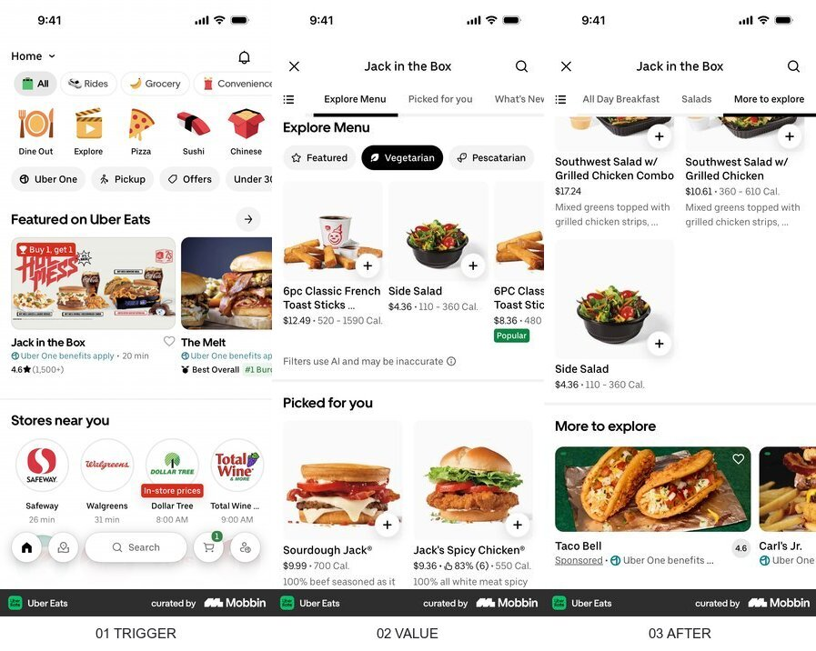

# 5개 MVP 전체 재설계 결정

결론: 다섯 앱을 하나의 시각 템플릿으로 통일하지 않는다. 대신 `한 화면 한 과업`, `입력 직후 실제 가치`, `결과 이후 선택적 저장·가입`, `모바일 우선 adaptive 구조`를 공통 계약으로 사용하고, 앱별 기억 단서는 각각 다르게 유지한다.

## 조사 브리프

- 사용자와 과업: 지금 필요한 앱 하나를 고르고, 설명을 배우지 않아도 핵심 입력·선택을 시작해 실제 결과를 받는다.
- 진입 트리거: 광고·공유 링크·실험 허브·재방문 링크.
- 현재 기준선: 다섯 앱의 라우트와 핵심 API는 존재하지만 첫 가치보다 랜딩 설명이 앞서거나, 입력·결과·보조 기능이 서로 다른 규칙으로 배치되어 있다.
- 가치 순간:
  - MATPICK: 저장한 영상의 실제 장소와 원본 영상이 지도에서 함께 보인다.
  - 한입코치: 사진에서 확인한 음식 그룹과 다음 끼니 행동 하나를 받는다.
  - 오늘 A: 관찰한 불편이 돈 낼 사람·순간·첫 제안이 있는 구조로 정리된다.
  - 오늘 B: 아이디어의 가장 위험한 가정이 오늘 시작할 7일 실험으로 바뀐다.
  - 카드형 AI 단편: 끌리는 카드를 고르는 순간 그 장면이 첫 대화 맥락이 된다.
- 검토할 요청: 가입은 결과 이후, 위치 권한은 위치 없이도 기본 결과를 본 뒤 선택적으로 요청한다. 결제는 이번 재설계 범위에서 요청하지 않는다.
- 결정: 공통 앱 셸과 상태 규칙을 만들고, 각 앱은 서로 다른 주 시각 언어와 기억 단서를 사용한다.
- 목표 지표: 첫 핵심 행동 시작률, 첫 결과 도달률.
- guardrail: 오류 복구율, 재방문률, 건강·개인정보 불만, 가입 전 이탈.
- 제약: MATPICK의 주 디자인은 Google Maps. Beli·Collect·Corner는 행동과 정보 구조만 참고한다. 카드 앱은 저장소의 기존 타로 덱을 재사용한다.

## Google Maps — MATPICK의 주 디자인

- 흐름: `지도·검색 진입 → 장소 결과와 핵심 행동 → 필터가 유지된 지도·목록`
- 관찰 E0: 지도, 검색, 범주 필터, 장소 사진, 평점, 길찾기 행동이 한 화면 안에서 위계만 달리해 공존한다.
- 전이 판단: `adopt` — MATPICK의 지도·목록 밀도, 검색·필터, 장소 선택 구조와 타이포그래피 기준으로 사용한다.
- 위험·한계: Google Maps의 색·로고·지도 데이터를 복제하지 않는다. 지도 이미지가 없는 MVP에서는 실제 장소 데이터와 간소화한 지도 표면을 사용한다.
- 출처: [Mobbin flow](https://mobbin.com/flows/fc8dfce3-bd09-4346-9a97-441f0948cf53)

## Uber Eats — 가까운 장소를 빠르게 비교하는 밀도

- 흐름: `근처 탐색 → 장소·메뉴 비교 → 상세에서 다음 후보를 이어서 탐색`
- 관찰 E0: 사진과 이름이 먼저 보이고, 거리·가격·상태는 짧은 보조 정보로 압축된다.
- 전이 판단: `adapt` — MATPICK 장소 카드에서는 메뉴 대신 `언급 영상`, 배달 시간 대신 `거리`, 구매 대신 `원본 영상·길찾기`를 사용한다.
- 위험·한계: 주문을 유도하는 상품 그리드 밀도를 그대로 적용하면 지도 탐색이 무거워진다.
- 출처: [Mobbin flow](https://mobbin.com/flows/177464d4-adc2-418b-bcec-4eca4abfe36e)

## Beli — 목록 우선 구조의 반례

- 흐름: `저장 목록 → 장소 선택 → 상세 → 목록으로 복귀`
- 관찰 E0: 사용자가 이미 저장한 장소를 다시 찾는 데에는 목록 중심 구조가 빠르다.
- 전이 판단: `adapt` — MATPICK의 재방문 탭과 위치 권한 거절 상태에 사용한다. 첫 방문의 기본 화면 전체를 목록으로 바꾸지는 않는다.
- 위험·한계: 사용자가 요구한 지도 가치를 첫 화면에서 숨기므로 주 디자인으로는 채택하지 않는다.
- 출처: [Mobbin flow](https://mobbin.com/flows/3255694a-faad-444f-914d-4b7c82083fa6)

## Lovi — 한입코치와 결과형 앱의 입력·결과 분리

- 흐름: `분석 대상 선택 → 사진 입력 → 핵심 판정·근거·다음 행동`
- 관찰 E0: 입력과 결과가 서로 다른 상태이며, 결과 첫 화면은 한 줄 판정과 세 가지 근거를 먼저 보여준다.
- 전이 판단: `adapt` — 한입코치는 한 줄 관찰, 확인 가능한 음식 그룹, 다음 끼니 행동 하나, 다시 촬영 순서로 사용한다. 구매 링크와 점수는 제외한다.
- 위험·한계: 건강 적합도 점수를 흉내 내면 의료적 확실성으로 오해될 수 있다.
- 출처: [Mobbin flow](https://mobbin.com/flows/12e8692d-5da8-40a3-a51d-a48d2d39fa8a)

## Pi — 카드 선택과 질문형 앱의 맥락 연속성

- 흐름: `상황 입력 → 같은 화면에서 맥락형 응답 → 후속 질문`
- 관찰 E0: 사용자의 첫 문장이 대화 상단에 남고, 답변과 후속 질문이 같은 입력창에서 이어진다.
- 전이 판단: `adopt` — 카드형 AI 단편은 카드 선택을 첫 사용자 메시지로 사용한다. 오늘 A·B는 필요한 후속 질문을 한 번만 이어서 결과를 만든다.
- 위험·한계: 모든 앱을 채팅 UI로 만들지 않는다. 맥락이 누적되는 순간에만 사용한다.
- 출처: [Mobbin flow](https://mobbin.com/flows/3633dacc-a527-49eb-b898-c410e2b2ce26)

## Flo — 한 화면 한 질문

- 흐름: `질문 하나 → 답변 → 조건 충족 후 다음 단계`
- 관찰 E0: 한 화면에 질문·입력·다음 행동만 남기고, 조건이 충족되기 전에는 다음 버튼을 비활성화한다.
- 전이 판단: `adapt` — 오늘 A·B의 긴 입력을 단계별 질문으로 나누고, 이미 답한 내용을 다음 화면에서 반복하지 않는다.
- 위험·한계: 모든 질문을 별도 화면으로 나누면 단계 수만 늘어난다. 결과를 실제로 바꾸는 질문만 남긴다.
- 출처: [Mobbin screen](https://mobbin.com/screens/a8f2b86d-154c-4bcd-835a-069e3cdfe6f1)

## 제품별 가로 여정

| 제품 | 진입 | 첫 행동 | 실제 가치 | 저장·실행 | 재사용 |
|---|---|---|---|---|---|
| 허브 | 광고·홈 | 필요한 결과 선택 | 앱의 입력과 결과 확인 | 앱 실행 | 최근 사용 앱으로 복귀 |
| MATPICK | 광고·DM 답장·지도 링크 | 지역 또는 현재 위치 확인 | 가까운 장소와 언급 영상 확인 | 장소 저장·길찾기 | 저장 지도와 새 장소 확인 |
| 한입코치 | 홈·공유 링크 | 음식 사진 선택 | 보이는 음식 그룹과 다음 행동 하나 | 행동 저장 | 다음 끼니 사진으로 이어가기 |
| 오늘 A | 홈 | 관찰한 불편 한 문장 | 돈 낼 사람·순간·첫 제안 구조 | 저장·복사 | 조건을 수정해 다시 구조화 |
| 오늘 B | 홈 | 아이디어와 고객 한 문장 | 가장 위험한 가정과 7일 실험 | 오늘 행동 체크 | 실험 기록과 다음 날 행동 |
| 카드형 AI 단편 | 홈 | 타로 덱에서 상황 선택 | 장면이 첫 메시지가 된 대화 | 대화 계속 | 다시 덱에서 다른 장면 선택 |

## 공통 설계 계약

1. 첫 화면의 최상위 행동은 하나만 강조한다.
2. 결과 전에 가입하지 않는다.
3. 위치 권한이 없어도 역 기준 데모 결과를 먼저 보여준다.
4. 모바일 compact 화면은 하단 행동과 sheet를 사용하고, expanded 화면은 보조 pane을 추가한다.
5. 모든 앱은 `loading / empty / error / partial / success / saved` 상태를 같은 언어 규칙으로 제공한다.
6. 공통 컴포넌트는 행동·상태·간격·접근성만 공유한다. 각 앱의 색·형태·기억 단서는 공유하지 않는다.
7. 카드 앱의 모션은 카드 선택에서 대화로 넘어가는 shared-object handoff에만 사용한다.
8. 지도·목록의 반복 탐색과 폼 입력에는 장식 모션을 사용하지 않는다.

## 적용 우선순위

1. MATPICK에서 로딩 중 빈 화면을 제거하고 역삼역·강남역 기본 결과를 즉시 보여준다.
2. 카드형 AI 단편에서 상황 목록보다 타로 덱을 먼저 보여주고, 선택 즉시 채팅을 시작한다.
3. 공통 앱 셸·상태·버튼·한국어 타이포그래피 토큰을 만든다.
4. 한입코치의 입력→관찰→다음 행동 결과를 단순화한다.
5. 오늘 A·B의 질문 단계를 줄이고 결과와 실행 상태를 분리한다.
6. 허브를 마케팅 랜딩이 아니라 앱 선택·복귀 화면으로 바꾼다.

## 검증

- primary metric: 첫 핵심 행동 시작률, 첫 결과 도달률.
- guardrail: 오류 후 복구율, D1·D7 재방문, 건강·개인정보 불만.
- 사전 점검: 390px·768px·1440px, 키보드, 200% 확대, reduced motion.
- E3 실험: 실제 사용자가 설명 없이 첫 행동을 시작하는지, 결과 이후 저장·실행을 선택하는지 확인한다.

> Mobbin 화면은 출시된 구조의 근거이며 성과·규정 준수의 증거가 아니다.
