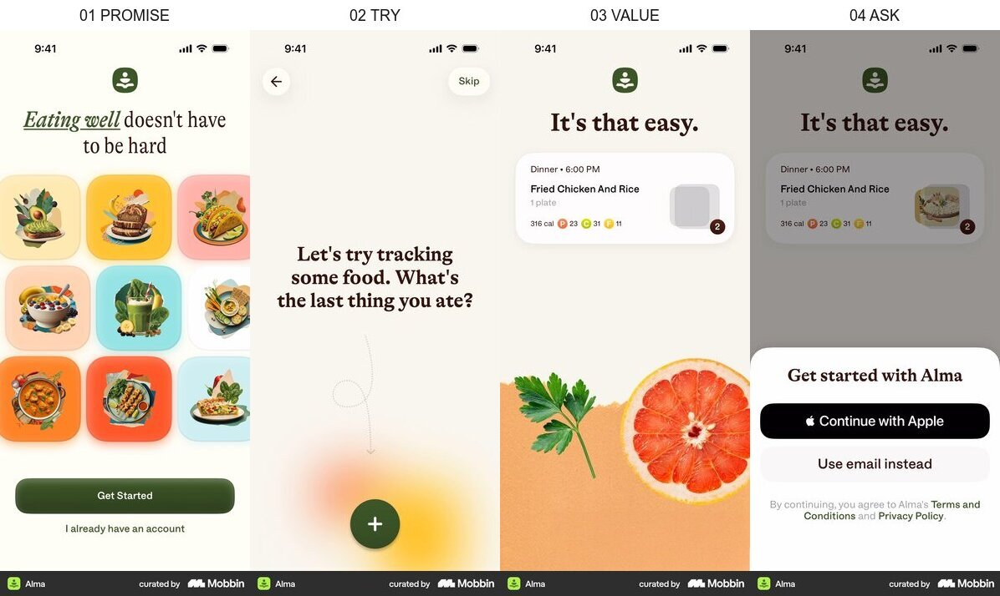
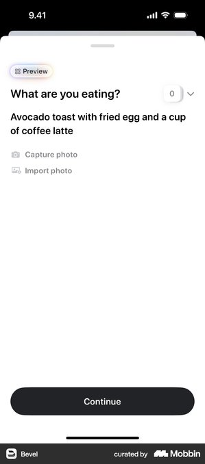
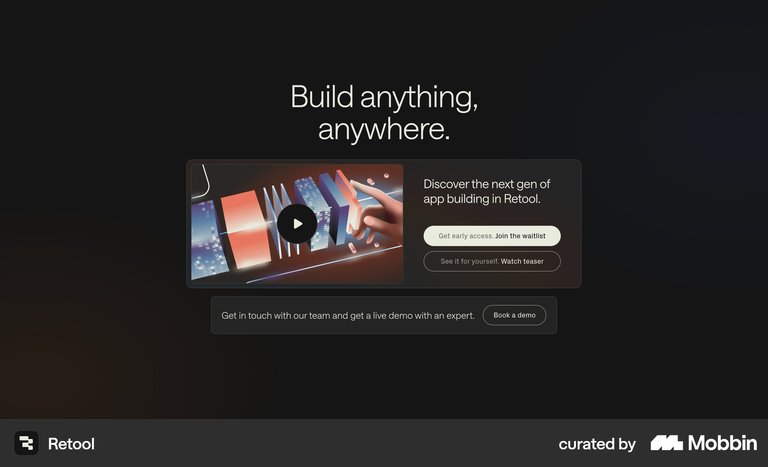
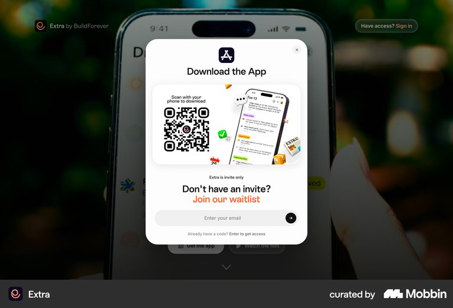

# 한입코치 모바일 랜딩페이지 레퍼런스 요약

결론: 첫 화면에서 `사진 한 장 → 다음 끼니 행동 하나`를 약속하고 실제 예시를 보여준 뒤, Google 예약은 그 다음에 요청합니다.

## 조사 브리프

- 사용자 과업: 광고를 누른 30대 여성이 한입코치가 무엇을 주는지 이해하고 첫 코칭을 예약한다.
- 진입 트리거: 야식·식단 관리 상황을 다룬 Meta 광고를 누른다.
- 현재 기준선: 광고에서 모바일 fake-door 랜딩과 예약 화면으로 이어지는 초안.
- 가치 순간: 음식 사진을 보내면 어떤 말과 다음 행동을 받는지 실제 예시로 이해한다.
- 검토할 요청: Google 가입·예약.
- 결정: 첫 화면의 정보 위계와 예약 요청 시점.
- 목표 지표: 랜딩 방문 대비 예약 완료율.
- guardrail: 첫 화면 이탈률, 예약 취소율, 의료·체중 감량 서비스로 오해한 문의.
- 가정: 실제 사용자는 사진을 보내고 1일 뒤 코칭 결과를 받는다. 즉시 AI 분석처럼 보이게 만들지 않는다.

## Alma — 먼저 한 번 해보고, 다음에 가입

- 흐름: 가치 약속 → 음식 입력 체험 → 기록 결과 → 계정 요청.
- 관찰 E0: 가입 창은 사용자가 음식 입력과 결과 화면을 본 뒤에 나타난다.
- 전이 판단: `adapt` — 한입코치는 영양 점수 대신 `다음 끼니 행동 하나`의 예시를 먼저 보여준다.
- 위험·한계: 영양소·칼로리 점수는 의료적 정확도를 기대하게 하므로 가져오지 않는다. 관찰 신뢰도 높음, 전이 신뢰도 높음.
- 출처: [Alma Onboarding · Mobbin](https://mobbin.com/flows/6e3d85dd-e2ea-4747-93a7-1104b0e06c9e)

## Bevel — 핵심 입력을 한 화면에 집중

- 관찰 E0: `무엇을 먹었나요?` 아래에 설명 입력, 사진 촬영, 사진 불러오기, 계속하기만 둔다.
- 전이 판단: `adopt` — 한입코치 예약 전 예시 입력도 음식 사진 한 장과 한 개 CTA로 제한한다.
- 위험·한계: 자유 입력과 사진을 동시에 열면 선택 부담이 생기므로 첫 테스트는 사진 하나만 둔다. 관찰 신뢰도 높음, 전이 신뢰도 높음.
- 출처: [Bevel Food Capture · Mobbin](https://mobbin.com/screens/1ee53fa5-378b-4a31-a49b-39cd66a02f5d)

## Retool — 기다림을 요구하기 전에 데모를 노출

- 관찰 E0: 대기자 등록 CTA 옆에 제품 데모를 확인할 수 있는 경로가 함께 있다.
- 전이 판단: `adapt` — 모바일에서는 별도 영상 대신 한입코치의 `사진 → 혼나는 한마디 → 다음 끼니 행동` 예시 한 세트를 예약 CTA 위에 둔다.
- 위험·한계: 웹 데스크톱 사례이므로 모바일 레이아웃이 아니라 `데모를 요청보다 먼저 둔다`는 원리만 가져온다. 관찰 신뢰도 높음, 전이 신뢰도 중간.
- 출처: [Retool Waitlist Hero · Mobbin](https://mobbin.com/sites/sections/cf57e12d-e9f3-43a8-a5ea-ae3f50cd77b9)

## Extra — 가입부터 막는 반대 사례

- 관찰 E0: 제품 가치를 충분히 확인하기 전에 이메일 입력과 초대 코드 요청이 전면에 나타난다.
- 전이 판단: `reject` — 광고에서 막 도착한 사용자는 한입코치 결과를 모른 채 Google 로그인을 요구받게 된다.
- 위험·한계: 초대 전용 서비스에는 맞을 수 있지만 첫 코칭을 설명해야 하는 fake-door에는 맞지 않는다. 관찰 신뢰도 높음, 전이 신뢰도 높음.
- 출처: [Extra Invite Waitlist · Mobbin](https://mobbin.com/sites/sections/9b837b74-68c9-47cb-b7ce-ecb802b2836f)

## 반복 패턴과 예외

- 반복 E1: Alma와 Retool은 핵심 경험이나 데모를 노출한 뒤 계정·대기 요청을 한다.
- 반복 E1: Alma와 Bevel은 한 화면에 하나의 질문과 하나의 주 행동을 둔다.
- counterexample: Extra처럼 이메일 입력을 먼저 막아 세우는 순서는 한입코치의 결과를 모르는 신규 방문자에게 가치 공백을 만든다.
- 외부 근거 E2: 이번 fast 조사에는 포함하지 않았다. Mobbin 화면만으로 전환 성과를 주장하지 않는다.

## 우리 앱에 적용

1. 결정: 모바일 랜딩을 `약속 → 실제 예시 → 3단계 설명 → Google 예약` 순서로 구성한다.
2. 근거: Alma의 체험 후 가입 순서, Bevel의 단일 입력, Retool의 데모 우선 구조가 같은 방향을 보인다(E0/E1).
3. 검증: 예약 버튼을 맨 위에 둔 안과 실제 코칭 예시 뒤에 둔 안을 비교한다. primary metric은 예약 완료율, guardrail은 첫 화면 이탈률·예약 취소율·서비스 오해 문의다.

### 권장 모바일 첫 화면

- 작은 문장: `먹은 걸 사진으로 보내면`
- 큰 문장: `1일 뒤, 다음 끼니를 딱 정해드려요`
- 이미지: 실제 식사 사진과 남성 코치의 분명한 반응. 가짜 앱 UI·점수·후기는 넣지 않는다.
- 첫 CTA: `코칭 예시 먼저 보기`
- 예시 다음 CTA: `첫 코칭 예약하기`
- 예약 안내: `사진을 보내면 1일 뒤 결과를 드려요.`

> Mobbin 화면은 출시된 구조의 근거이며 성과·규정 준수의 증거가 아니다.

## 조사 기록

- 모드: fast
- 레퍼런스: 직접 2개 · 유사 메커니즘 1개 · counterexample 1개
- 이미지 검토: 4/4, OCR 4회, 중복 이미지 0개
- Decision strip: 1개
- 이미지 검토 한계: 현재 macOS 환경에서 `macvis ask`는 지원되지 않아 OCR과 실제 이미지 직접 비교로 확인했다.
