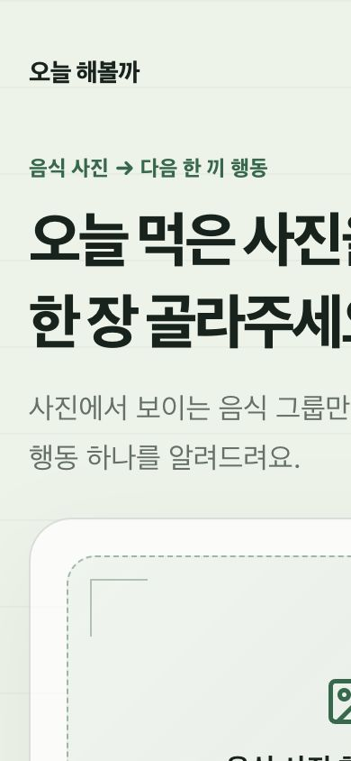
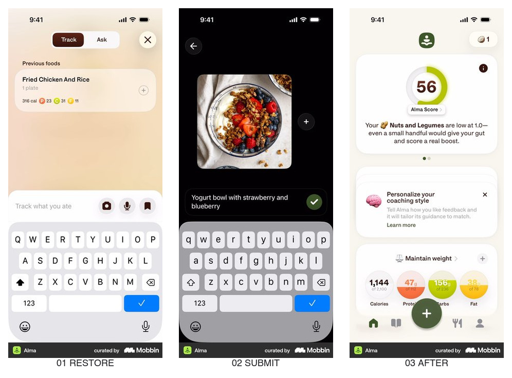
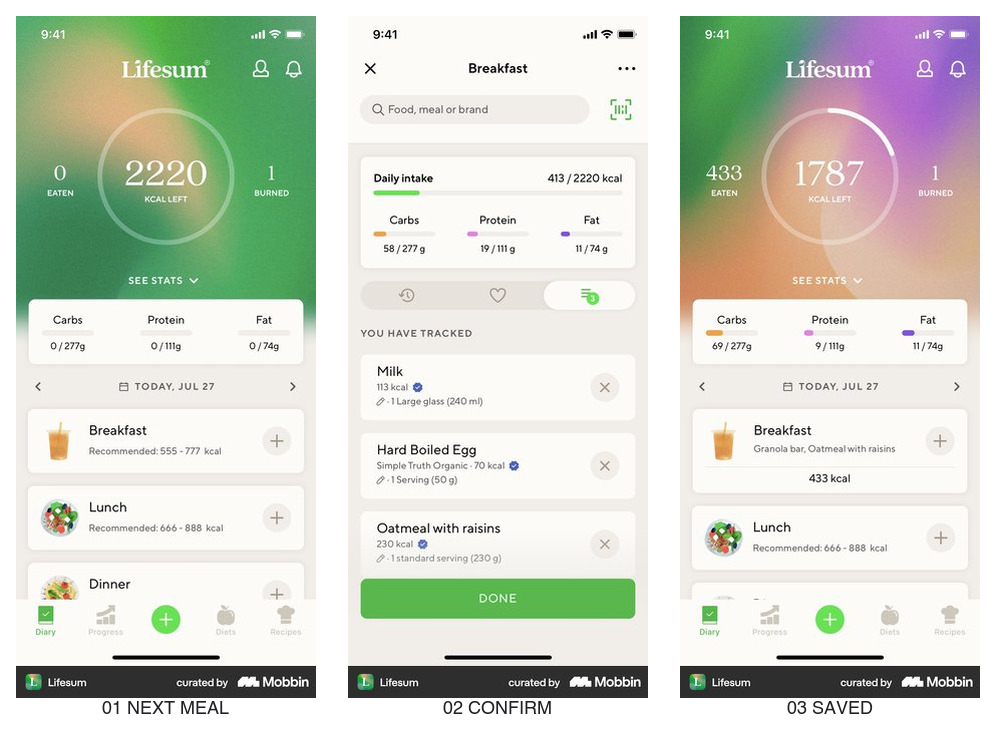
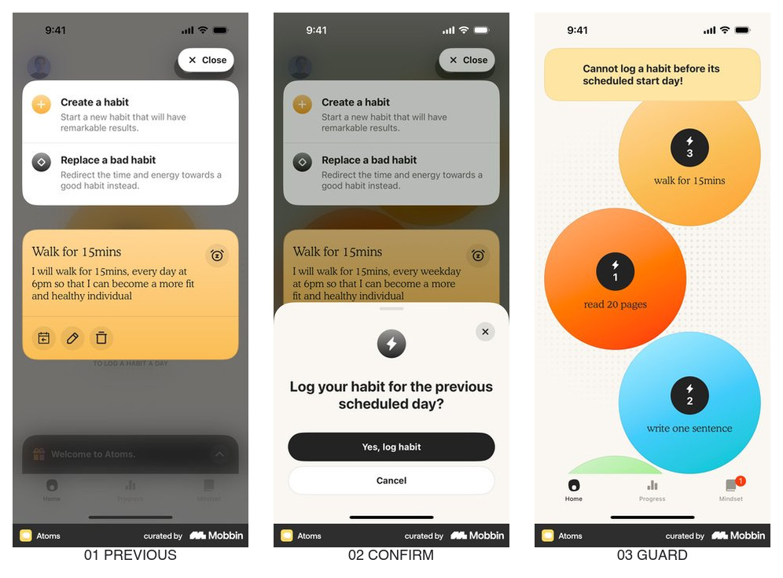
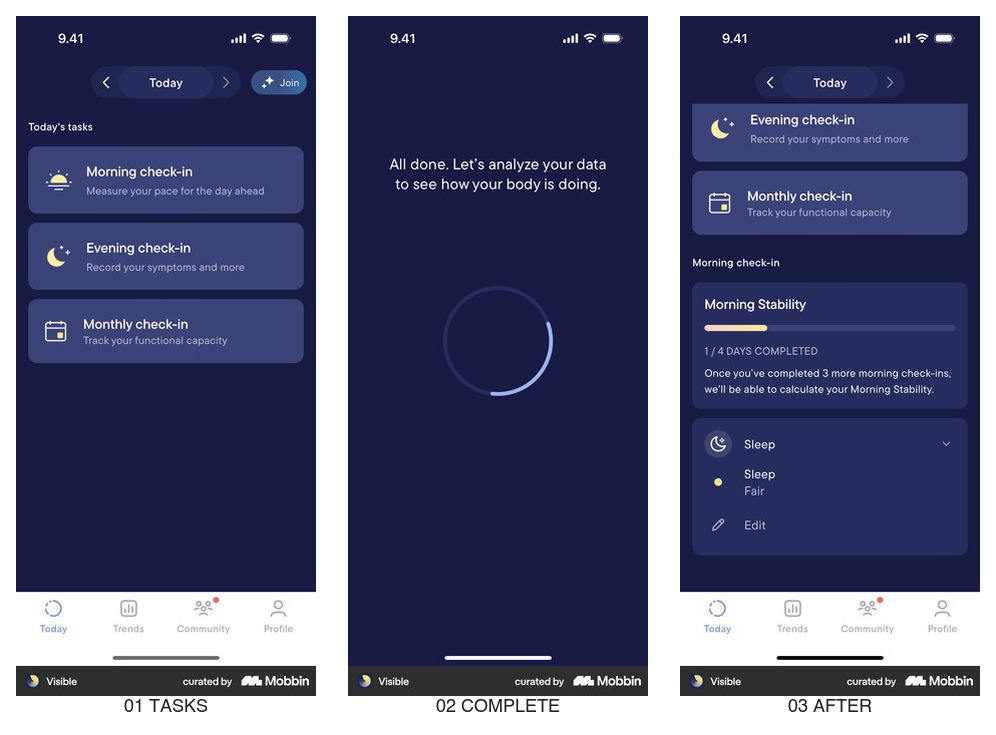
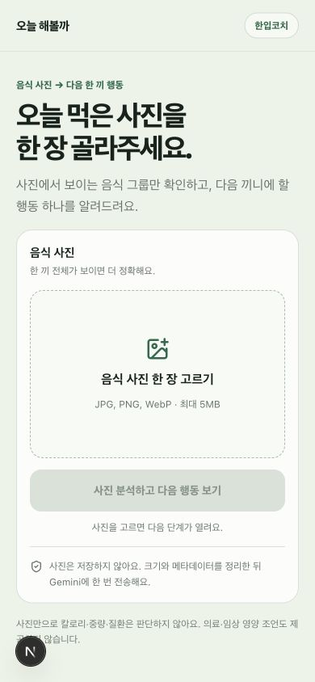
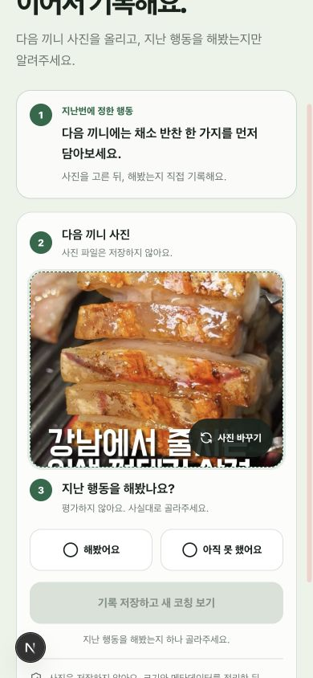
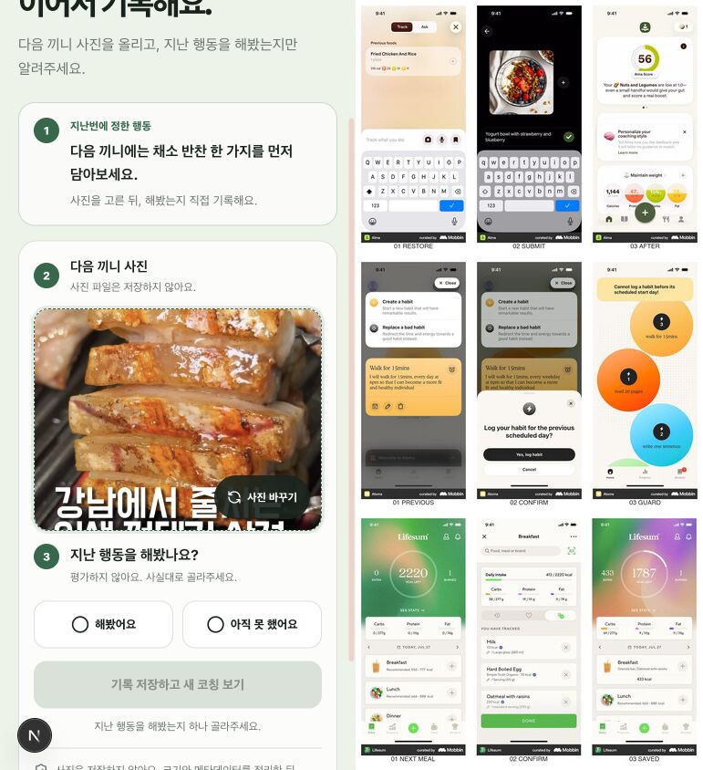

# 한입코치 재방문 루프 레퍼런스 요약

결론: 재방문 사용자는 새 분석을 다시 시작하기 전에 `지난 행동 → 다음 끼니 사진 → 실행 여부 → 저장된 기록`을 한 화면에서 이어가게 한다.

## 조사 브리프

- 제품/제품군: 한입코치 · 음식 사진 기반 작은 행동 코칭
- 사용자 과업: 지난번 행동을 잊지 않고 다음 끼니에서 실행 여부를 기록한다.
- 진입 트리거: 다음 끼니를 먹었거나, 이전에 저장한 행동을 확인하려고 다시 방문한다.
- 현재 기준선: 저장한 행동 문장은 복원되지만 실행 여부와 실행 기록은 남지 않는다.
- 가치 순간: 사용자가 다음 끼니 사진과 이전 행동의 실행 여부를 함께 저장하고 새 행동을 받는다.
- 검토할 요청: 가입 없음. 로컬 기록 후 다른 기기 복구가 필요할 때만 계정 연결.
- 결정: 재방문 화면의 정보 순서와 저장 피드백
- 목표 지표: 저장 행동 보유자의 다음 끼니 사진 제출률, 실행 기록 저장률
- guardrail: 사진 저장 0건, 의료·칼로리 판단 0건, 390px 가로 잘림 0건
- 플랫폼: 모바일 퍼스트 웹

## 현재 한입코치

- 관찰 E0: 390px에서 제목, 설명, 업로드 영역이 오른쪽으로 잘린다.
- 관찰 E0: 이전 행동은 문장으로 복원되지만 `실행했는지`를 답하거나 기록을 다시 볼 방법이 없다.
- 적용 판단: `redesign` — 재방문 상태를 별도 히어로가 아니라 오늘의 짧은 체크인으로 바꾼다.

## Alma — 이전 음식 복원과 사진 입력

- 흐름: `이전 음식 표시 → 사진으로 다음 음식 제출 → 결과에 반영`
- 관찰 E0: 입력 화면 위에 `Previous foods`가 먼저 보이고, 카메라 입력과 분석 후 결과가 같은 흐름으로 이어진다.
- 전이 판단: `adopt` — 한입코치도 지난 행동을 업로드 영역 위에서 복원한다.
- 위험·한계: Alma의 점수·영양소 수치는 한입코치의 비의료 원칙과 맞지 않아 가져오지 않는다.
- 출처: [Mobbin flow](https://mobbin.com/flows/c10846c3-9bdd-4411-ac14-0611ea5728ff)

## Lifesum — 다음 끼니 슬롯과 저장 후 일지

- 흐름: `다음 끼니 슬롯 → 입력 내용 확인 → 같은 날짜 일지에 저장`
- 관찰 E0: Breakfast·Lunch·Dinner가 다음 입력 위치를 명확히 만들고, 완료 후 같은 날짜 화면에서 저장 결과를 확인한다.
- 전이 판단: `adapt` — 칼로리 대신 `다음 끼니 사진` 슬롯과 `최근 실행 기록`을 사용한다.
- 위험·한계: 영양 목표와 수치는 의료·다이어트 판단처럼 보일 수 있어 제외한다.
- 출처: [Mobbin flow](https://mobbin.com/flows/3a8645fc-a11d-4896-9727-009752197d2b)

## Atoms — 이전 행동 실행 여부 확인

- 흐름: `이전 행동 복원 → 이전 일정의 실행 기록 확인 → 잘못된 시점 기록 차단`
- 관찰 E0: 사용자가 이전 행동을 다시 볼 수 있고, `Yes, log habit`으로 실행 기록 의사를 명시한다.
- 전이 판단: `adapt` — 한입코치는 `해봤어요 / 아직 못 했어요` 두 선택으로 실행 여부를 묻는다.
- 위험·한계: 성공·실패 점수나 강한 연속 기록 압박은 음식 행동에 죄책감을 줄 수 있어 제외한다.
- 출처: [Mobbin flow](https://mobbin.com/flows/c886bffe-e1d3-46ac-83ec-538a1e9cccae)

## Visible — 긴 체크인의 반례

- 흐름: `오늘의 체크인 선택 → 여러 단계 측정 → 완료 → 누적 결과`
- 관찰 E0: 한 번의 morning check-in이 15개 화면을 지나고, 완료 뒤 진행 카드가 갱신된다.
- 전이 판단: `reject` — 한입코치의 한 끼 기록에는 단계와 측정 부담이 너무 크다.
- 위험·한계: 의료적 상태 추적 맥락이라 일반 음식 행동 코칭에 그대로 전이할 수 없다.
- 출처: [Mobbin flow](https://mobbin.com/flows/198722d4-9e0c-4a3b-9bd3-09b0a8260640)

## 우리 앱에 적용

1. 저장한 행동이 있으면 일반 첫 화면 대신 `지난 행동을 이어서 기록해요`를 먼저 보여준다.
2. 다음 끼니 사진을 고른 뒤 `해봤어요 / 아직 못 했어요`를 선택해야 새 분석을 시작할 수 있다.
3. 실행 여부는 사진이 아니라 사용자 답으로 저장하고, 사진 파일은 저장하지 않는다.
4. 분석 결과 아래에서 새 행동을 저장하고, 재방문 화면에는 최근 실행 기록을 날짜순으로 보여준다.

## 구현 결과

- 첫 방문: 기존 가치 제안과 사진 분석 흐름을 유지했다.
- 재방문: `지난 행동 복원 → 다음 끼니 사진 → 실행 여부 → 새 코칭` 순서를 한 화면에 배치했다.
- 저장: 실행 기록은 최대 20개까지 이 기기에 저장하고, 같은 저장 행동을 재시도하면 중복 대신 상태를 갱신한다.
- 안전: 실행 여부만 저장하며 사진 파일은 저장하지 않는다.
- 확인: 390×844에서 가로 잘림이 없고, 실제 음식 사진으로 Gemini 분석·행동 저장·재방문·실행 기록까지 확인했다.

> Mobbin 화면은 출시된 구조의 근거이며 성과·규정 준수의 증거가 아니다.
