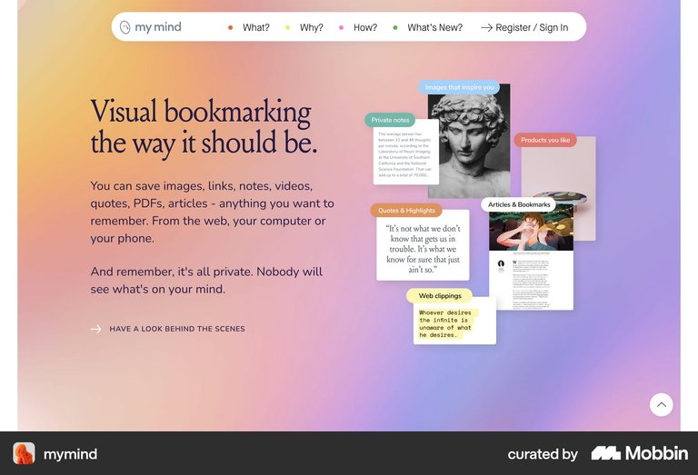
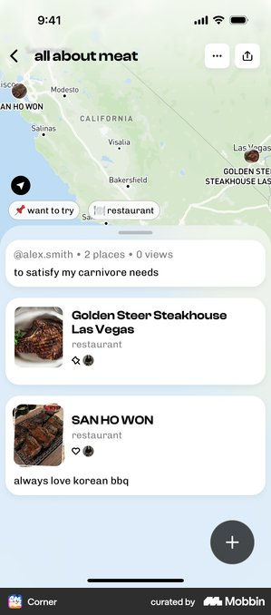

# 맛핀 광고 이후 전체 플로우 레퍼런스 요약

결론: 광고 다음에는 mymind의 한 문장 약속, Beli의 가치 선행 온보딩, Collect의 실제 공유 시트, Google Maps의 저장 피드백, Corner의 지도형 저장함을 순서대로 조합한다.

## mymind — 광고 클릭 뒤 랜딩

- 관찰: 큰 한 문장 약속 옆에 저장되는 콘텐츠 종류를 콜라주로 보여주고 가입 링크는 상단에 작게 둔다.
- 적용: `쇼츠와 릴스에서 발견한 맛집을 공유 한 번으로 저장`과 실제 맛집 카드 예시를 가입보다 먼저 보여준다.
- 제외: 광고에서 곧바로 링크 입력창이나 여러 기능 메뉴를 제시하지 않는다.
- 출처: [Mobbin section](https://mobbin.com/sites/sections/41f0260e-04a7-4105-a335-8222bbac15f6)

## Beli — 가입과 첫 설정

- 흐름: 저장 가치 약속 → 주로 먹는 지역 선택 → 첫 목록 만들기
- 관찰: 시작 화면은 음식점 기록 가치를 먼저 설명하고 지역을 고른 뒤 실제 목록 위에서 첫 행동을 요청한다.
- 적용: 샘플 결과를 본 뒤 간편 가입하고, `자주 가는 지역` 한 질문과 공유 방법 안내만 거쳐 첫 저장으로 보낸다.
- 제외: Beli의 전화번호·이메일·비밀번호·프로필·친구 초대까지 이어지는 31개 화면은 가져오지 않는다.
- 출처: [Mobbin flow](https://mobbin.com/flows/bf32f945-5507-4a2c-acac-578856b13f42)

## Collect — 다른 앱에서 공유 시작

- 관찰: 사용자가 보던 콘텐츠 위에 시스템 공유 시트가 올라오고 앱 대상과 `Copy link` 같은 보조 행동이 분리된다.
- 적용: 온보딩에서 실제 공유 시트 안의 `맛핀` 위치를 한 번 보여주고 이후에는 YouTube·Instagram 안에서 저장을 시작하게 한다.
- 제외: 맛핀 안에 가짜 공유 시트를 만들거나 사용자가 링크를 복사해 입력하도록 요구하지 않는다.
- 출처: [Mobbin screen](https://mobbin.com/screens/fa57253d-c437-4a78-a198-21930456cae6)

## Google Maps — 저장 완료 피드백

- 흐름: 장소 확인 → 저장 목록 선택 → 같은 화면에서 `Saved` 상태 확인
- 관찰: 사용자는 원래 장소 화면을 떠나지 않고 목록을 고른 뒤 저장 버튼의 상태 변화로 완료를 확인한다.
- 적용: 공유 직후 `저장했어요 · 장소를 찾는 중`을 먼저 보여주고 결과가 준비되면 맛집 카드와 지도 행동을 같은 화면에 갱신한다.
- 제외: 저장 전에 메모·목록 이름·세부 분류를 필수로 입력시키지 않는다.
- 출처: [Mobbin flow](https://mobbin.com/flows/fcd1f02e-80a9-421a-8078-996a8eb13b7c)

## Corner — 재사용하는 저장함

- 관찰: 컬렉션 제목과 지도 범위를 먼저 보여주고 음식점 카드를 같은 화면 아래에 이어 붙인다.
- 적용: `역삼역 맛집` 같은 지역 제목 아래에 YouTube·Reels 필터, 지도, 저장된 음식점 카드를 한 화면에 둔다.
- 제외: MVP에는 조회수·작성자·소셜 반응과 수동 추가 플로팅 버튼을 넣지 않는다.
- 출처: [Mobbin screen](https://mobbin.com/screens/48ed97b1-08c4-4956-8cc4-29d0e0718670)

## 우리 앱에 적용

1. 광고 클릭 뒤에는 mymind처럼 한 문장 약속과 실제 결과 예시를 먼저 보여준다.
2. 가입은 Beli의 가치 선행 구조만 가져오고 `간편 가입 → 자주 가는 지역 → 공유 방법` 세 화면으로 끝낸다.
3. 첫 사용은 Collect의 시스템 공유 시트에서 시작하고 Google Maps처럼 즉시 저장 상태를 돌려준다.
4. 재사용 화면은 Corner처럼 `지역 → 출처 필터 → 지도 → 음식점 카드` 순서로 고정한다.

> 화면 구조는 참고 근거이며 성과 개선을 보장하지 않는다.
