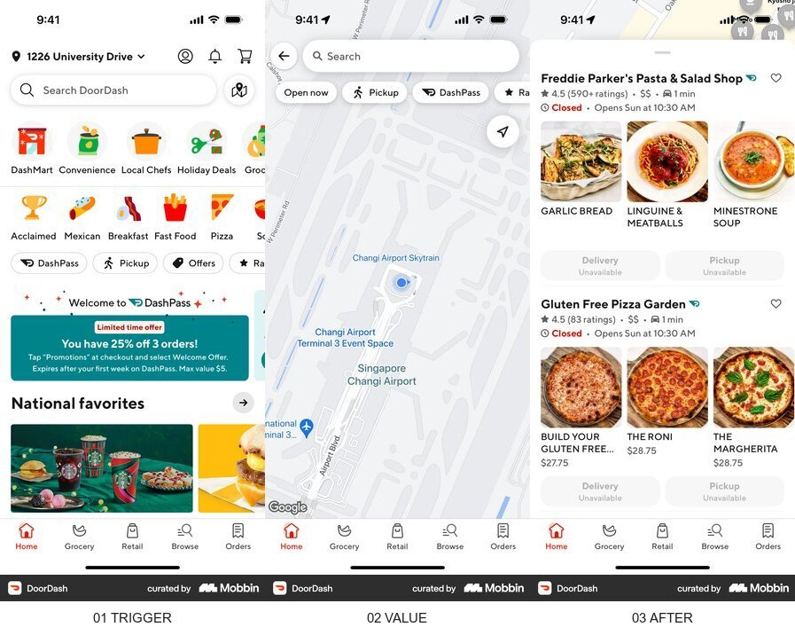

# 맛핀 모바일 근처·영상 플로우 레퍼런스 요약

결론: 모바일 기본 화면은 `현재 위치가 보이는 지도 → 선택한 장소 하단 시트 → 언급 영상 즉시 재생`으로 단순화하고, 긴 우측 목록과 데스크톱형 정보 패널은 761px 이상에서만 사용한다.

## 조사 브리프

- 사용자 과업: 저장한 장소 중 지금 가까운 곳을 찾고, 실제로 어떤 YouTube 영상에서 언급됐는지 즉시 확인
- 현재 기준선: 지도와 우측 목록을 동시에 보여주는 데스크톱 중심 반응형 화면
- 가치 순간: 가까운 장소 하나를 선택해 언급 영상을 화면 안에서 재생
- 검토할 요청: 위치 권한. 첫 화면을 막지 않고 사용자가 `현재 위치로 찾기`를 누를 때만 요청
- 결정: 390px을 기본 구조로 삼고 지도·하단 시트·가로 영상 레일을 한 화면에 유지
- 목표 지표 / guardrail: 장소 선택 후 영상 재생률 / 위치 권한 거절 후 이탈, 첫 화면 과밀도

## Uber Eats

- 흐름: 홈의 카테고리·주변 매장 → 선택한 매장의 핵심 메뉴 → 상세 탐색
- 관찰 E0: 모바일 홈은 위치 맥락을 상단에 두고, 주변 결과는 큰 이미지와 짧은 메타데이터로 세로 스캔하게 한다. 상세 안에서는 탭과 이미지 카드가 같은 너비를 유지한다.
- 전이 판단: `adapt` — 맛핀은 주문 메뉴 대신 `언급 영상`을 큰 썸네일과 채널·길이로 보여준다.
- 위험·한계: Uber Eats 화면은 주문 전환을 위한 구조이며 영상 증거 탐색 성과를 보여주지는 않는다.
- 출처: [Mobbin flow](https://mobbin.com/flows/177464d4-adc2-418b-bcec-4eca4abfe36e)

## DoorDash

- 흐름: 주소가 고정된 홈 → 검색·필터가 얹힌 전체 지도 → 매장 상세
- 관찰 E0: 지도 모드에서는 검색과 필터만 지도 위에 남기고, 상세를 선택하면 사진과 핵심 메타데이터가 화면의 주인공이 된다.
- 전이 판단: `adopt` — 지도 위에는 위치·필터·핀만 남기고, 선택 뒤 정보는 하단 시트로 집중한다.
- 위험·한계: 캡처된 지도 상태는 결과 카드가 적어 지도와 카드의 동시 밀도를 충분히 보여주지 않는다.
- 출처: [Mobbin flow](https://mobbin.com/flows/487f768e-3275-4509-ab96-a61fc22ce3cd)

## Google Maps

- 흐름: 지도·카테고리 → 이미지가 있는 장소 결과 → 지도와 상세 행동
- 관찰 E0: 검색과 필터는 상단에 고정되고, 결과는 사진·평점·상태·거리와 길찾기 같은 다음 행동을 압축해 보여준다.
- 전이 판단: `adopt` — Google Maps의 중립 색·작은 필터·파란 주요 행동을 유지하고, 평점 자리에 `YouTube 언급 영상 수`를 둔다.
- 위험·한계: 출시 화면의 구조 근거일 뿐 맛핀의 영상 재생률을 보장하지 않는다.
- 출처: [Mobbin flow](https://mobbin.com/flows/fc8dfce3-bd09-4346-9a97-441f0948cf53)

## Beli

- 흐름: 저장 목록 → 비어 있는 목록과 추천 → 필터된 세로 목록과 선택형 지도
- 관찰 E0: 저장 컬렉션의 기본값은 목록이며 지도는 `View Map` 보조 행동이다. 빈 상태에서도 가져오기·추천처럼 다음 행동이 남는다.
- 전이 판단: `adapt` — 맛핀은 사용자가 지도 페이지를 요구했으므로 지도를 기본값으로 유지하되, 위치 권한 거절 시에도 성수역 기준 결과를 즉시 보여준다.
- 위험·한계: Beli는 개인 저장·추천 제품이라 실시간 근처 탐색과 목적이 다르다.
- 출처: [Mobbin flow](https://mobbin.com/flows/3255694a-faad-444f-914d-4b7c82083fa6)

## 우리 앱에 적용

1. 결정: 기본 CSS와 첫 화면을 390px 지도·하단 시트 기준으로 만들고 데스크톱 분할 패널은 `min-width: 761px`에서만 추가한다.
2. 근거: DoorDash·Google Maps는 지도 위 컨트롤을 최소화하고 선택 결과를 별도 상세 영역으로 집중한다. Uber Eats는 이미지가 큰 가로·세로 카드로 빠른 스캔을 돕는다.
3. 결정: 장소 카드의 첫 보조 정보는 `거리`, 두 번째는 `YouTube 언급 영상 수`, 다음 행동은 `영상 재생`과 `길찾기`만 둔다.
4. 검증: 위치 버튼 사용, 핀 선택, 영상 재생의 세 행동을 모바일 뷰에서 확인한다. 위치 권한 거절 후에도 데모 기준 결과가 남아야 한다.

> Mobbin 화면은 출시된 구조의 근거이며 성과·규정 준수의 증거가 아니다.
