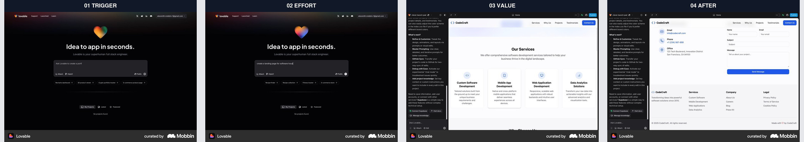
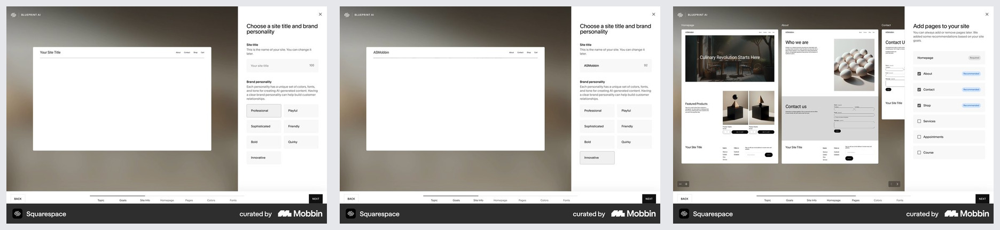
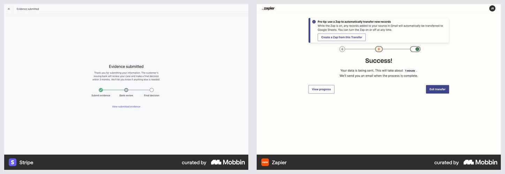
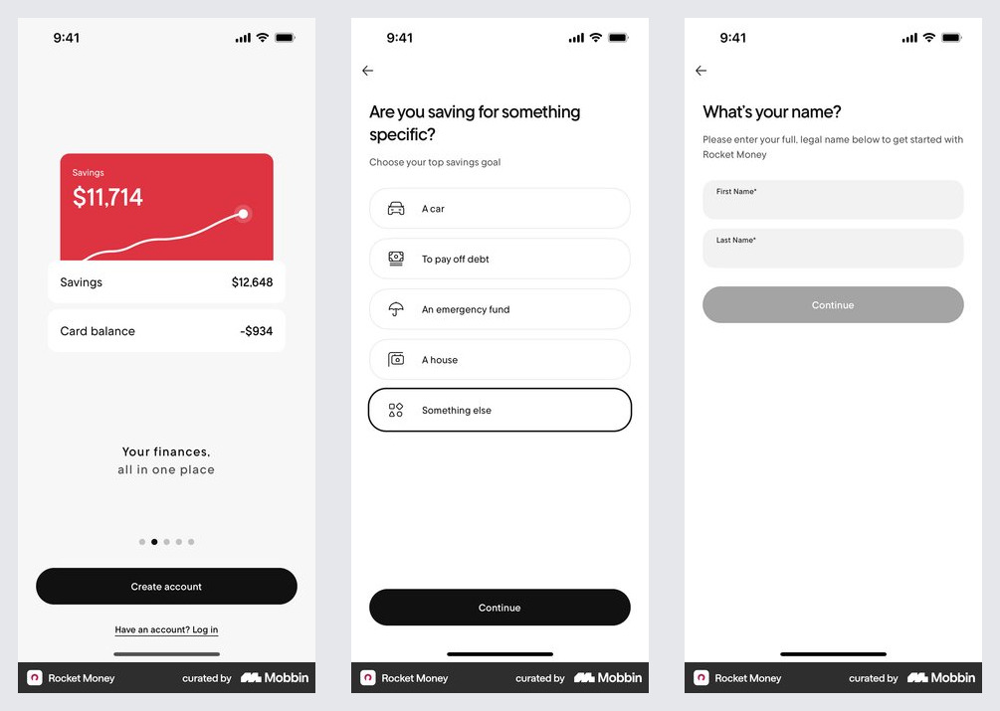

# 오늘 아이디어 통합 흐름 결정

결론: `Today A·B`를 하나로 합치고, `아이디어 있음/없음 선택 → 근거 기반 아이디어 확정 → 제작 신청 → 24시간 대기 → 광고 이미지·Fake Door 랜딩·측정 계획 수령`으로 설계한다. 가입부터 시키지 않고, 아이디어 초안과 사용한 원본 근거를 확인한 뒤 결과 전달에 필요한 이메일만 신청 마지막에 받는다.

## 조사 브리프

- 사용자와 과업: 만들 아이디어를 못 고르거나 이미 있는 아이디어를 검증 가능한 형태로 좁혀, 광고로 실제 신청 행동을 확인하고 싶다.
- 진입 트리거: 실험 허브, 광고, 공유 링크, `/today-a`·`/today-b` 기존 주소.
- 현재 기준선: Today A는 저장된 매출 원본과 문제를 매칭하고, Today B는 규칙 기반 7일 실험을 만든다. 두 결과가 분리되어 랜딩·광고 제작 신청으로 이어지지 않는다.
- 가치 순간: 사용자가 `누구의 어떤 문제를 어떤 결과로 바꿀지`, 사용한 매출 원본, 변형한 지점, 내일 받을 결과물 3개를 한 화면에서 확인한다.
- 검토할 요청: 가입. 전체 계정은 요구하지 않는다. 신청 결과를 알리는 이메일만 최종 제출 직전에 요청한다.
- 결정: 질문은 결과를 바꾸는 축만 한 번에 하나씩 받는다. 기존 아이디어가 있으면 Gemini가 저장된 원본 근거와 비교해 개선하고, 없으면 객관식 답으로 원본 구조를 선택·변형한다.
- primary metric: 아이디어 초안 확인 후 제작 신청 완료율.
- guardrail: 질문 중 이탈, 근거 펼침률, 신청 취소·이메일 불만, 24시간 뒤 결과 재방문율, 랜딩의 실제 CTA 전환율.
- 제약: 현재 저장소에는 운영 DB·메일·비동기 이미지 제작 큐가 없다. 로컬 MVP는 동일 API 계약의 데모 작업을 기기에 저장하고, 24시간 상태와 결과물 범위를 정직하게 시뮬레이션한다.

## Lovable — 한 문장 입력에서 편집 가능한 결과로

- lifecycle: `빈 프로젝트·프롬프트 → 설명 입력 → 생성된 사이트 미리보기 → 같은 작업 공간에서 수정`
- 관찰 E0: 첫 화면에서 긴 설정 없이 프롬프트 하나를 받고, 생성 후에는 대화와 실제 사이트 미리보기를 나란히 둔다.
- 전이 판단: `adapt` — 아이디어가 있는 경로는 한 문장 입력과 근거 기반 개선 초안을 같은 작업 흐름에서 보여준다. 즉시 완성 사이트를 연기하지 않고, 신청 뒤 24시간 제작 범위를 명확히 보여준다.
- 위험·한계: Lovable은 자동 생성 도구이고 우리는 초기 human-in-the-loop 실험이다. 생성 속도·완성도를 복제해 약속하지 않는다.
- observation confidence: high
- transfer confidence: high
- 출처: [Mobbin flow](https://mobbin.com/flows/f65cb860-b564-4984-8dd7-b62d6e1365e6)

## Squarespace Blueprint AI — 결과를 바꾸는 선택만 점진적으로

- lifecycle: `사이트 이름·성격 선택 → 선택이 반영된 미리보기 → 추천 페이지 선택`
- 관찰 E0: 왼쪽 미리보기는 안정적으로 남고, 오른쪽에서 현재 결정 하나만 받는다. 페이지 추천에는 선택 이유와 변경 가능성이 함께 보인다.
- 전이 판단: `adapt` — 아이디어가 없는 경로는 `고객 → 반복 문제 → 원하는 결과 → 닿을 채널`을 한 축씩 묻고, 앞의 답은 접힌 요약으로 보존한다. 결과를 바꾸지 않는 브랜드 취향 질문은 제작 신청 뒤로 미룬다.
- 위험·한계: 화면 수를 그대로 복제하면 아이디어 탐색이 사이트 편집 마법사처럼 길어진다. 객관식은 최대 세 질문으로 제한한다.
- observation confidence: high
- transfer confidence: high
- 출처: [Mobbin flow](https://mobbin.com/flows/6a0880c9-76a2-4390-9a6a-5cce826e77f4)

## Stripe·Zapier — 신청 뒤 불확실성을 상태로 바꾸기

- lifecycle: `제출 완료 → 현재 단계·예상 시간 → 알림 약속·진행 보기 → 완료`
- 관찰 E1: 두 화면 모두 성공 문구만 보여주지 않고, 처리 중인 일·예상 시간·알림 방식·다음 행동을 함께 제공한다.
- 전이 판단: `adopt` — 신청 완료 화면에 `아이디어 검토 → 광고 이미지·랜딩 제작 → 전달` 3단계, 정확한 준비 시각, 전달 이메일, 신청 내용 보기와 취소를 둔다.
- 위험·한계: 현재 로컬 MVP는 실제 메일을 보내지 않는다. 운영 큐가 연결되기 전에는 `이 브라우저에서 상태 확인`으로 표시하고 발송 완료를 가장하지 않는다.
- observation confidence: high
- transfer confidence: high
- 출처: [Stripe screen](https://mobbin.com/screens/7122f301-ec22-41ed-b114-8ed865ce3275), [Zapier screen](https://mobbin.com/screens/06183f18-903c-4557-b5dd-0e9acd6bf7a3)

## Rocket Money — 가치 전 가입의 counterexample

- lifecycle: `가치 약속 → 계정 생성 → 목표 선택 → 개인 정보 입력`
- 관찰 E0: 사용자는 개인화 결과를 보기 전에 계정과 이름을 먼저 제공한다.
- 전이 판단: `reject` — 아이디어 초안과 원본 근거를 보기 전에 계정 생성을 요구하지 않는다. 다만 24시간 결과 전달에 필요한 이메일은 제작 신청의 필수 입력으로, 사용 이유와 저장 범위를 함께 설명한다.
- 위험·한계: 금융 데이터 연결처럼 계정이 제품 가치의 전제인 서비스와 달리, 아이디어 초안은 익명으로 제공할 수 있다.
- observation confidence: high
- transfer confidence: high
- 출처: [Mobbin flow](https://mobbin.com/flows/fed2772b-6edd-432f-b195-0691f2d84d04)

## Toss 가입 화면에서 적용할 상호작용

- 공식 사례에서 확인한 문제: 입력 필드가 갑자기 생기거나 CTA가 키보드 아래로 밀리면 사용자가 다음 행동을 놓친다.
- 적용: 현재 질문 하나만 활성화하고, 완료한 답은 위쪽 요약으로 접어 보존한다. 다음 질문은 사용자가 CTA를 누른 뒤 추가하며 포커스를 이동한다.
- 적용: 모바일 CTA는 키보드와 새 필드에 밀리지 않도록 질문 카드의 마지막에 항상 남고, 새 필드가 생기는 대신 화면 전체가 교체되지 않는다.
- 적용: 질문을 무조건 한 페이지씩 늘리지 않는다. 기존 아이디어 경로는 한 문장 입력 하나, 아이디어 없음 경로만 결과를 바꾸는 객관식 세 축을 사용한다.
- 출처: [토스 회원가입 과정](https://toss.tech/article/toss-signup-process)

## 최종 제품 여정

| 단계 | 사용자가 아는 것 | 주 행동 | 다음 상태 |
|---|---|---|---|
| 시작 | 아이디어가 있는지 여부 | `아이디어가 있어요` 또는 `아직 없어요` | 경로 분기 |
| 구체화 | 현재 한 축과 이전 답 | 문장 입력 또는 객관식 한 개 선택 | 다음 축·부분 요약 |
| 초안 | 아이디어·고객·결과·원본 근거·변형점 | `이 아이디어로 제작 신청하기` | 신청 정보 |
| 신청 | 내일 받을 광고 이미지·랜딩·측정 계획 | 이메일 확인 후 제출 | 24시간 작업 상태 |
| 대기 | 준비 시각·현재 단계·신청 내용 | 상태 확인 또는 신청 취소 | 진행/취소/준비됨 |
| 결과 | 광고 이미지·Fake Door 랜딩·CTA·측정 기준 | 랜딩 열기·이미지 저장·새 아이디어 | 실제 광고 실험 |

## 공통 설계 계약

1. 첫 초안 전에는 가입하지 않는다.
2. 질문은 한 축씩 열고 이전 답을 보존한다.
3. Gemini 결과는 저장된 실제 매출 원본의 이름·URL·보존한 구조·변형점을 함께 반환한다.
4. Gemini가 없거나 실패하면 같은 응답 계약의 `catalog_snapshot`으로 복구한다.
5. 신청 뒤 24시간을 실제 비동기 작업처럼 보여주되, 운영 큐·메일이 없으면 로컬 데모라고 명확히 표시한다.
6. 광고 이미지는 제품 근거와 CTA를 분리하고, 랜딩은 문제·약속·행동 하나만 강조한다.
7. motion은 질문 진행의 160–220ms 위치 변화와 신청 완료 상태 handoff에만 사용한다. `prefers-reduced-motion`에서는 위치 이동 없이 상태만 바꾼다.

> Mobbin 화면은 출시된 구조의 근거이며 성과·규정 준수의 증거가 아니다. 현재 제품의 전환·재방문 효과는 E3 실험으로 확인해야 한다.
