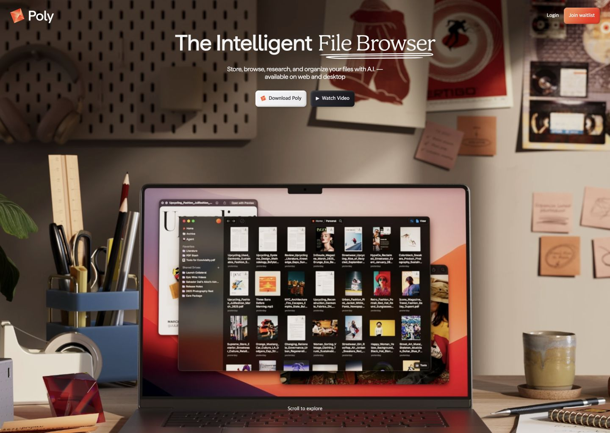
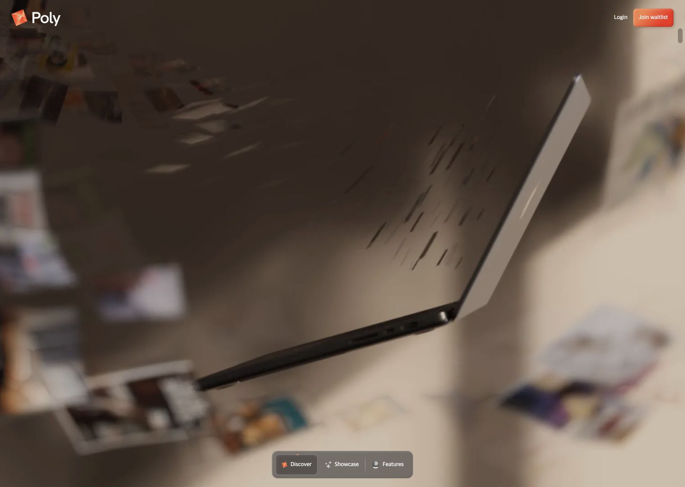
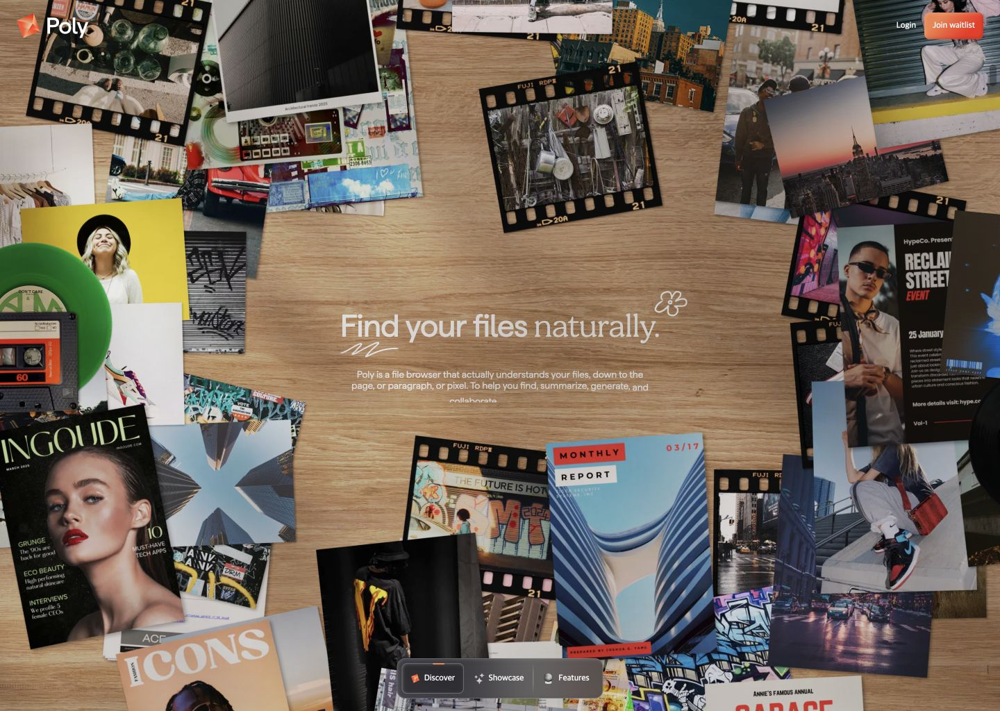
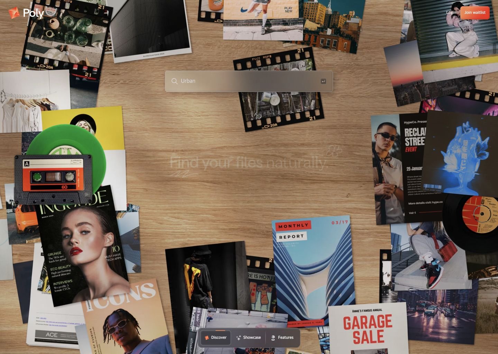
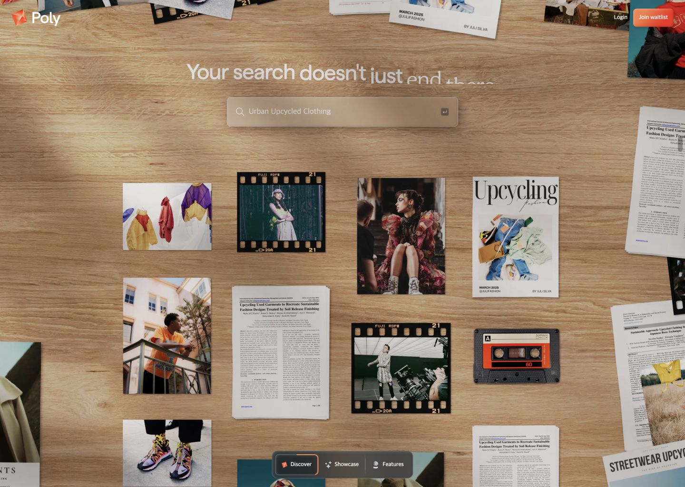
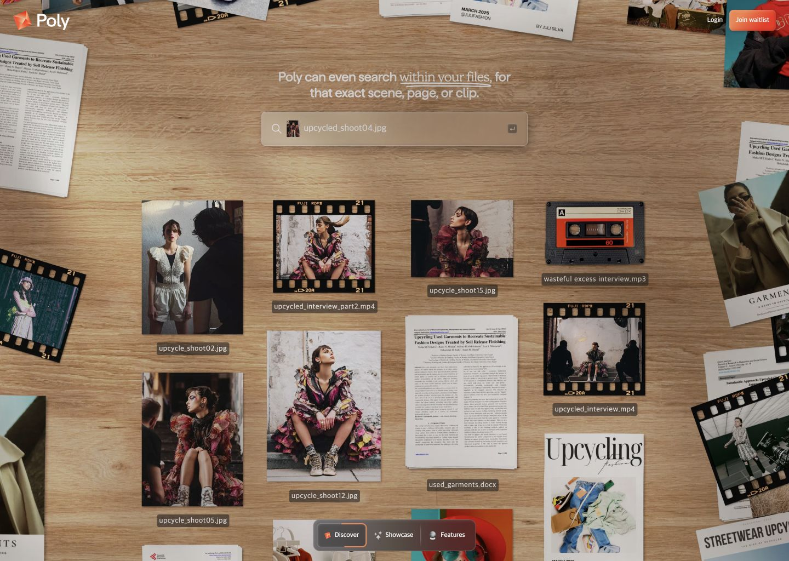
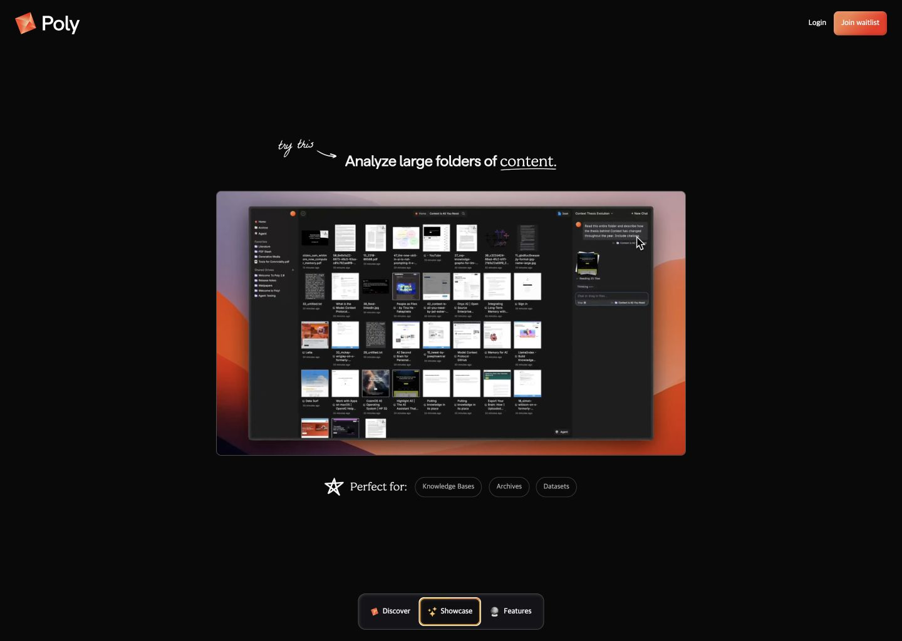
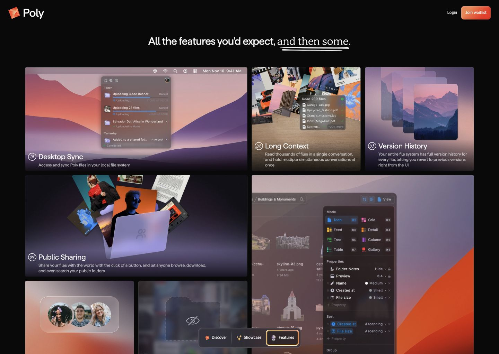
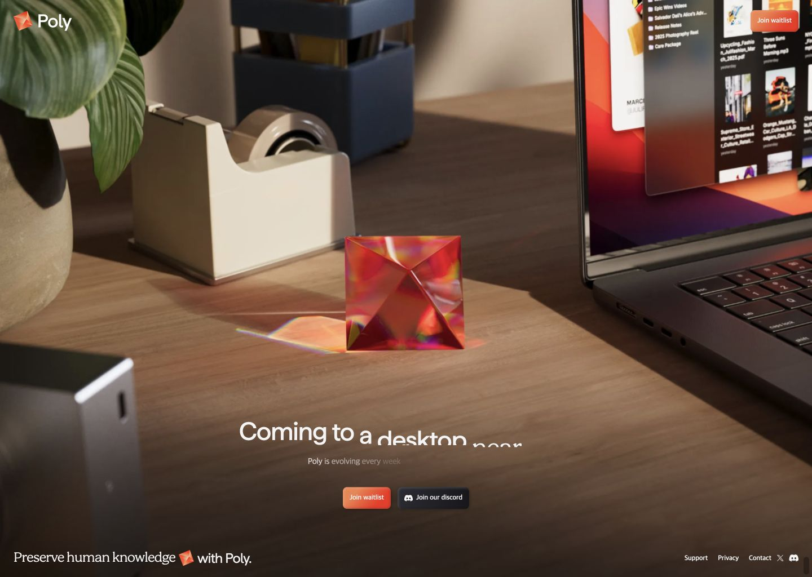

# Poly landing frame audit

- Source: https://poly.app/
- Captured: 2026-08-02
- Viewport: 1440 x 1024
- Scope: desktop landing, scroll-driven product story

## Overall verdict

Poly does not present a normal stack of marketing sections. It keeps one stage and uses scrolling as a camera and timeline. The story is ordered as `promise -> demonstration -> proof -> feature breadth -> final CTA`. Stable navigation anchors remain visible while the world behind them changes.

## Frame 1 — Product promise

- The physical desk and laptop make an abstract AI product feel tangible before any feature explanation.
- One large claim, one supporting sentence, and two actions are enough for the first frame.
- The product UI is shown inside its real usage environment instead of as an isolated screenshot.
- Risk: the scene is visually rich, so the small supporting copy depends on the darkened background for readability.

## Frame 2 — Scroll becomes a camera

- The page does not visibly jump to a new section. The camera moves around the same laptop and desk.
- The persistent bottom chapter control (`Discover / Showcase / Features`) tells users that the motion has a destination.
- The transition is meaningful because it moves from the product object to the user’s content world.
- Risk: body scrolling is custom and the document body is locked, so keyboard, reduced-motion, and motion-sickness behavior require implementation testing.

## Frame 3 — A visual metaphor for the problem space

- Files appear as real photographs, pages, film strips, audio objects, and magazines on one tabletop.
- The central empty area holds a single promise while the scattered media explains the product category without a feature list.
- This is an environment before it is UI: the user first recognizes their messy content world.
- Risk: white copy over light wood has weak contrast in parts of the scene.

## Frame 4 — Show the input

- The search field becomes the stable visual anchor.
- The surrounding content moves away to make room for the input, which visually communicates filtering before a result is shown.
- The query is concrete (`Urban`) rather than a generic demo placeholder.
- The lesson is to show the user’s action, not only the finished result.

## Frame 5 — Show the transformation and result

- The original query stays visible while unrelated objects disappear and related media regroup.
- Photos, documents, video, and audio are mixed in one result space, proving cross-format search through visible evidence.
- The transition follows a readable causal chain: `input -> rearrangement -> result`.

## Frame 6 — Turn the broad claim into a precise proof

- A narrower sentence explains that Poly can find an exact scene, page, or clip.
- File names and types are visible, so the claim is backed by a concrete output rather than repeated marketing copy.
- This frame closes the Discover chapter only after both the action and its result have been shown.

## Frame 7 — One feature, one proof screen

- The visual world becomes quiet and black so the real product screen becomes the main evidence.
- A single sentence names the capability and a small `Perfect for` row explains the use case.
- Feature proof comes before the complete inventory, which keeps attention on the strongest value moment.
- Handwritten accents soften the otherwise technical product presentation.

## Frame 8 — Breadth only after understanding

- The dense feature grid appears late, after the user already understands the core promise and has seen proof.
- Card sizes create hierarchy: important capabilities receive large areas, secondary capabilities remain compact.
- Every card uses a visual example rather than an icon and description alone.
- Risk: fine text inside screenshots and cards is difficult to read at smaller widths.

## Frame 9 — Return to the original world and ask

- The ending returns to the same physical desk and Poly gemstone used at the start, creating visual closure.
- The final action repeats the waitlist request and adds a lower-commitment community action.
- The brand mission sits beside support and policy links, so the ending carries both emotion and trust.

## Reusable principles for Matpin

1. Compress the current long landing into three visible chapters: `Send the Reel / Save the Places / Find Them Again`.
2. Keep stable anchors while the content changes: Matpin logo, Instagram CTA, and a three-chapter progress control.
3. Use motion only to show causality: a reel moves into place evidence, evidence becomes saved pins, and pins become a personal map.
4. Show one real action and its result before listing capabilities.
5. Use the selected woman advertisement as the emotional entry, then switch to actual Matpin product evidence for proof.
6. Move FAQ and supporting details after the result instead of interrupting the core story.
7. Reuse the opening visual world in the final CTA to give the landing a clear ending.

## Do not copy

- Do not copy Poly’s file-browser objects, desk set, gemstone, typography, colors, or exact camera moves.
- Do not depend on a heavy 3D/WebGL scene for Matpin’s core explanation.
- Do not lock normal scrolling without a working keyboard and reduced-motion alternative.
- Do not present staged restaurant cards as real product evidence; keep the current advertising disclosure.

## Accessibility limits

Screenshots confirm visible hierarchy, contrast risks, target placement, and the scroll-driven nature of the experience. They do not prove keyboard operation, screen-reader order, focus visibility, reduced-motion support, or zoom behavior. Those require implementation-level testing.
