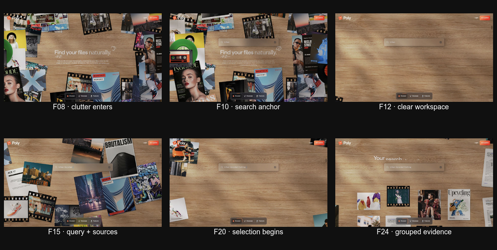
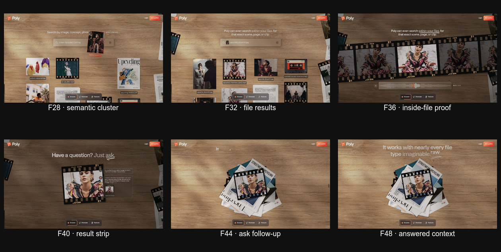
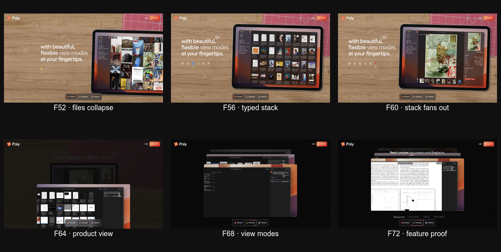
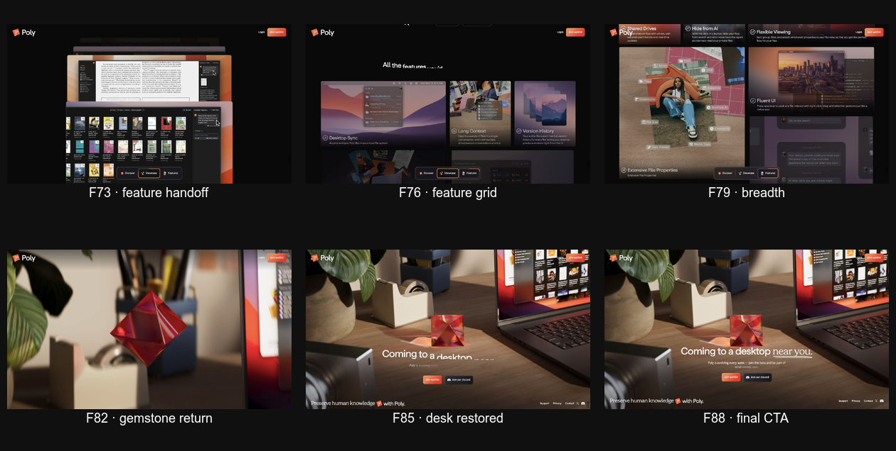

# Poly landing deep frame audit

- Source: https://poly.app/
- Captured: 2026-08-02
- Viewport: 1280 × 720
- Capture method: 360px wheel input followed by a stable screenshot
- Evidence: 119 captured states; the visible story reaches its final stable frame around sample 91
- Important limit: the numbers below are evenly sampled **scroll states**, not the site's native 60fps render-frame numbers

## Core conclusion

Poly's core story is not simply `messy files → neat grid`. It repeats the same reduction pattern four times:

```text
Many unrelated objects
  → relevant subset
    → one exact scene or file
      → one answered question
        → one organized product system
```

The reason the transformation is understandable is that the original objects do not disappear and get replaced by unrelated UI. The same photos, film strips, documents, and audio artifacts remain recognizable while their position, scale, grouping, labels, and container change.

The real product proof is therefore **identity-preserving reorganization**:

```text
same objects + stable anchor + visible removal + visible regrouping = believable organization
```

## Four movement rules that make it work

1. **The background stays stable while the objects reorganize.** During Discover, the wooden table is the coordinate system.
2. **One anchor survives each transition.** The search bar stays while surrounding files leave and return; later the laptop frame stays while view modes change.
3. **Unrelated items visibly leave before relevant items align.** The page shows subtraction, not only a finished result.
4. **The same object is handed to the next scene.** A film strip seen in the scattered field becomes a result, an exact clip, a follow-up answer source, a physical stack, and finally content inside the product UI.

## Phase 1 — From disorder to a query



| Sample | Approx. story progress | Visible state | Motion role |
|---|---:|---|---|
| F00 | 0% | Physical desk, laptop, product promise | Establishes the real-world stage and the laptop as the first anchor |
| F03 | 3% | Camera isolates and tilts the laptop | Moves from marketing promise toward the product object |
| F05 | 5% | Fast top-down camera handoff with blur | Hides the spatial cut at peak velocity; desk becomes a top-down workspace |
| F07 | 8% | Empty wooden table with `Find your files naturally` | Gives the eye a quiet reset before adding complexity |
| F08 | 9% | Mixed photos, documents, film and magazines fill the perimeter | Makes the user's unorganized world visible before explaining a feature |
| F10 | 11% | Search bar appears over the clutter | Introduces a stable input anchor without removing the problem yet |
| F12 | 13% | Almost every object leaves; only the search bar remains | Creates negative space and makes the coming query feel causal |
| F15 | 16% | `Urban Upcycled Clothing` is visible while candidate sources return | The query stays fixed; objects move in relation to it |
| F20 | 22% | Most irrelevant sources have moved out; a small relevant subset remains | Shows selection as subtraction rather than magic appearance |
| F24 | 26% | Relevant media align below the query | First clear organized result; labels and similar scale make the grouping legible |

### Why the empty frame is necessary

F12 is the most important hidden beat. If Poly moved directly from F08's full clutter to F24's neat row, the user would only see two unrelated layouts. By briefly clearing the field while keeping the query bar, Poly establishes the query as the cause of the reorganization.

The sequence is:

```text
clutter remains
→ search anchor arrives
→ clutter exits
→ query becomes specific
→ relevant objects return
→ objects align
```

This is stronger than animating every object straight into a grid at the same time because the user can distinguish `input`, `removal`, and `result`.

## Phase 2 — From a group to exact proof



| Sample | Approx. story progress | Visible state | Motion role |
|---|---:|---|---|
| F28 | 31% | Mixed media are grouped around the same semantic query | Proves cross-format search while keeping a tactile tabletop world |
| F32 | 35% | File names and exact-scene copy become readable | Adds evidence only after the broad visual result is understood |
| F36 | 40% | One film strip grows dominant and an audio waveform appears | Narrows from many relevant results to the exact moment inside a file |
| F40 | 44% | `Have a question? Just ask` and an answer panel appear beside the same film strip | Turns found media into an actionable answer without discarding its source |
| F44 | 48% | The result media collapse into one physical stack | Compresses many artifacts into one manageable object before changing chapters |
| F48 | 53% | File-type words orbit the central stack | Explains breadth while preserving the stack as a stable object |

### The second organization arc

The first arc organized by relevance. The second arc organizes by depth:

```text
relevant files
→ exact file
→ exact scene or clip
→ answer grounded in that source
```

The large film strip is the shared object. It prevents the query result, inside-file search, and answer from feeling like three separate feature slides.

## Phase 3 — From evidence to a product system



| Sample | Approx. story progress | Visible state | Motion role |
|---|---:|---|---|
| F52 | 57% | The physical stack has become content inside a laptop interface | Hands the metaphor back to real product evidence |
| F56 | 62% | Grid-like file browser view | Shows one organized representation while the laptop stays fixed |
| F60 | 66% | A different media/story view replaces the grid inside the same frame | Demonstrates flexibility without moving the whole scene |
| F64 | 70% | Tabletop darkens; layered product windows enter | Ends Discover and begins feature proof with a quieter black stage |
| F68 | 75% | One product capability is isolated in the front window | One feature, one proof screen |
| F72 | 79% | Complex document and diagram proof comes forward | Adds depth by changing the front layer, not the surrounding chapter frame |
| F73 | 80% | Multiple proof screens form a stacked handoff | Prepares the eye for the full feature inventory |

This chapter changes only the content inside stable containers. That restraint is important: the earlier reorganization already used the user's attention budget, so the proof chapter becomes quieter and more literal.

## Phase 4 — Breadth and visual closure



| Sample | Approx. story progress | Visible state | Motion role |
|---|---:|---|---|
| F76 | 84% | Full feature grid appears on black | Shows breadth only after the core organization story has been proven |
| F79 | 87% | Dense feature cards fill the viewport | Secondary capabilities receive space without interrupting the earlier narrative |
| F82 | 90% | Poly gemstone replaces the grid | Compresses the product system into a brand object |
| F85 | 93% | Camera returns to the original desk and laptop | Restores the opening world and signals that the story is ending |
| F88 | 97% | Final waitlist and Discord actions appear | Asks for action only after promise, mechanism, result, and breadth |
| F91 | 100% | Final desk scene is fully settled | Creates a readable hold instead of ending during motion |

## Full story timeline

```text
00  Promise: the product exists in a real desk environment
03  Camera isolates the laptop
05  High-speed camera handoff
07  Empty tabletop and category promise
08  Unorganized content fills the perimeter
10  Search anchor appears
12  Workspace clears
15  Query becomes specific
20  Unrelated content exits
24  Relevant content groups
28  Cross-format result becomes visible
32  Filenames and file types prove the result
36  One exact scene or clip becomes dominant
40  A grounded answer appears beside its source
44  Many sources collapse into one stack
48  File-type breadth is explained around the stack
52  Stack becomes content inside the product
56  Organized grid view
60  Alternative view of the same library
64  Product proof moves to a quiet black stage
68  One capability, one proof screen
72  Another proof moves to the front
76  Full feature inventory
82  Feature system collapses into the gemstone
85  Original desk world returns
88  Final action
91  Stable ending
```

## What Matpin should take from this

Matpin's current three-scene prototype follows one reel. That explains a transaction, but it does not yet visualize the user's main problem: many saved reels are scattered and difficult to rediscover.

The Matpin equivalent should use the same reduction funnel:

```text
many different reel cards
→ one stable station/search anchor
→ caption/comment/video clues appear
→ irrelevant clues leave
→ reels with the same station move together
→ station groups align into a shelf
→ one station opens to its saved videos
```

### Recommended Matpin story

1. **Problem frame — scattered reels**
   - Show 7–10 visibly different reel cards around the edges.
   - Keep the center open for one sentence: `저장해둔 맛집 릴스, 다시 찾기 어려우셨죠?`
   - The cards must be real product evidence or clearly disclosed demo media.

2. **Stable input — the account or station anchor**
   - Keep `matpin.kr로 보낸 릴스` or a station search field in the same central position.
   - Do not move the anchor while the reels reorganize.

3. **Visible analysis — clues separate from each reel**
   - Caption, author comment, and video clue chips emerge from each card.
   - These chips should remain visibly connected to their source card before moving.

4. **Subtraction — irrelevant clues leave**
   - Generic hashtags and non-place text fade or move outward first.
   - Station names and place evidence remain.

5. **Grouping — reels converge by station**
   - The same reel cards seen in frame 1 move into `역삼역`, `성수역`, and `을지로입구역` groups.
   - Do not replace them with new thumbnails; preserve visual identity.

6. **Result — one station shelf settles**
   - `역삼역 · 저장한 영상 4개` becomes the final stable state.
   - Stop motion long enough for the user to read and choose a reel.

### What not to carry over

- Do not copy Poly's desk, gemstone, typeface, colors, or exact camera moves.
- Do not run a heavy 3D world just to create spectacle. Matpin can reproduce the causal sequence with 6–10 DOM cards, transform, opacity, and a fixed station anchor.
- Do not make every card move at once. Start removals in a short 30–80ms stagger, then gather the relevant cards.
- Do not cut from clutter directly to a finished station grid. Keep one empty or almost-empty causal frame in between.
- Do not treat the map as the final proof if the product direction is station-first video rediscovery.

## Motion contract for Matpin

- Purpose: explain organization, not decorate the landing.
- Frequency: first landing visit or optional replay, not repeated navigation.
- Trigger: native page scroll.
- Stable anchor: central station/account field.
- Shared objects: the original reel cards.
- Exit order: unrelated clue chips first, then empty space opens.
- Enter order: station labels, then relevant reels, then counts.
- Settled states: scattered, analyzing, grouped, station shelf.
- Reduced motion: show the same four states as ordinary stacked sections with no camera movement or parallax.

## UX and accessibility risks observed

- Confirmed: the live page kept `window.scrollY`, `documentElement.scrollTop`, and `body.scrollTop` at `0` through the sampled story, indicating a custom scroll timeline rather than normal document scrolling.
- Full-frame camera motion and blur between the desk and tabletop can cause motion discomfort.
- White copy over light wood becomes low contrast in several transitional frames.
- The bottom chapter control helps orientation, but it does not communicate fine progress inside the long Discover chapter.
- Screenshots cannot prove keyboard access, screen-reader order, focus handling, or reduced-motion behavior.
- This audit covers the 1280 × 720 desktop flow. Mobile reflow and performance were not assessed.

## Overall health by chapter

1. Hero and entry — **good**: clear promise and physical product evidence.
2. Camera handoff — **effective but risky**: strong continuity, high motion load.
3. Scattered content — **very good**: the problem is visible before the feature is explained.
4. Query and subtraction — **excellent**: input, removal, and result are separate readable beats.
5. Exact result and answer — **excellent**: progressively narrows from many files to one grounded answer.
6. Product proof — **good**: calmer containers after a motion-heavy chapter.
7. Feature breadth — **dense**: correctly placed late, but difficult to scan at smaller sizes.
8. Final return and CTA — **very good**: the opening world returns and gives the story closure.
