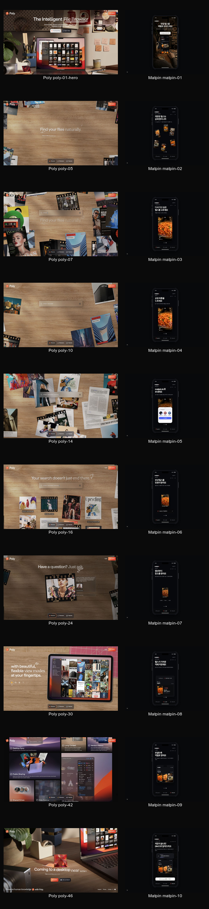
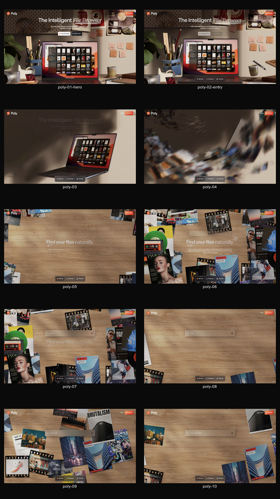
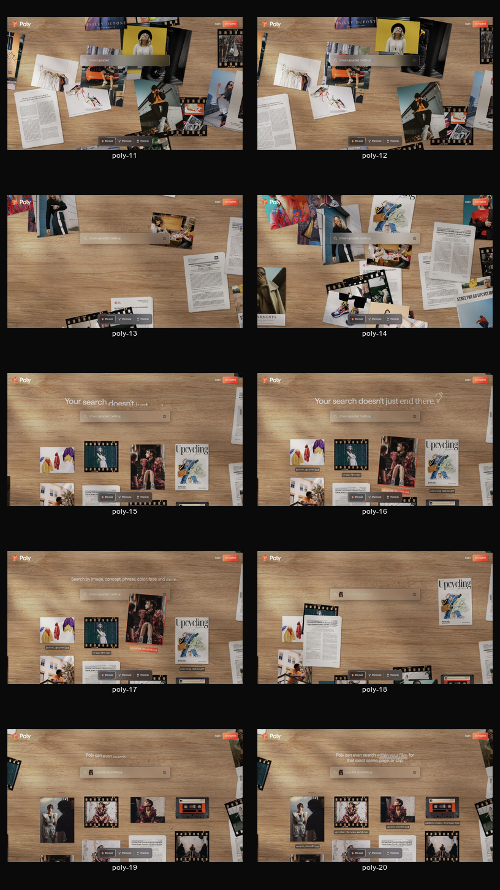
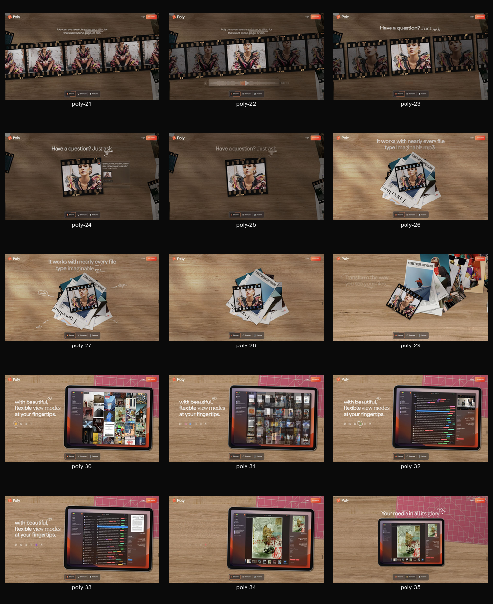
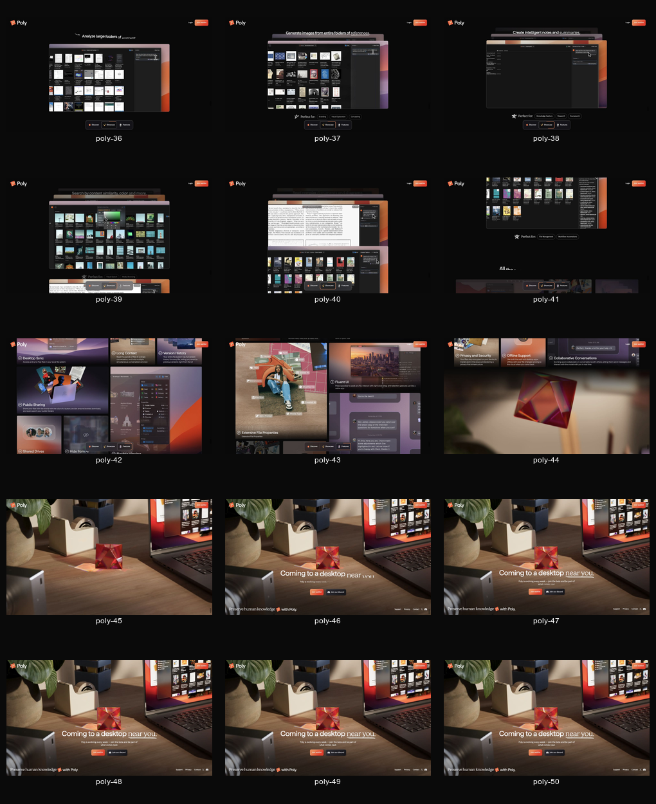
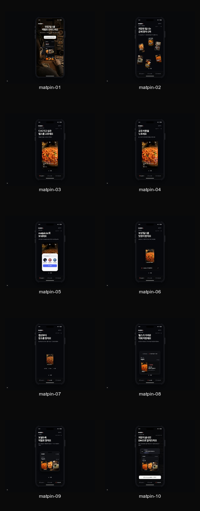
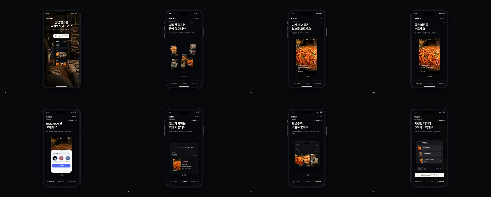

# Poly와 맛핀 스크롤 타임라인 심층 비교

확인일: 2026-08-07

결론: `캡션부터 장소를 찾아요`는 독립 장면으로 필요하지 않습니다. 장소 추출 방식은 핵심 가치가 아니라 내부 처리 방법이며, 현재 6단계와 8단계 사이에서 같은 릴스를 거의 같은 크기로 반복해 이야기의 속도를 늦춥니다.

## 감사 범위

- Poly: 실제 랜딩을 1280 × 720에서 휠 스크롤하며 50개 프레임으로 캡처
- 맛핀: 실제 `/matpin`의 10개 장면을 같은 브라우저에서 캡처
- 사용자 목표: 릴스를 보내면 역별 보관함에 쌓인다는 결과를 빠르게 이해하고 Instagram에서 시작하기
- 비교 기준: 장면마다 새로 생기는 정보, 같은 대상의 상태 변화, 사용자 행동, 제품 결과, 다음 장면의 필요성
- 한계: 이번 Poly 캡처는 데스크톱 뷰포트입니다. 모바일 레이아웃의 크기와 여백이 아니라 스크롤 서사와 상태 전환을 비교했습니다.

## 전체 비교

## Poly 전체 타임라인

Poly는 50개 캡처 프레임이 있지만 서사 단위는 다음 9개입니다.

1. 약속: 제품 범주와 큰 효용을 노트북 한 대에 묶습니다.
2. 진입: 카메라가 노트북에서 멀어지며 같은 공간을 다음 무대로 바꿉니다.
3. 문제 세계: 흩어진 파일이 화면 가장자리에서 들어옵니다.
4. 입력: 검색창이 나타나고 구체적인 검색어가 입력됩니다.
5. 반응: 검색어는 고정되고 관련 파일이 주변으로 모입니다.
6. 결과 증거: 파일 이름, 이미지, 영상 프레임이 검색 결과로 남습니다.
7. 깊이 증거: 장면, 페이지, 클립 내부까지 찾는 모습을 같은 파일로 증명합니다.
8. 제품 증거: 실제 앱 화면에서 기능 하나씩 보여줍니다.
9. 마무리: 처음의 책상과 제품으로 돌아와 가입 행동을 제시합니다.

핵심은 설명의 양이 아닙니다. 같은 파일이 `흩어짐 → 입력 반응 → 정리 → 상세 결과 → 실제 제품`으로 계속 상태를 바꿉니다. 화면에 새 상태가 생길 때만 문장이 하나 추가됩니다.

## 맛핀 현재 타임라인

1. `맛집 릴스를 역별로 모아드려요`, 상태: 좋음
   - 약속과 실제 보관함 결과를 한 화면에서 보여줍니다.
2. `저장한 릴스는 금세 쌓이니까`, 상태: 좋음
   - 여러 세로 릴스가 흩어진 문제 세계를 만듭니다.
3. `다시 가고 싶은 릴스를 고르세요`, 상태: 좋음
   - 흩어진 대상 중 하나를 입력 대상으로 고정합니다.
4. `공유 버튼을 누르세요`, 상태: 대체로 좋음
   - 실제 사용자 행동을 보여줍니다. 3단계와 연속 모션으로 더 가깝게 붙일 수 있습니다.
5. `matpin.kr로 보내세요`, 상태: 좋음
   - 공유 대상 선택이라는 맛핀 고유 행동을 보여줍니다.
6. `보낸 릴스를 맛핀이 받아요`, 상태: 약함
   - 전송 완료는 확인되지만 사용자 가치나 제품 결과는 아직 달라지지 않습니다.
7. `캡션부터 장소를 찾아요`, 상태: 삭제 권장
   - 캡션, 댓글, 영상은 내부 처리 순서입니다. 사용자 행동이 없고 릴스의 상태 변화도 작습니다.
8. `릴스가 가까운 역에 저장돼요`, 상태: 매우 좋음
   - 장소 확인, 역 연결, 저장 완료가 한 장면에서 결과로 바뀝니다.
9. `보낼수록 역별로 쌓여요`, 상태: 매우 좋음
   - 한 번의 성공을 반복 사용 가치로 확장합니다.
10. `저장이 끝나면 DM으로 알려드려요`, 상태: 좋음
   - 완료 피드백과 재방문 행동을 연결합니다.

## 왜 7단계가 흐름을 끊는가

1. 사용자의 질문에 답하지 않습니다.
   - 사용자가 알고 싶은 것은 어디에서 텍스트를 읽는지가 아니라, 내가 보낸 릴스가 어느 역에 저장되는지입니다.
2. 새 상태가 거의 없습니다.
   - 6단계와 7단계 모두 한 장의 떡볶이 릴스가 중앙에 남습니다. 달라지는 것은 주변 라벨뿐입니다.
3. 8단계가 이미 결과를 증명합니다.
   - `장소 확인 완료`, `가장 가까운 역, 역삼역`, `저장 완료`가 한 카드 안에 있어 7단계의 설명을 흡수할 수 있습니다.
4. 구현 설명이 제품 약속보다 앞섭니다.
   - Poly는 검색 알고리즘 순서를 따로 설명하지 않습니다. 검색어에 파일이 반응하고 결과가 남는 모습으로 능력을 증명합니다.
5. 신뢰 문구의 위치가 아닙니다.
   - 캡션, 작성자 댓글, 영상 단서 정책은 `어떻게 찾나요?` 도움말이나 저장 결과의 출처 표시에서 확인하는 편이 정확합니다.

## 권장 8장면

1. 약속과 결과: 맛집 릴스를 역별로 모아드려요.
2. 문제 세계: 저장한 릴스가 흩어져 있어요.
3. 입력 선택: 다시 보고 싶은 릴스를 고르세요.
4. 사용자 행동: 공유 버튼을 누르세요.
5. 전송: matpin.kr로 보내세요.
6. 변환: 릴스가 가까운 역에 저장돼요.
7. 반복 가치: 보낼수록 역별로 쌓여요.
8. 완료와 재진입: DM에서 내 보관함을 열어요.

6단계에서는 `캡션부터`를 말하지 않고, 릴스 카드가 역삼역 보관함 카드로 형태를 바꾸는 모션을 중심에 둡니다. 보조 문장은 `장소를 확인해 가까운 역에 연결해요.` 정도면 충분합니다.

## 유지할 정보와 옮길 정보

- 랜딩에 유지: 릴스 보내기, 가까운 역에 저장, 계정별로 누적, DM으로 결과 확인
- 도움말로 이동: 캡션, 작성자 댓글, 영상 단서의 확인 순서
- 결과 상세에 표시: 어떤 단서로 장소를 찾았는지, 확신도가 낮을 때 사용자가 확인할 방법
- 개인정보 안내에 유지: 사용자의 현재 위치는 수집하지 않는다는 정책

## 접근성 위험

- 현재 장면이 10개라 스크롤과 `다음` 조작이 길고, `aria-live` 안내도 최대 10번 바뀝니다.
- 7단계는 시각적으로 작은 라벨만 추가되므로 저시력 사용자에게 새 장면의 의미가 약할 수 있습니다.
- 8장면으로 줄이면 핵심 결과까지의 조작 수와 상태 알림 수가 함께 줄어듭니다.
- 스크린샷만으로 키보드 조작, 화면 읽기 순서, 실제 모션 감소 설정의 완전한 동작은 확인하지 않았습니다.

## 최종 판단

- 7단계 독립 장면: 삭제
- `캡션, 댓글, 영상` 정보: 도움말 또는 결과 상세로 이동
- 6단계와 8단계: 하나의 변환 장면으로 연결
- 전체 장면: 10개에서 8개로 축소

이 결정은 Poly의 표면 스타일을 따라가는 것이 아니라, 같은 대상이 원인과 결과를 이어서 보여주는 서사 원리를 적용한 것입니다.

## 적용 결과

- 10개 장면을 권장안대로 8개로 줄였습니다.
- `보낸 릴스를 맛핀이 받아요`와 `캡션부터 장소를 찾아요`를 독립 장면에서 삭제했습니다.
- 6단계에서 선택한 세로 릴스가 가까운 역의 저장 카드로 바뀌도록 연결했습니다.
- 마지막 장면은 한 건의 저장 완료 알림 대신, 서로 다른 릴스 3개가 역삼역, 성수역, 을지로입구역에 저장된 DM으로 구성했습니다.
- DM 아래에는 `역 3개, 릴스 12개` 보관함 요약을 두어 반복 저장과 계정 단위 누적을 한 화면에서 확인할 수 있습니다.

