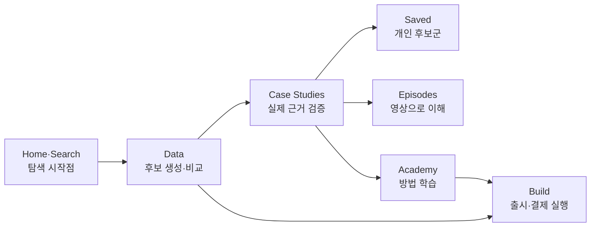
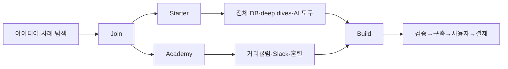
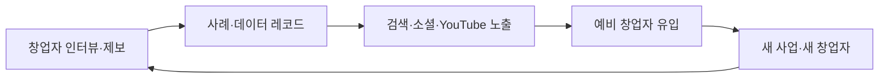
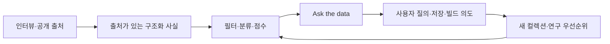
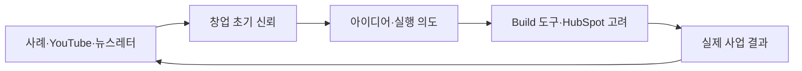
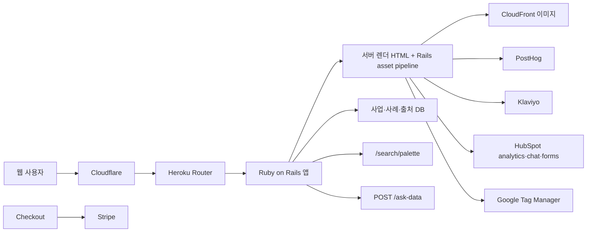

# Starter Story 공개 블랙박스 리버스 엔지니어링

조사일: 2026-07-21  
대상: [Starter Story](https://www.starterstory.com/), [Starter Story Home](https://www.starterstory.com/home)

## 0. 범위와 한 줄 결론

이 보고서는 공개 페이지, 공식 정책·인수 발표, 실제 로그인 브라우저의 DOM·네트워크, 공개 결제 화면으로 제품을 관찰한 블랙박스 분석이다. 소스 코드·서버·관리자 화면에 접근하거나 결제·권한을 우회하지 않았다.

**한 줄 결론:** Starter Story는 더 이상 “창업가 인터뷰를 읽는 미디어”만이 아니다. `사례를 발견한다 → 구조화된 수익·성장 데이터를 비교한다 → AI에 데이터로 질문한다 → 비슷한 제품을 직접 만든다 → Academy에서 실행한다`로 이어지는 **창업 아이디어 데이터·미디어·교육·빌드 퍼널**이다.

핵심 발견:

1. 콘텐츠의 원자는 `founder-written case study`와 `AI researched profile` 두 종류다.
2. 홈의 핵심 오브젝트는 글이 아니라 **사업체 레코드**다. 수익, 시작 비용, 기간, 도구, 성장 채널, 창업자, 출처를 구조화한다.
3. `/data`는 2,921~2,929개 프로젝트를 표·필터·자연어 질의로 탐색하게 하고 각 행을 `Build this`로 연결한다.
4. 무료 데이터·뉴스레터·사례가 획득을 담당하고, Starter·Academy·Build가 실행 의지가 높은 사용자를 수익화한다.
5. 2026-02-24 HubSpot Media 인수 후 “HubSpot Media” 브랜드·리드 수집·분석 도구가 깊게 결합됐다.
6. 공개 랜딩은 “Free”를 전면에 두지만 `/join`과 결제는 여전히 유료 멤버십을 판매한다. 현재는 무료 데이터 확장과 기존 유료 경계가 공존하는 전환기다.

## 1. 제품의 현재 위치

### 1.1 창업 인터뷰에서 구조화된 아이디어 DB로

초기 제품은 창업가가 직접 답한 장문 인터뷰였다. 현재는 다음 네 층으로 확장됐다.

| 층 | 핵심 오브젝트 | 사용자 질문 | 대표 경로 |
|---|---|---|---|
| Evidence | founder-written case study | 실제 창업가는 어떻게 시작·성장했나? | `/stories/:slug` |
| Research | AI researched profile | 이 사업의 수익·수익화·성장·도구는 무엇인가? | `/businesses/:slug` |
| Discovery | idea database + Ask the data | 내 조건에 맞는 검증된 아이디어는 무엇인가? | `/data`, `/explore` |
| Execution | Build + Academy | 아이디어를 어떻게 좁히고 실제 앱으로 출시할까? | `build.starterstory.com`, `/academy` |

이 변화로 Starter Story는 “읽고 영감을 얻는 사이트”에서 “아이디어를 고르고 실행하는 운영체제”로 이동하고 있다.

### 1.2 HubSpot 인수가 바꾼 상위 목적

[HubSpot 공식 발표](https://blog.hubspot.com/marketing/hubspot-starter-story-acquisition)는 2026-02-24 다음 규모를 밝혔다.

- 연 1억 명 이상 도달.
- YouTube 구독자 80만+.
- 뉴스레터 구독자 30만.
- 창업가 사례·인터뷰 4,500+.
- HubSpot Media 전체 YouTube 구독자 290만.

HubSpot이 밝힌 인수 논리는 “광고로 관심을 빌리지 말고, 창업자가 도구를 고르기 전에 신뢰하는 미디어를 소유한다”는 것이다. Starter Story의 독자는 pre-seed~Series A에서 CRM·마케팅·결제 도구를 고르는 핵심 잠재고객이다.

따라서 현재 제품의 사업적 역할은 두 가지다.

1. Starter Story 자체의 멤버십·교육·Build 매출.
2. HubSpot이 초기 창업자의 관심·이메일·의도를 확보하는 상단 퍼널.

## 2. 핵심 사용자와 JTBD

| 사용자 | 상황 | 해결하려는 일 | 성공 상태 |
|---|---|---|---|
| 예비 창업자 | 아이디어가 없거나 너무 많음 | 돈이 되는 구체적 문제를 찾기 | 조건에 맞는 후보 3~5개 저장 |
| 사이드프로젝트 빌더 | 직장을 유지하며 작게 시작 | 비용·기간·난이도가 감당 가능한지 판단 | 1개 아이디어를 Build로 넘김 |
| 초기 창업자 | 제품은 있지만 획득이 막힘 | 유사 사업의 성장 채널·도구 확인 | 다음 성장 실험 1개 선택 |
| 콘텐츠 소비자 | 성공담은 좋아하지만 실행은 약함 | 현실적인 동기·패턴 얻기 | 뉴스레터·YouTube 반복 소비 |
| 강한 실행 의지층 | 혼자서는 계속 미룸 | 커리큘럼·커뮤니티·책임감 확보 | 5주 내 출시·첫 사용자·결제 |
| HubSpot | 초기 창업자를 일찍 만나야 함 | 고의도 오디언스와 1st-party 관계 구축 | 리드·도구 고려·브랜드 선호 |

가장 중요한 JTBD는 “아이디어를 생성해 달라”가 아니다.

> 내가 감당할 수 있고 실제로 돈을 번 선례가 있는 사업을 찾아, 왜 가능한지 확인하고, 다음 행동으로 넘어가게 해 달라.

## 3. 실제 정보 구조

로그인 상태 홈의 왼쪽 내비게이션:

```text
Home
Data
  All Ideas
  SaaS Ideas
  App Ideas
  AI Ideas
  More Ideas
Case Studies
  All Case Studies
  Saved
  Random
Episodes
  All Episodes
  Must Watch
Learn
  Academy
  Build
```

홈 본문은 다음 순서로 설계됐다.

1. Trending episodes
2. Database categories
3. Recently added profiles
4. Trending case studies
5. Browse by category

콘텐츠 타입을 분리하지만 결국 모두 `아이디어 발견 → 상세 근거 → 저장/빌드`로 수렴한다.

### 3.1 전역 검색

`⌘K` 검색은 command palette다.

- placeholder: `Search businesses, case studies, or jump to a page…`
- 검색 전: Home, Ideas, Case Studies, Favorites, Random, Episodes, Academy로 즉시 이동.
- 검색 중: `GET /search/palette?q=...` 호출.

이 검색은 문서 검색과 앱 내비게이션을 합쳐 “큰 콘텐츠 사이트에서 길을 잃는 문제”를 줄인다.

### 3.2 메뉴별 기능 명세

메뉴는 같은 콘텐츠를 이름만 바꿔 보여주는 구조가 아니다. `Data`, `Case Studies`, `Episodes`, `Learn`은 각각 발견·검증·시청·실행이라는 다른 과업을 담당한다.

| 메뉴 | 사용자가 하는 일 | 핵심 입력·조작 | 결과 | 접근 경계 | 대표 다음 행동 |
|---|---|---|---|---|---|
| Home | 지금 볼 만한 사업과 콘텐츠를 빠르게 훑기 | 카테고리·추천 카드 선택 | 트렌딩 에피소드, 데이터베이스, 신규 프로필, 인기 사례 | 로그인 필요 | 데이터베이스 또는 상세 열기 |
| All Ideas | 전체 사업 데이터에서 조건에 맞는 아이디어 찾기 | 자연어 질문, 정렬, 매출·초기비용 필터, Rows/Cards 전환 | 사업 아이디어 비교표·카드 | 공개 미리보기, 자연어 질문은 계정 필요 | 사례 확인 또는 `Build this` |
| SaaS Ideas | 마이크로 SaaS 후보만 비교하기 | 매출·트래픽·초기비용·성장·ICP 필터 | SaaS 사전 필터 데이터셋 | 공개 미리보기 | 후보 상세·구축 경로 열기 |
| App Ideas | iOS 앱 후보만 비교하기 | 매출·트래픽·초기비용·성장·ICP 필터 | 앱 사전 필터 데이터셋 | 공개 미리보기 | 후보 상세·구축 경로 열기 |
| AI Ideas | GPT wrapper·AI 제품 후보 비교하기 | 매출·초기비용·개발일수 정렬, 사용 도구 필터 | AI 사전 필터 데이터셋 | 공개 미리보기 | 후보 상세·구축 경로 열기 |
| More Ideas | 주제별 아이디어 모음과 심층 분석 탐색하기 | 테마 카드 선택 | 큐레이션된 데이터베이스·Deep Dive 목록 | 디렉터리는 공개, 상세는 상품별 경계 | 테마별 컬렉션 열기 |
| All Case Studies | 창업 사례를 조건과 키워드로 찾기 | 검색, 정렬, 매출·비용 슬라이더, 사업·성장·고객·창업자 필터 | 사례 카드와 핵심 지표 | 12개 공개 미리보기 후 가입 유도 | 사례 읽기 또는 저장 |
| Saved | 나중에 볼 사례를 개인 목록으로 관리하기 | 다른 화면의 Save 버튼, 저장 목록 열기 | 저장 개수와 저장된 사례 | 로그인 필요 | 저장 사례 재방문 |
| Random | 선택 피로 없이 사례 하나 발견하기 | 메뉴 클릭 한 번 | 무작위 사례 상세로 즉시 이동 | 로그인 필요 | 사례 읽기·저장·관련 사례 탐색 |
| All Episodes | 영상 인터뷰·분석 콘텐츠 찾기 | 검색, 정렬, 매출·비용·사업·고객·창업자 필터 | 영상 카드, 조회수·매출·게시 시점 | 12개 공개 미리보기 후 가입 유도 | 에피소드 시청 |
| Must Watch | 인기 영상부터 보기 | 메뉴 클릭 | `All Episodes`에 `Most Popular` 정렬이 적용된 결과 | All Episodes와 동일 | 인기 에피소드 시청 |
| Academy | 단계별 창업 교육과 Deep Dive 고르기 | 성장 단계·코스 카드 선택 | Course·Deep Dive 카탈로그, 모듈 수, 수강 CTA | 로그인 필요, 개별 콘텐츠는 플랜 통제 | `Enroll Now` 또는 `Read It` |
| Build | 아이디어를 실제 제품과 결제로 전환하기 | 단계별 sprint 시작 | 검증·출시·사용자/데이터·수익화 실행 과정 | 랜딩 공개, 프로그램 별도 가입 | `Start building` |

#### Home — 로그인 사용자의 발견 대시보드

`/home`은 비로그인 랜딩 페이지가 아니라 로그인 후 사용하는 발견 허브다. 비로그인 상태에서는 로그인 화면으로 이동한다.

- `Trending episodes`: 현재 주목받는 영상 콘텐츠로 진입한다.
- `Database categories`: Micro-SaaS, Solopreneur, No-code, Vibe Coding, Digital Products, GPT Wrappers, One-page Sites, Solo Developer 등으로 데이터를 좁힌다.
- `Recently added profiles`: 새로 들어온 사업과 AI 추정 매출을 보여준다.
- `Trending case studies`: 자기 보고 매출이 붙은 인기 사례를 보여준다.
- `Browse by category`: 관심 업종으로 다시 탐색하게 한다.

즉, Home의 기능은 콘텐츠 소비가 아니라 사용자가 탐색을 시작할 적절한 입구를 고르게 하는 것이다.

#### Data — 후보를 생성하고 비교하는 데이터 도구

**All Ideas (`/data`)**

- `Ask the data`에 자연어로 조건을 입력한다.
- Solopreneur Score, 최신 등록, 매출, 초기비용, 인기순으로 정렬한다.
- 매출과 초기비용을 빠른 구간 필터로 제한한다.
- `Rows`와 `Cards` 사이에서 비교 밀도를 바꾼다.
- 표에서는 아이디어·도메인, 매출, 직원당 매출, 성장 방식, 사용 도구, Solo Score, `Build this`를 비교한다.
- 현재 관찰 화면은 전체 2,921개 중 100개를 먼저 노출했다.

**SaaS Ideas (`/data/micro-saas-ideas`)**

- All Ideas를 Micro-SaaS로 미리 좁힌 전문 뷰다.
- 매출뿐 아니라 월간 트래픽과 초기비용의 높고 낮음을 정렬할 수 있다.
- Growth와 ICP 필터로 “누구에게 어떤 방식으로 파는 SaaS인가”까지 좁힌다.

**App Ideas (`/data/ios-app-ideas`)**

- 앱 사업만 모은 전문 뷰다.
- 매출·월간 트래픽·초기비용 정렬과 Growth·ICP 필터를 제공한다.
- 관찰 시점의 공개 결과는 63개였다.

**AI Ideas (`/data/gpt-wrapper-ideas`)**

- GPT wrapper와 AI 제품만 모은 전문 뷰다.
- `Days To Build` 정렬로 매출 가능성과 개발 난이도를 함께 비교한다.
- Google Analytics, YouTube, Slack, Stripe, Shopify 등 도구 스택으로 필터링한다.

**More Ideas (`/ideas`)**

- 또 하나의 비교표가 아니라 주제별 컬렉션 디렉터리다.
- `9-5 직장을 유지하며 만들 수 있는 사이드 프로젝트`, `No-code`, `Build With AI`, `No Audience Required` 같은 문제·제약 기반 묶음을 제공한다.
- 데이터 행을 직접 비교하기보다 컬렉션이나 Deep Dive로 들어가게 하는 편집·상품화 레이어다.

#### Case Studies — 후보의 실제 근거를 검증하는 사례 도구

**All Case Studies (`/explore`)**

- `newsletter`, `productized service`처럼 키워드로 사례를 검색한다.
- 매출, 초기 투자비, 인기, 최신순으로 정렬한다.
- 사업 유형, 카테고리, 성장 방식, 비즈니스 모델, 국가·대륙, 출시 시점, 창업자·직원 수, 투자 여부, B2B/B2C, ICP, 전업/사이드 프로젝트로 좁힌다.
- 결과 카드는 핵심 수치와 Save 동작을 제공하며, 공개 화면은 먼저 12개를 보여준 뒤 전체 데이터 접근을 위해 무료 계정을 유도한다.

**Saved (`/saved`)**

- 별도의 북마크 관리 화면이다.
- 저장 개수와 저장 사례를 보여주며, 빈 상태에서는 `Browse case studies`로 탐색을 재개시킨다.
- 현재 계정에서는 `0 saved items` 빈 상태를 확인했다. 저장·삭제 같은 변경은 수행하지 않았다.

**Random (`/random`)**

- 목록을 보여주는 화면이 아니다.
- 메뉴를 누르면 서버가 임의의 사례 상세 URL로 즉시 리디렉션한다.
- 선택 피로를 없애고 예상하지 못한 사례를 발견시키는 탐색 장치다.

#### Episodes — 같은 사례 데이터의 영상 소비 도구

**All Episodes (`/episodes`)**

- 제목을 검색하고, 매출·초기비용·인기·최신순으로 정렬한다.
- 사업 유형, 카테고리, 성장, 비즈니스 모델, 지역, 시작 시점, 창업자·직원·투자, B2B/B2C, ICP, 전업 여부, Case Study/Breakdown 유형으로 좁힌다.
- 결과 카드에는 썸네일, 제목, 조회수, 매출, 게시 시점이 붙는다.
- 공개 화면은 먼저 12개를 노출하고 전체 데이터 이용을 위해 무료 계정을 유도한다.

**Must Watch (`/episodes?sort=most_popular`)**

- 별도 영상 카탈로그가 아니다.
- All Episodes에 `Most Popular` 정렬을 미리 적용한 바로가기다.
- 새 사용자가 필터를 이해하지 않아도 검증된 인기 콘텐츠에서 시작하게 한다.

#### Learn — 지식 습득과 실제 실행을 분리

**Academy (`/academy`)**

- Ideas, Build & MVP, Validation, Growth, Monetization, Scale 단계별 교육 라이브러리다.
- `How To Find A $1M Business Idea`, `How to Build an App With Lovable`, `Short Form Playbook`, `Lean Email`, `Lean SEO`, `Lean Sponsorships` 같은 Course와 Deep Dive를 카드로 제공한다.
- 카드에는 콘텐츠 유형, 모듈 수, `Enroll Now` 또는 `Read It` 동작이 표시된다.
- 로그인 상태에서 라이브러리 인덱스는 확인했지만, 개별 코스·리포트의 플랜별 열람 범위는 결제 변경 없이 확인하지 않았다.

**Build (`https://build.starterstory.com/`)**

- Academy의 읽기형 학습과 달리, 실제 제품 출시를 위한 별도 실행 프로그램이다.
- 1단계 `Scope & Validate`: 아이디어 제약, 빠른 검증, MVP 범위를 정한다.
- 2단계 `Ship Fast`: Lovable·Vercel·Netlify 등을 이용해 실제 URL과 초기 사용자까지 만든다.
- 3단계 `Users & Data`: Supabase·Clerk·Firebase 등으로 인증과 데이터 구조를 붙인다.
- 4단계 `Monetize`: Stripe, 가격, 접근 제어, 출시 체크리스트를 연결한다.
- Deep Work 일일 계획, accountability, scorecard, office hours가 실행 운영체계로 붙는다.
- `Start building`은 `/welcome/step1` 온보딩으로 이동한다.

### 3.3 메뉴 간 역할 경계



핵심 구분은 다음과 같다.

- `Data`는 “무엇을 만들까?”에 답한다.
- `Case Studies`는 “정말 가능한가?”에 답한다.
- `Episodes`는 같은 근거를 더 쉽게 소비하게 한다.
- `Saved`와 `Random`은 각각 재방문과 우연한 발견을 담당한다.
- `Academy`는 방법을 배우게 하고, `Build`는 정해진 순서로 실행하게 한다.

## 4. 콘텐츠·데이터 모델

### 4.1 Founder-written case study

관찰한 인터뷰 사례는 다음 고정 질문 구조를 가진다.

```text
About The Company
Coming Up With The Idea
Building The First Version
Launching The Business
Growing The Business
Revenue + Financials
Lessons Learned
Recommended Tools
Books & Resources
Advice For Founders
Learn More
```

상단 엔터티:

```ts
type FounderCaseStudy = {
  title: string;
  publishedAt: string;
  founder: Founder;
  business: Business;
  monthlyRevenue?: number;
  foundersCount?: number;
  employeesCount?: number;
  answers: Array<{
    section: string;
    question: string;
    richText: string;
    media: Media[];
    pullQuotes: string[];
  }>;
  tools: Tool[];
  externalLinks: string[];
  upvotes: number;
};
```

제품적 장점:

- 질문 형식이 같아 여러 사례를 비교하기 쉽다.
- 한 번 받은 답변을 스토리, 데이터 필드, 도구 페이지, 성장 채널 페이지로 재사용할 수 있다.
- 제목의 수익 숫자와 실제 창업자의 1인칭 서사가 클릭과 신뢰를 함께 만든다.

### 4.2 AI researched profile

[How We Research](https://www.starterstory.com/how-we-research)에 따르면 researched profile은 창업자가 제출한 글이 아니다.

1. 인터뷰·팟캐스트·기사·보도자료·공시·회사 사이트에서 출처를 찾는다.
2. 수익, 설립일, 팀 규모, 도구, 성장 채널 같은 검증 가능한 사실을 추출한다.
3. 각 사실을 원문과 다시 대조하고 근거 없는 값은 버린다.
4. revenue, monetization, growth, founders, tools 페이지로 컴파일한다.
5. 게시 전 검토하고 새 출처가 생기면 다시 확인한다.

실제 사업 상세의 하위 라우트:

```text
/businesses/:slug
/businesses/:slug/revenue
/businesses/:slug/monetization
/businesses/:slug/growth-channels
/businesses/:slug/founders
/businesses/:slug/tools
```

관찰된 필드:

```ts
type ResearchedBusinessProfile = {
  name: string;
  website: string;
  summary: string;
  category: string;
  customerType: "B2B" | "B2C" | string;
  launchedAt?: string;
  updatedAt: string;
  monthlyRevenueEstimate?: {
    amount: number;
    asOf: string;
    sourceCount: number;
    confidenceLabel: string;
  };
  monetizationModels: string[];
  founders: Founder[];
  tools: Tool[];
  growthChannels: string[];
  sources: Source[];
  provenance: "self-reported" | "estimated-public-sources";
};
```

신뢰 UX가 중요하다.

- self-reported 수익과 AI 추정 수익에 서로 다른 tooltip을 붙인다.
- researched profile 상단에 “창업자가 쓰지 않았고 자동 연구가 틀릴 수 있다”고 명시한다.
- 각 사실에 출처를 연결한다.
- stale data, mistaken identity, misread figures, source quality를 공식적으로 한계로 적는다.

### 4.3 Idea database

`/data`의 표는 단순한 콘텐츠 목록이 아니다.

| 필드 | 사용자 가치 |
|---|---|
| Idea / domain | 무엇을 만드는가 |
| Revenue | 결과의 크기 |
| Rev / Employee | 인력 효율 |
| How Grew | 획득 채널 |
| Built With | 기술·운영 스택 |
| Solo Score | 1인이 하기 좋은 정도 |
| Starting Cost | 진입 비용 |
| Time to Start | 출시 속도 |
| Founder | 선례의 주체 |
| Provenance | self-reported인지 공개 출처 추정인지 |

현재 공개 화면은 `Showing 100 of 2,921 ideas`를 표시했고 랜딩·메타 설명은 2,929를 표시했다. 이는 조사 중 업데이트 또는 캐시 시점 차이로 보이며, 보고서에서는 2,921~2,929로 기록한다.

정렬:

- Solopreneur Score
- Recently Added
- Revenue
- Initial Investment
- Most Popular

필터:

- Revenue: `<$10K`, `$10K–$50K`, `>$50K` / month.
- Starting Costs: `<$1K`, `$1K–$5K`, `>$5K`.
- 데이터 컬렉션: Micro-SaaS, Solopreneur, No-code, Vibe Coding, Digital Products, GPT Wrappers, Solo Developer 등.

각 행의 `Build this`는 다음과 같이 business ID를 실행 제품으로 넘긴다.

```text
https://build.starterstory.com/?business_id=:id
```

이것이 미디어와 실행 제품을 연결하는 가장 강한 handoff다.

### 4.4 Ask the data

`/data` 상단은 자연어 입력을 제공한다.

```text
Ask anything —
“SaaS making $10K/mo”
“AI tools”
“newsletters”
```

실제 관찰:

```text
POST /ask-data
```

고정 예시 `AI tools making $10K+/mo`를 실행하면 서버가 200을 반환하고 여러 사업 레코드 이미지를 불러왔다. 즉, 일반 LLM이 웹을 즉석 검색하는 UI가 아니라 **Starter Story의 구조화된 독점 데이터에 질의해 결과 레코드를 반환하는 RAG/검색형 기능**으로 보는 것이 타당하다.

제품적 의미:

- 복잡한 필터 학습 없이 의도를 표현한다.
- 답변을 “문장”으로 끝내지 않고 출처가 있는 사업 레코드로 돌려준다.
- 기존 데이터 자산에 AI 인터페이스를 얹어 복제 가능한 UI보다 복제하기 어려운 corpus를 강조한다.

## 5. 핵심 사용자 여정

### 5.1 무료 발견 여정


### 5.2 유료 실행 여정



### 5.3 Build 여정

[Starter Story Build](https://build.starterstory.com/)가 공개한 네 단계:

1. Scope & Validate — 아이디어 제약, 빠른 검증, MVP 범위.
2. Ship Fast — scaffolding, 배포, 실제 URL과 초기 사용자.
3. Users & Data — 인증, 데이터 모델, 확장 가능한 앱 구조.
4. Monetize — 결제, 접근 제어, 출시 체크리스트.

추천 도구는 Vercel, Netlify, Lovable, Supabase, Clerk, Firebase, Stripe다. 여기서 Starter Story의 데이터는 읽을거리에서 **빌드할 명세의 시작점**으로 바뀐다.

## 6. 공개·가입·유료 경계

### 6.1 관찰된 경계

| 표면 | 비로그인 | 로그인 계정 | 유료 |
|---|---|---|---|
| 랜딩·카테고리 | 공개 | 공개 | 동일 |
| Idea DB 일부 | 100개 미리보기·이메일 CTA | 필터·Ask 사용 가능 | 전체·고급 접근으로 판매 |
| 인터뷰형 사례 | 일부 공개 노출 | 장문 원문 확인 | `/join`은 전체 사례 접근을 혜택으로 기재 |
| researched profile | 개요·출처 일부 공개 | 상세 하위 라우트 접근 | premium unlock 문구가 일부 페이지에 남음 |
| Saved | 로그인 필요 | 개인 저장 | 멤버십에 따라 확장 가능성 |
| Academy | 로그인 리디렉션 | 권한 필요 | Academy 플랜 |
| Build | 랜딩 공개 | 온보딩 필요 | 프로그램·플랜별 |

공개 표면과 결제 카피가 완전히 정합하지는 않다.

- 루트 랜딩: 2,929+ 프로젝트, `Updated live. Free.`
- `/data`: 무료 계정을 만들면 데이터에 질문 가능.
- `/join`: Starter는 4,296 founder case studies와 46+ databases를 제공한다고 설명.
- 결제: Starter는 2,929+ case studies라고 설명.
- HubSpot 공식 발표: 4,500+ founder case studies and interviews.

이는 반드시 오류라기보다 `프로젝트 레코드`, `founder case study`, `case study + interview`의 분모가 다른 것일 수 있다. 하지만 사용자는 같은 “case studies”로 읽으므로 단일 정의와 업데이트 시점을 UI에 명시하는 편이 낫다.

### 6.2 가격

2026-07-21 공개 결제 화면 기준:

| 플랜 | 표시 가격 | 실제 청구 | 주요 경계 |
|---|---:|---:|---|
| Starter | $39/month, billed quarterly | $119 / 3개월 | DB, 사례, deep dives, AI idea tools |
| Academy | $66/month, billed quarterly | $199 / 3개월 | Starter 전체 + private Slack + curriculum + courses + Build 할인 |

Starter 체크아웃에는 `$99` Deals Database 업셀도 있다.

- 324 tools.
- $50K+ savings.
- 결제 필드와 `StripeM-Inner`가 관찰돼 Stripe 기반 결제로 판단된다.
- 구독은 분기마다 자동 청구되며 언제든 취소 가능하다고 표시한다.

## 7. 수익 모델

현재 수익원은 한 제품의 구독만으로 보기 어렵다.

| 수익원 | 확인 근거 | 역할 |
|---|---|---|
| Starter subscription | $119 quarterly checkout | 데이터·사례 접근 |
| Academy subscription | $199 quarterly checkout | 커뮤니티·교육·실행 |
| Build programs | 공개 Accelerator·sprint 카피 | 코호트·부트캠프 |
| Deals Database | checkout $99 upsell | ARPU 확장 |
| Sponsorship / ads | 과거 Klaviyo sponsorship, 현재 미디어 규모 | 오디언스 수익화 |
| Affiliate / tool referrals | 사례의 tools, `/go.*` 링크 | 상업적 추천 |
| HubSpot lead value | 공식 인수 논리·HubSpot 폼·추적 | 모회사 고객 획득 |

인수 전에는 정보 상품·멤버십 매출이 중심이었다면, 인수 후에는 **미디어 자체 수익 + HubSpot의 고객 획득 가치**를 합쳐 판단해야 한다.

## 8. 성장 루프

### 8.1 Founder supply loop



창업자가 참여할 이유:

- 브랜드 노출과 백링크.
- 수익·성장 스토리를 통한 신뢰.
- “Starter Story에 소개됨”이라는 사회적 증거.
- 자신의 사례를 공유하면서 추가 유입.

### 8.2 Programmatic SEO loop

한 사업 레코드가 여러 페이지를 만든다.

```text
business overview
revenue
monetization
growth channels
founders
tools
category collections
idea success stories
profitability
startup costs
pros and cons
business names / slogans / geography pages
```

사이트맵 표본에서도 `/stories`, `/businesses`, `/data`, `/ideas`, `*-breakdown`, `*-business-ideas`, `*-names`, `*-slogans`가 반복됐다.

과거 성장 전략인 Lean SEO:

1. 최소 콘텐츠로 검색 수요를 테스트한다.
2. 반응·순위가 생긴 주제만 확장한다.
3. 인터뷰와 데이터 레코드를 내부 링크한다.
4. 동일 데이터를 여러 검색 의도에 맞게 재조합한다.

### 8.3 Data compounding loop



AI가 강한 이유는 모델 자체가 아니라 `수익 + 시작 비용 + 기간 + 도구 + 성장 채널 + 출처`가 같은 스키마에 있기 때문이다.

### 8.4 Media-to-software loop



HubSpot 관점에서 이 루프는 CRM을 찾을 때 광고하는 대신, 창업자가 무엇을 만들지 고민할 때부터 관계를 시작한다.

## 9. 기술 구조

### 9.1 관찰된 스택



확인 근거:

- CSRF meta tag와 `authenticity_token`.
- `/users/sign_in`, `/users/auth/google_oauth2`, passwordless email link 등 Rails/Devise 형태의 인증 라우트.
- fingerprinted `/assets/application-*.js|css`, `async_application-*.js`.
- 응답 헤더 `via: 2.0 heroku-router`, `report-to: heroku-nel`.
- Cloudflare `server`와 `cf-cache-status: DYNAMIC`.
- 과거 공식 사례에도 Ruby on Rails와 Heroku 사용이 명시된다.
- Tailwind CSS 번들, Inter 폰트.
- CloudFront 이미지와 S3의 과거 콘텐츠 이미지가 공존.
- PostHog surveys·feature flags, Klaviyo onsite forms, HubSpot analytics·chat·feedback·ads pixel, GTM/GA.

### 9.2 서버 렌더링 중심의 장점

- 수천 개 콘텐츠 페이지를 검색 엔진이 바로 읽는다.
- 인증·권한에 따라 같은 URL의 HTML을 다르게 렌더링한다.
- 복잡한 SPA 없이도 콘텐츠·표·모달·command palette를 점진적으로 추가한다.
- Rails의 단일 모놀리스가 편집·결제·회원·콘텐츠·데이터를 한 도메인에 묶는다.

### 9.3 동적 엔드포인트

| 엔드포인트 | 역할 |
|---|---|
| `GET /search/palette?q=` | 전역 사업·사례 검색 |
| `POST /ask-data` | 자연어 조건을 데이터 레코드로 변환 |
| `POST /api/track` | 자체 행동 이벤트 |
| `/upvotes?story_id=` | 사례 저장·upvote 계열 액션 |
| `/checkout?plan=` | 플랜별 결제 |
| `build.starterstory.com/?business_id=` | 사업 레코드를 Build로 handoff |

### 9.4 운영상 약점

페이지는 첫 문서 이후 PostHog, Klaviyo, HubSpot, GTM, GA, Facebook pixel, chat, feedback 등 다수의 마케팅 스크립트를 불러온다.

리스크:

- 페이지 무게와 상호작용 지연.
- consent·개인정보 관리 복잡성.
- 같은 이벤트가 여러 분석 시스템에 중복.
- 인수 후 HubSpot 도구와 기존 Klaviyo·PostHog의 역할 중첩.
- 서버 HTML이 사용자별이라 Cloudflare cache가 `DYNAMIC`이고 대규모 트래픽에서 원본 부하가 커질 수 있음.

## 10. 무엇이 진짜 해자인가

복제 난이도 순서:

| 자산 | 복제 난이도 | 이유 |
|---|---:|---|
| 화면·내비게이션 | 낮음 | 일반적인 sidebar, table, command palette |
| 필터·저장·검색 | 중간 | 표준 웹 앱 기능 |
| Ask the data UI | 중간 | LLM·검색 API로 빠르게 구현 가능 |
| 구조화된 business schema | 높음 | 여러 콘텐츠 타입을 같은 엔터티로 정규화해야 함 |
| 출처가 붙은 수익·성장 데이터 | 매우 높음 | 수집·검증·업데이트 운영 필요 |
| 창업자 네트워크·브랜드 신뢰 | 매우 높음 | 2017년부터 누적된 관계와 사회적 증거 |
| 멀티채널 배포 | 매우 높음 | SEO·뉴스레터·YouTube·소셜의 복합 오디언스 |

따라서 화면을 닮게 만드는 것은 리버스 엔지니어링의 핵심이 아니다. **콘텐츠를 데이터로 바꾸는 스키마와 공급 운영**이 핵심이다.

## 11. 재구현 청사진

### Phase 0 — 가장 좁은 wedge

한 분야만 고른다. 예:

- 한국 1인 앱.
- 직장인 사이드프로젝트.
- 지역 기반 소상공인 자동화.

MVP 오브젝트:

```ts
type EvidenceBackedIdea = {
  problem: string;
  customer: string;
  businessModel: string;
  observedRevenue?: number;
  startingCost?: number;
  timeToLaunch?: number;
  growthChannels: string[];
  tools: string[];
  sourceUrls: string[];
  sourceType: "founder-submitted" | "public-research";
  verifiedAt: string;
};
```

### Phase 1 — 50개 고품질 레코드

1. 동일 질문 10개로 창업자 인터뷰 20개.
2. 공개 출처 researched profile 30개.
3. 수익·기간·비용에는 반드시 `as of`와 provenance.
4. 하나의 레코드에서 overview, revenue, tools, growth 페이지 생성.

성공 기준:

- 상세 페이지→저장 15%+.
- 출처 클릭 10%+.
- 주 2회 이상 재방문 20%+.

### Phase 2 — 필터와 컬렉션

- revenue, cost, time, solo-fit, business model.
- “퇴근 후 가능”, “100만 원 이하”, “첫 고객까지 30일”처럼 사용자 언어로 컬렉션.
- SEO 페이지는 데이터가 10개 이상인 조합만 생성.

### Phase 3 — Ask the data

LLM이 자유롭게 답하지 않게 한다.

```text
질문
→ 조건 파싱
→ 구조화 DB 필터
→ 후보 재랭킹
→ 레코드 + 출처 + 필터 설명 반환
```

답변에 반드시 포함:

- 적용한 조건.
- 제외된 조건.
- 추천 레코드 3~10개.
- 각 추천의 출처와 검증일.
- “추정”과 “창업자 직접 제공” 구분.

### Phase 4 — 실행 handoff

각 레코드의 `Build this`를 실제 딜리버러블로 바꾼다.

- 타깃 사용자 1명.
- 문제 문장.
- 7일 MVP 범위.
- 첫 10명 획득 경로.
- 실패 기준.
- 필요한 도구·예상 비용.

### Phase 5 — 수익화

무료:

- 전체 레코드 탐색.
- 기본 필터.
- 주 3회 Ask.
- 뉴스레터.

유료:

- 상세 출처 묶음과 비교.
- 저장·리스트·export.
- 검증일 알림.
- 실행 브리프 생성.
- 코호트·피드백·책임감.

Starter Story처럼 초기부터 거대한 Academy를 만들지 말고, 데이터→행동 전환이 확인된 뒤 커뮤니티를 붙인다.

## 12. “오늘 해볼까” 적용점

### 12.1 그대로 가져올 것

1. **아이디어 카드에 evidence receipt 추가**  
   카드의 주장마다 실제 사업, 수익 범위, 출처, 검증일을 붙인다.

2. **후보 생성보다 비교 가능한 스키마를 우선**  
   대상, 문제, 시작 비용, 첫 결과까지 시간, 성장 채널, 필요한 도구를 모든 카드에 같은 형식으로 둔다.

3. **선택 결과를 Build this로 연결**  
   “이거 해볼까?”에서 끝내지 말고 7일 MVP·첫 10명·중단 기준을 자동 생성한다.

4. **직접 제보와 공개 조사 구분**  
   사용자 직접 경험과 AI/공개 출처 추정을 같은 신뢰도로 보여주지 않는다.

5. **자연어 탐색은 구조화 필터 위에 얹기**  
   “퇴근 후 혼자, 30만 원 이하, 두 달 안에 검증”을 데이터 조건으로 바꾼다.

6. **Random을 탐색 장치로 사용**  
   반복 방문에서 선택 피로를 줄이고 새로운 후보를 노출한다.

### 12.2 가져오지 말 것

1. 시작부터 수천 개 프로그램매틱 SEO 페이지를 만들지 않는다.
2. 검증되지 않은 AI 점수 하나로 “돈 되는 아이디어”를 단정하지 않는다.
3. 무료·가입·유료 경계를 페이지마다 다르게 설명하지 않는다.
4. 카드 생성, 데이터베이스, Academy, Build를 동시에 만들지 않는다.
5. 사용자 증언·수익 숫자를 신뢰 배지 없이 섞지 않는다.

### 12.3 가장 작은 실험

기존 아이디어 카드 20개에만 다음을 추가한다.

```text
실제 선례 1개
수익 또는 사용 신호 1개
출처 2개
시작 비용 범위
첫 검증까지 예상 기간
다음 7일 행동 1개
```

기존 카드와 evidence card를 비교한다.

| 지표 | 가설 |
|---|---|
| 카드 확정률 | evidence card가 상승 |
| 공유율 | 지인에게 설명 가능한 근거가 있어 상승 |
| 상세 출처 클릭률 | 신뢰 필요가 실제 행동으로 나타남 |
| 실행 브리프 생성률 | 영감보다 행동 전환이 상승 |
| 7일 뒤 재방문 | 근거와 다음 행동이 재방문 이유가 됨 |

## 13. 리스크와 반례

1. **SEO 의존**  
   프로그램매틱 페이지는 알고리즘 변화와 AI answer engine에 취약하다.

2. **데이터 신선도**  
   수익은 빠르게 변한다. `verifiedAt`·`asOf`·변경 이력을 보여줘야 한다.

3. **출처 오인**  
   같은 이름의 회사, 목표 수치, 누적 매출, GMV, MRR을 잘못 읽을 수 있다.

4. **분모 혼란**  
   2,929 프로젝트, 4,296 사례, 4,500+ 사례·인터뷰처럼 정의가 다르면 신뢰가 깎인다.

5. **콘텐츠 품질 희석**  
   AI researched profile이 늘수록 창업자 1인칭의 독창성과 감정이 줄 수 있다.

6. **유료 경계 충돌**  
   “Free”를 전면에 두면서 결제 페이지는 전체 데이터 접근을 판매한다. 사용자가 무엇을 사는지 명확해야 한다.

7. **인수 후 편집 독립성**  
   HubSpot이 공식적으로 독립성을 약속했지만, 도구 추천·리드 수집이 모회사 퍼널과 결합될수록 이해상충 고지가 중요하다.

8. **운영비**  
   레코드 하나는 자동 생성할 수 있어도 출처 검토·정정·업데이트는 사람의 비용을 요구한다.

## 14. 우선순위 판정

Starter Story를 복제하려면 다음 순서가 맞다.

| 우선순위 | 만들 것 | 이유 |
|---|---|---|
| P0 | 한 니치의 출처 있는 레코드 50개 | 화면보다 corpus가 핵심 |
| P0 | provenance·as-of·source UX | 수익 데이터 신뢰의 기반 |
| P0 | 동일 스키마 필터·비교 | 의사결정 가치 |
| P1 | 저장·리스트·Random | 재방문과 의도 수집 |
| P1 | Build this 실행 브리프 | 발견→행동 전환 |
| P1 | 자연어 질의 | 필터의 사용성 개선 |
| P2 | 프로그램매틱 SEO | 충분한 데이터 이후 획득 확대 |
| P2 | 뉴스레터·창업자 제보 루프 | 공급과 배포 복리 |
| P3 | Academy·커뮤니티 | 행동 수요가 검증된 뒤 |

최종적으로 Starter Story의 강점은 “좋은 창업 이야기가 많다”가 아니다.

> 같은 질문으로 모은 사람의 경험을 구조화하고, 출처가 있는 사업 데이터로 재가공하고, 그 데이터에서 사용자가 자기 조건에 맞는 다음 행동을 고르게 만든다.

이 구조가 미디어, 데이터 SaaS, 교육, 빌드 제품, HubSpot의 장기 고객 획득을 하나의 퍼널로 묶는다.

## 15. 주요 근거

- [Starter Story 루트](https://www.starterstory.com/) — 현재 무료 데이터베이스 포지셔닝과 프로젝트 수.
- [Idea Database](https://www.starterstory.com/data) — 필드, 필터, 자연어 질의, Build 연결.
- [Micro SaaS Ideas](https://www.starterstory.com/data/micro-saas-ideas) — SaaS 전용 정렬·Growth·ICP 필터.
- [iOS App Ideas](https://www.starterstory.com/data/ios-app-ideas) — 앱 아이디어 전용 데이터 뷰.
- [GPT Wrapper Ideas](https://www.starterstory.com/data/gpt-wrapper-ideas) — 개발일수·사용 도구 필터가 있는 AI 데이터 뷰.
- [More Ideas](https://www.starterstory.com/ideas) — 제약·테마별 컬렉션과 Deep Dive 디렉터리.
- [Explore Case Studies](https://www.starterstory.com/explore) — 사례 탐색 표면.
- [Episodes](https://www.starterstory.com/episodes) — 영상 검색·정렬·필터와 공개 미리보기.
- [Must Watch](https://www.starterstory.com/episodes?sort=most_popular) — Episodes의 인기순 프리셋.
- [Academy](https://www.starterstory.com/academy) — 단계별 Course·Deep Dive 라이브러리.
- [How We Research Profiles](https://www.starterstory.com/how-we-research) — AI researched profile의 수집·검증·한계.
- [Join Starter Story](https://www.starterstory.com/join) — Starter·Academy 경계와 가격 카피.
- [Starter checkout](https://www.starterstory.com/checkout?plan=starter_plan_quarterly) — $119 분기 청구와 Deals Database 업셀.
- [Academy checkout](https://www.starterstory.com/checkout?plan=academy_quarterly) — $199 분기 청구와 혜택.
- [Starter Story Build](https://build.starterstory.com/) — scope, ship, users/data, monetize 실행 프레임.
- [HubSpot 공식 인수 발표](https://blog.hubspot.com/marketing/hubspot-starter-story-acquisition) — 인수일·오디언스 규모·전략적 이유.
- [Starter Story 자체 사업 분석](https://www.starterstory.com/stories/starter-story-breakdown) — 초기 성장·Lean SEO·Rails·Heroku의 역사적 근거.
