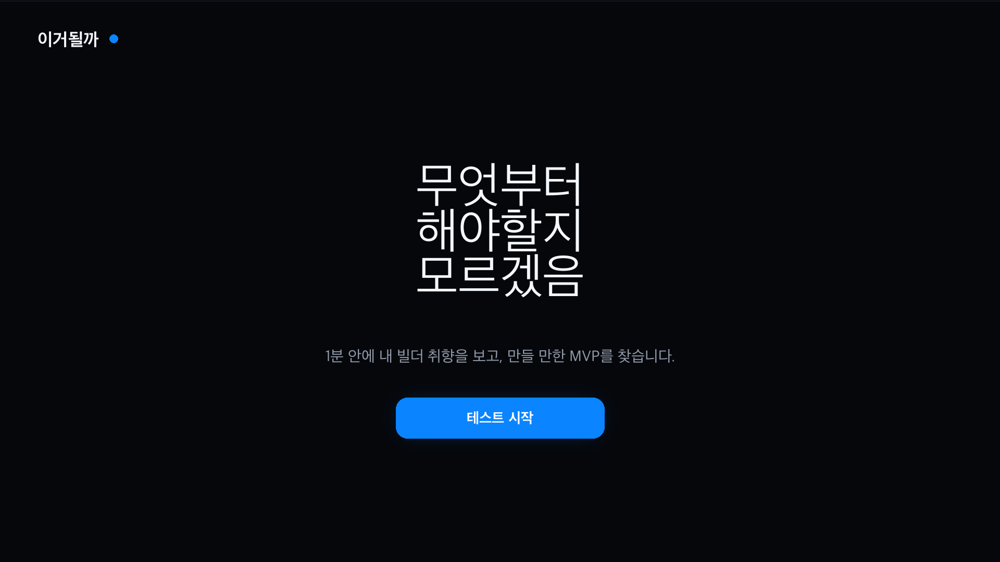
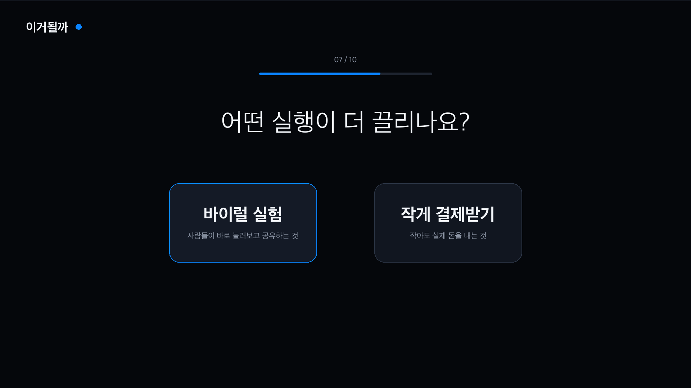
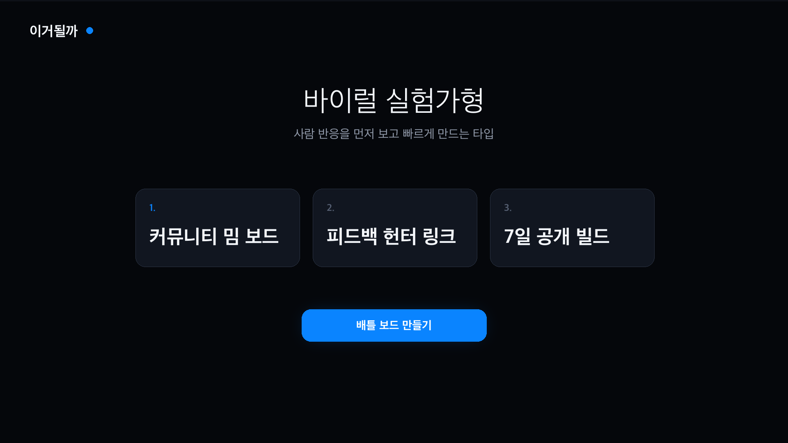
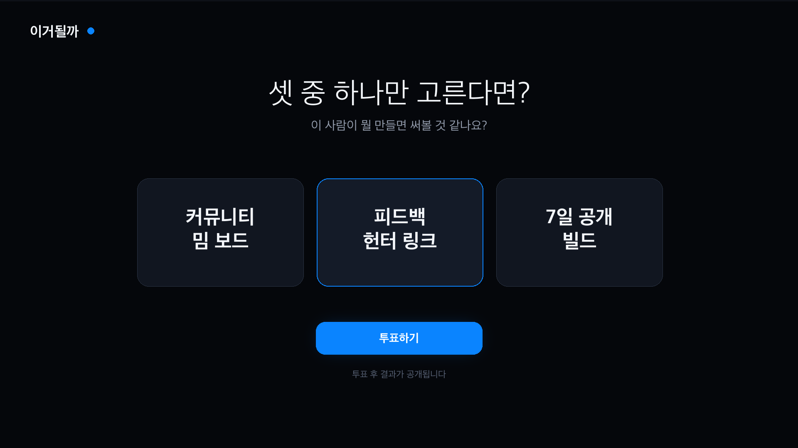
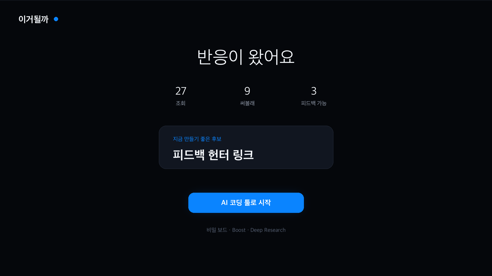

# 이거될까 PRD

> BF.D Vibe Coding Challenge — 4주차 프로젝트  
> 작성자: 이윤규 | 작성일: 2026-07-05

---

## 0. 메타

| 항목 | 내용 |
|------|------|
| 주당 가용 시간 | 20시간 |
| AI/코딩 수준 | Lv.3 |
| 도구 스택 | AI 코딩 툴 전반: Claude Code 앱, Claude Code 터미널, Codex, Cursor 등 |

---

## 1. 문제 정의

### 표면 문제

초보 1인 빌더는 AI 코딩 툴로 무엇이든 만들 수 있게 되었지만, 정작 어떤 문제를 풀어야 할지, 무엇부터 시작해야 할지, 실제 반응을 어디서 받아야 할지 몰라 시작하지 못한다.

### 본질적 문제

AI 코딩 시대의 병목은 제작 능력이 아니라, 아이디어를 실제 사람의 반응과 실행으로 연결하는 짧고 재미있는 검증 루프다.

### 현재 사람들이 푸는 방식

- ChatGPT/Claude에게 아이디어를 추천받는다.
- v0/Lovable/Codex/Claude Code로 일단 만들어본다.
- X/커뮤니티에서 “이 아이디어 어때요?” 글을 보거나 직접 올린다.
- 친구 몇 명에게 보여주고 멈춘다.
- 노션/구글폼/타입폼으로 대기자를 받는 단계까지는 잘 가지 못한다.
- AI에게 피드백을 받지만, 결과가 평균적인 의견으로 수렴한다.

### Why now?

AI 코딩 툴 덕분에 제작 비용은 크게 낮아졌다. 이제 문제는 “만들 수 있느냐”가 아니라 “무엇을 만들고, 누구에게 반응을 받고, 어떤 신호가 있으면 계속 만들지”를 빠르게 판단하는 것이다. 그래서 초보 빌더에게는 무거운 PRD 작성기보다, MBTI 테스트처럼 가볍고 공유하기 쉬운 검증 루프가 필요하다.

---

## 2. 타겟 & JTBD

### 페르소나

지민 / 29세 / 비개발 직군 또는 주니어 기획자·마케터  
AI 코딩 툴로 사이드프로젝트를 시작하고 싶지만, 만들 아이디어를 못 고르고, 커뮤니티에 “내 아이디어 어때요?”라고 올리는 것도 부담스러워 매번 아이디어 대화만 반복하다가 중단하는 사람.

### 순간별 심리

- 시작 전: “무엇부터 해야 할지 모르겠음”
- 아이디어 추천 후: “괜찮아 보이는데 이게 진짜 문제인지 모르겠음”
- 제작 직전: “만들 수는 있을 것 같은데, 아무도 안 쓰면 어떡하지?”
- 공유 직전: “내 아이디어를 평가받는 느낌이라 부담됨”
- 반응 후: “누가 눌러주니까 일단 만들어봐도 되겠다”

### Job Story

When **AI 코딩 툴로 무언가 만들어보고 싶지만, 어떤 문제를 골라야 할지와 누구에게 검증받아야 할지 막막할 때**,  
I want to **MBTI 테스트처럼 가볍게 내 빌더 취향을 진단하고, MVP 후보를 공개 배틀로 공유해 실제 사람 반응을 받아보고**,  
so I can **혼자 확신을 만들려고 시간을 쓰지 않고, 만들지 말지와 무엇부터 만들지를 빠르게 결정할 수 있다.**

### Value Proposition

- **Who**: AI 코딩 툴로 사이드프로젝트를 시작하고 싶은 초보 1인 빌더
- **Why**: 만들 수는 있지만, 뭘 만들지와 누구에게 검증받을지 몰라 시작 루프가 길어짐
- **What before**: ChatGPT/Claude에게 아이디어만 반복해서 묻거나, AI 코딩 툴로 일단 만들다가 실제 반응 없이 중단
- **How**: MBTI식 빌더 취향 테스트, MVP 후보 3개, 공개 배틀 보드, 반응 수집, 실행 프롬프트, 결제 언락을 하나의 짧은 루프로 제공
- **What after**: 외부 반응을 기준으로 만들지 말지 결정하고, AI 코딩 툴에 바로 넣을 첫 실행 프롬프트를 얻음
- **Alternatives**: ChatGPT 아이디어 추천, v0/Lovable/Codex로 일단 만들기, X/커뮤니티 질문, 노션/구글폼 대기자 수집. 기존 대안은 아이디어 생성이나 제작에는 강하지만, 재미있는 공유와 실제 반응 수집 루프가 약함.

---

## 3. 임팩트 가설

### North Star Metric

사용자가 완료한 취향 테스트 중, 공개 배틀 보드가 생성되고 외부 반응 1개 이상을 받은 비율

### Input Metrics

1. 테스트 완료율: 시작한 사용자 중 빌더 타입 결과까지 도달한 비율
2. 공개 배틀 생성률: 결과를 받은 사용자 중 MVP 후보 3개를 공개 보드로 만든 비율
3. Viral K: 공유 링크를 통해 유입된 사람이 새 테스트 또는 새 보드를 만든 수
4. 외부 반응률: 공개 보드 방문자 중 투표/반응/코멘트를 남긴 비율
5. 결제 전환율: 무료 실행 후 비밀 보드, Boost, 고급 프롬프트, Deep Research 중 하나를 결제한 비율

### 정성적 임팩트

> “이거 쓰니까 아이디어 고민만 하던 상태에서 실제 사람 반응을 받고, 바로 만들지 말지 결정할 수 있었어요.”

---

## 4. 솔루션 (MVP)

### UI 목업 방향

- 데스크톱 웹을 기준으로 한다.
- 전체는 다크모드로 설계한다.
- 색상 비율은 다크 배경 70%, 중립 표면 20%, 푸른 불꽃 Primary 10% 이하로 제한한다.
- Primary 컬러는 CTA, 진행률, 선택 상태, 작은 강조 배지에만 사용한다.
- 한 화면에는 하나의 주요 행동만 둔다.
- Apple 제품 페이지처럼 여백을 크게 쓰고, 설명보다 사용자의 다음 행동을 명확히 보여준다.

#### 1. 시작 페이지

#### 2. 빌더 취향 테스트 페이지

#### 3. 결과 페이지

#### 4. 공개 배틀 보드 페이지

#### 5. 반응 확인 및 실행 페이지

### 핵심 가치 한 문장

`이거될까`는 AI 코딩 툴로 뭘 만들지 모르는 초보 1인 빌더를 위한 MBTI식 MVP 검증 앱으로, 취향 테스트처럼 가볍게 MVP 후보를 만들고 사람들에게 한판 붙여 실제 반응과 실행 신호를 받게 한다.

### MVP 핵심 루프

1. 사용자가 `무엇부터 해야할지 모르겠음` 버튼으로 시작한다.
2. MBTI식 8~12개 질문에 답한다.
3. 결과로 `빌더 타입`과 MVP 후보 3개를 받는다.
4. MVP 후보 3개가 공개 배틀 보드로 만들어진다.
5. 친구/커뮤니티 사용자가 가입 없이 반응한다.
6. 반응이 쌓이면 사용자는 기본 실행 프롬프트로 바로 AI 코딩 툴을 시작한다.
7. 더 안전하게 숨기거나, 더 빨리 반응을 받거나, 더 깊게 실행하고 싶은 사용자가 결제한다.

### Must-have 기능

1. **MBTI식 빌더 취향 테스트**
   - 8~12개 선택형 질문
   - 결과 타입 예시: `바이럴 실험가형`, `피드백 사냥꾼형`, `작게 돈 받는 툴메이커형`, `커뮤니티 장작형`, `문제 집착형`, `취향 큐레이터형`
   - 질문은 Concept, Object, Cognition, Who, Situation, Context 카드를 쉬운 말로 바꿔 구성

2. **MVP 공개 배틀 보드**
   - 테스트 결과 기반 MVP 후보 3개 생성
   - 각 후보는 문제, 대상, 상황, 해결 방식, 첫 실행 방법을 포함
   - 공유 가능한 공개 보드 생성
   - 반응 버튼: `써볼래`, `문제 공감`, `피드백 가능`, `별로`
   - 짧은 코멘트 입력
   - 참여 후 `나도 내 보드 만들기` CTA 제공

3. **실행과 결제를 막지 않는 유료화**
   - 무료로 기본 실행 프롬프트 제공
   - 유료는 실행 차단이 아니라 가속/보호/노출에 붙임
   - Polar Checkout Link로 일회성 결제부터 검증
   - 카카오 로그인으로 결과 저장, 보드 관리, 결제 언락 연결

### 무료 제공

- 카카오 로그인
- 빌더 취향 테스트
- 빌더 타입 결과 카드
- MVP 후보 3개 생성
- 공개 배틀 보드 1개 생성
- 공유 이미지/공유 문구 생성
- 외부 투표/반응/짧은 코멘트 수집
- 기본 지표: 조회수, 투표수, 공감수, 피드백 가능 수
- 기본 AI 코딩 툴 시작 프롬프트

### 유료 제공

1. **비밀 보드**
   - 기본은 공개
   - 유료 사용자는 제목/요약만 공개하고 상세 아이디어, 문제, 타겟, 해결 방식, 프롬프트를 가릴 수 있음
   - 링크를 받은 사람 또는 피드백 참여자에게만 공개 가능
   - 커뮤니티에는 `비밀 아이디어`로 활동 신호는 남김

2. **Boost**
   - 일정 시간 동안 `오늘의 될까` 또는 주제 피드 상단 노출
   - Tinder Boost처럼 “더 빨리 반응 받기”에 과금

3. **Super Feedback**
   - “진짜 피드백 받고 싶음”으로 강조 표시
   - 피드백 가능자에게 더 잘 보이게 함

4. **Likes You**
   - 누가, 어떤 출처에서, 어떤 후보에 관심을 눌렀는지 상세 보기

5. **Deep Research**
   - 유사 서비스, 경쟁 제품, 커뮤니티, 타겟 채널, 첫 배포 문구 리서치

6. **Start Prompt Pack Pro**
   - Claude Code, Codex, Cursor 등에 바로 넣을 상세 PRD, 태스크 분해, 첫 커밋 프롬프트, 테스트 체크리스트

7. **7일 빌드 챌린지**
   - 공개 빌드 약속
   - 데일리 미션
   - 진행률 배지
   - 실행 랭킹 반영

### 초기 가격 가설

| 상품 | 가격 가설 | 목적 |
|------|----------|------|
| 비밀 보드 | 2,900원 | 아이디어 노출 불안을 줄임 |
| Boost | 1,900원 | 더 빨리 외부 반응 받기 |
| Start Prompt Pack Pro | 4,900원 | AI 코딩 툴 시작을 더 쉽게 함 |
| Deep Research | 6,900원 | 어디에 배포하고 누구에게 물어볼지 구체화 |
| 7일 빌드 챌린지 | 9,900원 | 실행 지속과 커뮤니티 참여 유도 |

### 로그인 정책

- MVP에는 카카오 로그인만 제공한다.
- Google/Gmail 로그인은 제공하지 않는다.
- Instagram 로그인은 제공하지 않는다.
- Gmail/Instagram 스크래핑은 하지 않는다.
- 카카오톡 메시지, 친구 목록, 채팅 데이터는 수집하지 않는다.
- 취향 분석은 사용자가 직접 답한 테스트 응답만 사용한다.

### Non-goals

- Gmail/Instagram 데이터 자동 분석 없음
- 자유 게시판, DM, 팔로우 기능 없음
- 복잡한 추천 알고리즘 없음
- 정교한 구독 권한 시스템 없음
- 첫 버전에서 앱스토어/모바일 앱 출시 없음
- 사용자의 실행 자체를 막는 페이월 없음

### Demo Flow

1. 사용자가 `무엇부터 해야할지 모르겠음`을 누르고 카카오 로그인한다.
2. MBTI식 질문 10개에 답해 빌더 타입 결과를 받는다.
3. MVP 후보 3개가 카드로 생성되고 공개 배틀 보드가 만들어진다.
4. 사용자가 공유 문구를 복사해 X/카톡/커뮤니티에 올린다.
5. 외부 사용자가 가입 없이 `써볼래`, `문제 공감`, `피드백 가능`을 누른다.
6. 사용자는 반응 요약을 보고 기본 AI 코딩 툴 시작 프롬프트를 복사한다.
7. 필요하면 비밀 보드, Boost, Start Prompt Pack Pro를 Polar로 결제한다.

---

## 5. 리스크 & 가정

### VUVF 가정 매핑

| 카테고리 | 가정 |
|----------|------|
| Value | 초보 1인 빌더는 아이디어 생성기보다 MBTI식 취향 테스트와 공개 배틀 보드를 더 부담 없이 공유한다. |
| Usability | 사용자는 3분 안에 테스트 완료 → 결과 확인 → 공개 보드 생성 → 공유 문구 복사까지 할 수 있다. |
| Viability | 주 20시간, Lv.3 기준으로 1일 정적 MVP와 4주 내 카카오 로그인/반응 저장/Polar 결제까지 구현 가능하다. |
| Feasibility | 카카오 로그인, 공개 보드, 반응 저장, Polar Checkout Link 기반 유료 언락을 단순한 웹 앱으로 구현할 수 있다. |

### 가장 위험한 가정

1. 사용자가 “내 아이디어 평가해줘”보다 “내 빌더 타입 결과와 MVP 후보를 봐줘”를 더 쉽게 공유하는가
2. 공유받은 사람이 가입 없이 투표/반응/코멘트를 남기는가
3. 사용자가 실행을 막지 않는 유료 기능, 특히 비밀 보드나 Boost에 실제로 돈을 내는가

### 1주차 검증 실험

코드 없이 먼저 수동으로 검증한다.

1. 빌더 취향 테스트 질문 10개를 Tally/Google Form으로 만든다.
2. 결과 타입 6개와 MVP 후보 생성 규칙을 수동으로 준비한다.
3. 초보 빌더 5~10명에게 테스트를 진행하게 한다.
4. 각자 결과 카드와 MVP 후보 3개를 받아 공유하게 한다.
5. 공유 링크 또는 이미지에 대해 외부 반응을 수집한다.
6. 비밀 보드/Boost/Start Prompt Pack Pro 결제 버튼을 가짜 또는 Polar Checkout Link로 노출한다.
7. 클릭률, 실제 결제, 공유 부담감, 첫 반응까지 걸린 시간을 기록한다.

### 성공 기준

- 5명 중 3명 이상이 결과/보드를 실제 공유
- 공유된 보드의 50% 이상이 외부 반응 1개 이상 획득
- 외부 방문자 10명 중 5명 이상이 가입 없이 반응 클릭
- 빌더 2명 이상이 “이 반응을 보고 만들지 말지 판단이 쉬워졌다”고 말함
- 유료 버튼 클릭률 5% 이상 또는 실제 결제 1건 이상 발생

---

## 6. 주차별 마일스톤

### Day 1: 정적 MVP

- **목표**: MBTI식 테스트와 공개 배틀 보드를 하루 안에 사용 가능한 정적 MVP로 만든다.
- **산출물**:
  - 정적 웹 페이지
  - 빌더 취향 질문 8~12개
  - 결과 타입 6개
  - MVP 후보 3개 생성 로직
  - 공개 보드 화면
  - 공유 문구 생성
  - GA4 이벤트 삽입

### 1주차: 가정 검증

- **목표**: 초보 빌더 5~10명이 실제로 테스트를 완료하고 결과를 공유하는지 검증한다.
- **산출물**:
  - 테스트 완료율
  - 공개 보드 생성률
  - 공유율
  - 첫 외부 반응까지 걸린 시간
  - 반응 수
  - 유료 버튼 클릭률
  - 인터뷰 메모

### 2주차: 핵심 기능 구현

- **목표**: 정적 MVP를 실제 데이터가 저장되는 웹 앱으로 만든다.
- **산출물**:
  - 카카오 로그인
  - 사용자별 결과 저장
  - 공개 배틀 보드 URL
  - 반응/코멘트 저장
  - 기본 결과 대시보드
  - 기본 AI 코딩 툴 시작 프롬프트

### 3주차: 결제와 게이미피케이션

- **목표**: 실행을 막지 않는 유료화와 커뮤니티 동기를 넣는다.
- **산출물**:
  - Polar Checkout Link 연동
  - 비밀 보드
  - Boost
  - Start Prompt Pack Pro
  - 실행 랭킹
  - 첫 반응 배지
  - 7일 빌드 약속 진입

### 4주차: 바이럴/결제 검증과 데모

- **목표**: 제품이 단순 생성기가 아니라 바이럴 루프와 결제 신호를 만드는지 검증한다.
- **산출물**:
  - Viral K 추정치
  - 테스트 완료율/공유율/반응률 리포트
  - 유료 버튼 클릭률/결제 전환율
  - 실제 사용자 보드 사례
  - 데모 영상
  - 다음 버전 백로그

---

## 7. 참고 레퍼런스

- IFboard: 취향표/분류표/보드 기반 공유 놀이
- Love Virtually: 1분 Hook, 개인화 결과, 지인/관계 개입, 희소성, 소셜프루프
- Tinder: 무료 핵심 루프 + Boost/Super Like/Likes You/Priority 기반 결제 게이미피케이션
- Polar.sh: 디지털 상품, Checkout Link, 일회성 결제, 구독 확장 가능
