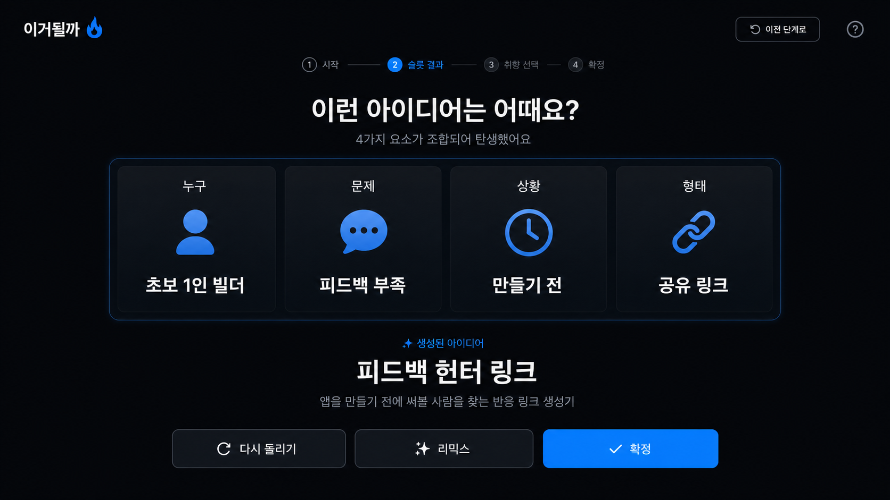
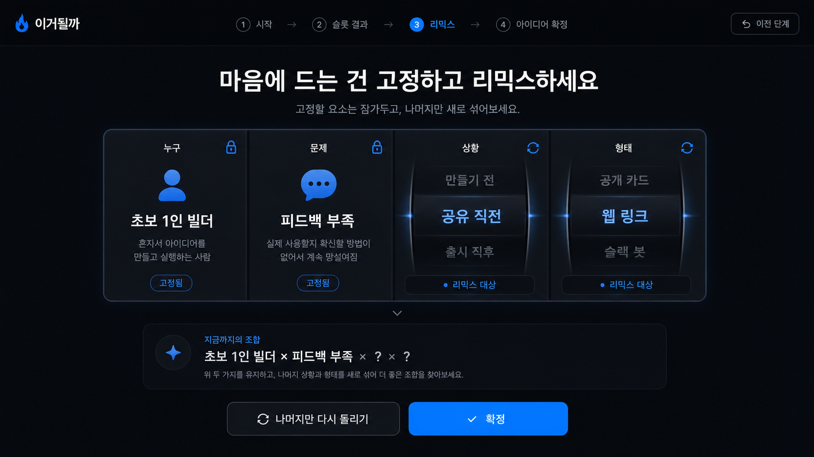
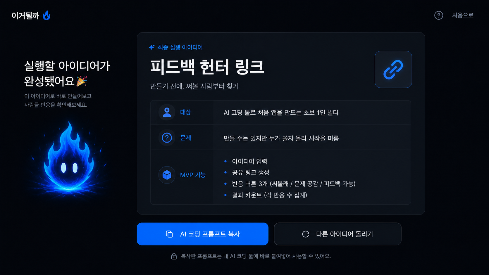

# 이거될까 PRD

> BF.D Vibe Coding Challenge — 4주차 프로젝트  
> 작성자: 이윤규 | 작성일: 2026-07-05

---

## 0. 메타

| 항목 | 내용 |
|------|------|
| 주당 가용 시간 | 20시간 |
| AI/코딩 수준 | Lv.3 |
| 도구 스택 | AI 코딩 툴 전반: Claude Code 앱, Claude Code 터미널, Codex, Cursor 등 |

---

## 1. 문제 정의

### 표면 문제

초보 1인 빌더는 AI 코딩 툴로 앱을 만들 수 있게 되었지만, 정작 **무엇을 만들지 몰라 시작하지 못한다.**

### 본질적 문제

AI 코딩 시대의 첫 병목은 개발 능력이 아니라, **지금 바로 실행할 수 있을 만큼 구체적인 아이디어를 얻는 것**이다.

### 현재 사람들이 푸는 방식

- ChatGPT/Claude에게 “만들 아이디어 추천해줘”라고 묻는다.
- 추천받은 아이디어가 너무 일반적이라 다시 묻는다.
- v0/Lovable/Codex/Claude Code를 열지만 첫 프롬프트를 못 정한다.
- 아이디어를 고르기 전에 시장성, 피드백, 수익화까지 생각하다가 멈춘다.

### Why now?

AI 코딩 툴 덕분에 제작 비용은 낮아졌다. 이제 초보 빌더에게 필요한 것은 완벽한 검증 시스템이 아니라, **망설임을 줄이고 바로 만들 수 있는 아이디어 1개를 뽑아주는 시작 장치**다.

---

## 2. 타겟 & JTBD

### 페르소나

지민 / 29세 / 비개발 직군 또는 주니어 기획자·마케터  
AI 코딩 툴로 사이드프로젝트를 시작하고 싶지만, 무엇을 만들어야 할지 몰라 ChatGPT와 아이디어 대화만 반복하다가 멈추는 사람.

### Job Story

When **AI 코딩 툴로 뭔가 만들고 싶은데 무엇을 만들지 막막할 때**,  
I want to **슬롯을 돌리듯 가볍게 아이디어 조합을 보고 마음에 드는 조합을 확정하고**,  
so I can **고민을 끝내고 AI 코딩 툴에 바로 넣을 실행 프롬프트로 시작할 수 있다.**

### Value Proposition

- **Who**: 무엇을 만들지 모르는 초보 1인 빌더
- **Why**: AI 코딩 툴은 열 수 있지만 첫 아이디어와 첫 프롬프트를 정하지 못함
- **What before**: ChatGPT에게 막연히 아이디어를 추천받고, 마음에 안 들어 다시 묻는 루프를 반복
- **How**: 누구, 문제, 상황, 형태, 심리 카드를 슬롯처럼 조합하고 리믹스하게 함
- **What after**: 실행할 아이디어 1개와 AI 코딩 시작 프롬프트를 얻음
- **Alternatives**: ChatGPT 아이디어 추천, 노션 아이디어 목록, X/커뮤니티 아이디어 글. 기존 대안은 많지만 “바로 실행 가능한 하나”로 좁혀주지 못함.

---

## 3. 임팩트 가설

### North Star Metric

슬롯을 시작한 사용자 중 **최종 아이디어를 확정하고 AI 코딩 프롬프트를 복사한 비율**

### Input Metrics

1. 슬롯 시작률: 시작 페이지 방문자 중 `슬롯 돌려보기`를 누른 비율
2. 리믹스 사용률: 첫 결과 이후 `다시 돌리기` 또는 `리믹스`를 사용한 비율
3. 아이디어 확정률: 슬롯 결과를 본 사용자 중 아이디어를 확정한 비율
4. 프롬프트 복사율: 확정된 아이디어에서 `AI 코딩 프롬프트 복사`를 누른 비율

### 정성적 임팩트

> “이거 쓰니까 뭘 만들지 고민하던 상태에서 바로 하나 골라 시작할 수 있었어요.”

---

## 4. 솔루션 (MVP)

### 핵심 가치 한 문장

`이거될까`는 무엇을 만들지 모르는 초보 1인 빌더를 위한 **아이디어 슬롯 생성기**로, 랜덤 조합과 리믹스를 통해 바로 실행 가능한 앱 아이디어 1개와 AI 코딩 시작 프롬프트를 만든다.

### MVP 핵심 루프

1. 사용자가 `뭘 만들지 모르겠나요?` 화면에서 `슬롯 돌려보기`를 누른다.
2. `누구`, `문제`, `상황`, `형태`, `심리` 카드가 조합되어 아이디어가 나온다.
3. 마음에 들지 않으면 다시 돌린다.
4. 마음에 드는 축은 고정하고 나머지만 리믹스한다.
5. 마음에 드는 아이디어가 나오면 확정한다.
6. 확정된 아이디어를 실행 문서로 변환한다.
7. 사용자는 AI 코딩 툴에 넣을 시작 프롬프트를 복사한다.

### UI 목업

#### 1. 시작 페이지

#### 2. 슬롯 결과 페이지

#### 3. 리믹스 페이지

#### 4. 실행 아이디어 페이지

### Must-have 기능

1. **아이디어 슬롯 돌리기**
   - 카드 축: `Who`, `Problem`, `Situation`, `Format`, `Cognition`
   - 버튼: `슬롯 돌려보기`, `다시 돌리기`
   - 결과: 아이디어 이름과 한 줄 설명

2. **리믹스**
   - 마음에 드는 축을 고정
   - 나머지 축만 다시 조합
   - 확정 전까지 여러 번 재시도 가능

3. **실행 프롬프트 생성**
   - 아이디어 이름
   - 타겟 고객
   - 해결할 문제
   - MVP 기능 3~4개
   - 첫 화면 구성
   - AI 코딩 툴 시작 프롬프트

### Non-goals

- 피드백 수집 기능 없음
- 공개 피드 없음
- 좋아요 랭킹 없음
- 비밀 보드 없음
- 결제 없음
- 카카오 로그인 없음
- 커뮤니티 기능 없음

### Demo Flow

1. 사용자가 `슬롯 돌려보기`를 누른다.
2. 예시 결과로 `피드백 헌터 링크`가 나온다.
3. 사용자가 `초보 1인 빌더`, `피드백 부족` 축을 고정하고 리믹스한다.
4. 최종 아이디어를 확정한다.
5. 실행 아이디어 페이지에서 AI 코딩 프롬프트를 복사한다.

---

## 5. 리스크 & 가정

### VUVF 가정 매핑

| 카테고리 | 가정 |
|----------|------|
| Value | 사용자는 검증/커뮤니티보다 먼저, 실행할 아이디어 1개를 빠르게 얻는 데 가치를 느낀다. |
| Usability | 사용자는 설명 없이도 슬롯 돌리기, 고정, 리믹스, 확정 흐름을 이해할 수 있다. |
| Viability | 주 20시간, Lv.3 기준으로 정적 웹 MVP는 1~2일 안에 만들 수 있다. |
| Feasibility | 카드 데이터와 조합 규칙만으로 충분히 그럴듯한 아이디어를 생성할 수 있다. |

### 가장 위험한 가정

1. 랜덤 조합으로 나온 아이디어가 사용자가 “만들어볼 만하다”고 느낄 만큼 구체적인가
2. 사용자가 리믹스를 통해 마음에 드는 아이디어까지 도달하는가
3. 최종 프롬프트가 AI 코딩 툴에 바로 넣을 만큼 실행 가능한가

### 1주차 검증 실험

코드 없이 20~30개의 카드 조합을 수동으로 만들고, 초보 빌더 5명에게 보여준다.

측정할 것:

- 첫 아이디어를 보고 이해하는 데 걸린 시간
- 다시 돌리고 싶은 이유
- 고정하고 싶은 카드 축
- 최종적으로 “이건 만들어볼 만하다”고 고른 아이디어 수
- AI 코딩 프롬프트를 보고 바로 시작할 수 있다고 느끼는지

성공 기준:

- 5명 중 4명이 1분 안에 아이디어를 하나 이상 이해
- 5명 중 3명이 리믹스를 통해 더 마음에 드는 아이디어를 찾음
- 5명 중 3명이 최종 프롬프트를 “그대로 AI 코딩 툴에 넣어볼 수 있다”고 응답

---

## 6. 주차별 마일스톤

### Day 1: 정적 MVP

- **목표**: 슬롯 돌리기, 리믹스, 확정, 프롬프트 복사까지 되는 정적 웹 MVP를 만든다.
- **산출물**:
  - 카드 데이터 JSON
  - 슬롯 UI
  - 고정/리믹스 UI
  - 실행 아이디어 결과 페이지
  - 프롬프트 복사 버튼
  - GA4 이벤트: `slot_spin`, `reroll`, `remix_lock`, `idea_confirmed`, `prompt_copied`

### 1주차: 아이디어 품질 검증

- **목표**: 초보 빌더가 실제로 만들고 싶은 아이디어를 얻는지 확인한다.
- **산출물**:
  - 사용자 5명 테스트 기록
  - 확정된 아이디어 목록
  - 마음에 안 들었던 조합 패턴
  - 개선할 카드 축 목록

### 2주차: 카드 데이터 개선

- **목표**: 실제로 실행 가능한 아이디어가 더 자주 나오도록 카드와 조합 규칙을 개선한다.
- **산출물**:
  - 카드 축별 데이터 50개 이상
  - 금지 조합/추천 조합 규칙
  - 아이디어 설명 템플릿
  - 프롬프트 생성 템플릿

### 3주차: 사용성 개선

- **목표**: 사용자가 더 빠르게 마음에 드는 아이디어에 도달하도록 UX를 다듬는다.
- **산출물**:
  - 리믹스 개선
  - 카드 고정 상태 저장
  - 결과 비교 UI
  - 프롬프트 복사 UX 개선

### 4주차: 데모 완성

- **목표**: 1분 안에 아이디어를 확정하고 AI 코딩 프롬프트를 복사하는 데모를 완성한다.
- **산출물**:
  - 데모 영상
  - 최종 PRD
  - 사용성 테스트 결과
  - 다음 버전 백로그

---

## 7. 다음 버전 후보

MVP에서는 제외하지만, 이후 확장할 수 있는 기능이다.

- 공유용 아이디어 카드
- 피드백 받기
- 좋아요 랭킹
- 공개 피드
- 비밀 보드
- 결제
- 카카오 로그인
